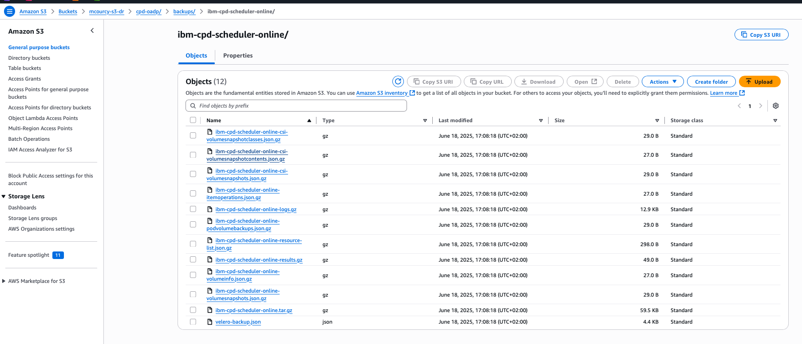

# Backup docmumentation 

[An architecture view](https://community.ibm.com/community/user/blogs/yip-hing-ng/2025/03/28/an-introduction-to-backup-and-restore-service-orch) Authors: Yip-Hing Ng, Arie Sutiono, Mat Seto, Andrew D’Amario. This article open the possibility to work with third party vendor.

[The change in this version](https://www.ibm.com/docs/en/software-hub/5.1.x?topic=overview-whats-new#whats-new__enhancements__title__1) see "Streamlined process to back up and restore IBM Software Hub with the OADP utility" 

The 5.1.X version made backup and restore much simpler.

[Backing up and restoring IBM Software Hub](https://www.ibm.com/docs/en/software-hub/5.1.x?topic=administering-backing-up-restoring-software-hub). Show that 2 backup type exist : online and offline. Which is actually one using snapshot and one using the old velero restic workflow which is not crash consistent and for this reason require to quiesce the service the time of the backup. Given the size of a CPD project this time can be very very long.

Also ther is this [Matrix](https://www.ibm.com/docs/en/software-hub/5.1.x?topic=administering-backing-up-restoring-software-hub#backup_restore__supported_storage__title__1). We are focusing on using ODF anyway and we get standard support for cpdbr.


In this [page](https://www.ibm.com/docs/en/software-hub/5.1.x?topic=hub-services-that-support-backup-restore) you can check if watson studio is supported for backup and restore. Online and Offline backup is supported.

# Installing the backup solution 

[Documentation](https://www.ibm.com/docs/en/software-hub/5.1.x?topic=hub-installing-backup-restore-software)

## Installing and configuring the IBM Software Hub OADP utility on the source cluster

[Documentation](https://www.ibm.com/docs/en/software-hub/5.1.x?topic=software-installing-configuring-oadp-utility#reference_bds_zvh_ndc)

In the previous step when installing hub software we created a file call cpd-vars.sh 

Change line 12
```
export PATH=$PWD/cpd-cli-darwin-EE-14.1.3-1968:$PATH
```

by 
```
export PATH=$PWD/cpd-cli-darwin-EE-14.1.3-1968:$PWD/cpd-cli-darwin-EE-14.1.3-1968/plugins/lib/darwin/:$PATH
```

now check each executable can run :
```
bash
. cpd-vars.sh
cpd-cli version
config version 
cpdbr version
cpdbr-oadp version
cpdtool version
health version
info version
manage version
platform-diag version
platform-mgmt --help
```

Append this vars to your cpd-vars.sh file 
TODO remove credential
```
# ------------------------------------------------------------------------------
# OADP (backup and restore)
# ------------------------------------------------------------------------------
OADP_PROJECT=openshift-adp
ACCESS_KEY_ID='<your access key>'
SECRET_ACCESS_KEY='<your secret access key>'
# a value of 0 means unbounded
VELERO_POD_CPU_LIMIT=0
NODE_AGENT_POD_CPU_LIMIT=0
CPDBR_VELERO_PLUGIN_IMAGE_LOCATION=icr.io/cpopen/cpd/cpdbr-velero-plugin:${VERSION}
BUCKET_NAME=<your bucket name>
BUCKET_PREFIX=cpd-oadp
REGION=us-east-1
```

Source the file 
```
. cpd-vars.sh 
```

### Create the oadp project 

```
$OC_LOGIN 
oc create ns $OADP_PROJECT
oc annotate namespace ${OADP_PROJECT} openshift.io/node-selector=""
cpd-cli oadp install \
--component=cpdbr-tenant \
--agent-pod-cpu-request=100m \
--namespace ${OADP_PROJECT} \
--tenant-operator-namespace ${PROJECT_CPD_INST_OPERATORS} \
--skip-recipes \
--log-level=debug \
--verbose
```

to uninstall
```
cpd-cli oadp uninstall \
--component=cpdbr-tenant \
--namespace ${OADP_PROJECT} \
--tenant-operator-namespace ${PROJECT_CPD_INST_OPERATORS} \
--skip-recipes \
--log-level=debug \
--verbose
```

Install the Red Hat OADP operator. To install operators in a cluster with Internet access, see the Red Hat documentation [Adding Operators to a cluster](https://www.ibm.com/links?url=https%3A%2F%2Fdocs.redhat.com%2Fen%2Fdocumentation%2Fopenshift_container_platform%2F4.14%2Fhtml-single%2Foperators%2Findex%23olm-adding-operators-to-a-cluster).


Create a secret in the ${OADP_PROJECT} project with the credentials of the S3-compatible object store that you are using to store the backups.
Credentials must use alphanumeric characters and cannot contain special characters like the number sign (#).

Create a file named credentials-velero that contains the credentials for the object store:
```
cat << EOF > credentials-velero
[default]
aws_access_key_id=${ACCESS_KEY_ID}
aws_secret_access_key=${SECRET_ACCESS_KEY}
EOF
```

Create the secret.
The name of the secret must be cloud-credentials.
```
oc create secret generic cloud-credentials \
--namespace ${OADP_PROJECT} \
--from-file cloud=./credentials-velero
```


Install OADP (Velero) now 
```
cat << EOF | oc apply -f -
apiVersion: oadp.openshift.io/v1alpha1
kind: DataProtectionApplication
metadata:
  name: dpa-sample
  namespace: ${OADP_PROJECT}
spec:
  configuration:
    velero:
      customPlugins:
      - image: ${CPDBR_VELERO_PLUGIN_IMAGE_LOCATION}
        name: cpdbr-velero-plugin
      defaultPlugins:
      - aws
      - openshift
      - csi
      podConfig:
        resourceAllocations:
          limits:
            cpu: "${VELERO_POD_CPU_LIMIT}"
            memory: 4Gi
          requests:
            cpu: 500m
            memory: 256Mi
      resourceTimeout: 60m
    nodeAgent:
      enable: true
      uploaderType: restic
      timeout: 72h
      podConfig:
        resourceAllocations:
          limits:
            cpu: "${NODE_AGENT_POD_CPU_LIMIT}"
            memory: 32Gi
          requests:
            cpu: 500m
            memory: 256Mi
        tolerations:
        - key: icp4data
          operator: Exists
          effect: NoSchedule
  backupImages: false
  backupLocations:
    - velero:
        provider: aws
        default: true
        objectStorage:
          bucket: ${BUCKET_NAME}
          prefix: ${BUCKET_PREFIX}
        config:
          region: ${REGION}          
        credential:
          name: cloud-credentials
          key: cloud
EOF
```

Check that the velero pods are running in the ${OADP_PROJECT} project.

```
c get po -n $OADP_PROJECT 
NAME                                                READY   STATUS    RESTARTS   AGE
node-agent-29xz7                                    1/1     Running   0          3m21s
node-agent-2cxj8                                    1/1     Running   0          3m21s
node-agent-4jhmk                                    1/1     Running   0          3m21s
node-agent-6xw9j                                    1/1     Running   0          3m21s
node-agent-86k5m                                    1/1     Running   0          3m21s
node-agent-b4jjg                                    1/1     Running   0          3m21s
node-agent-b74gf                                    1/1     Running   0          3m21s
node-agent-d9s5m                                    1/1     Running   0          3m21s
node-agent-fnv4q                                    1/1     Running   0          3m21s
node-agent-k4lnl                                    1/1     Running   0          3m21s
node-agent-kb7qj                                    1/1     Running   0          3m21s
node-agent-kf2bt                                    1/1     Running   0          3m21s
node-agent-nwdcs                                    1/1     Running   0          3m21s
node-agent-pldsg                                    1/1     Running   0          3m21s
node-agent-tnpz8                                    1/1     Running   0          3m21s
node-agent-vjzd4                                    1/1     Running   0          3m21s
node-agent-vlgbk                                    1/1     Running   0          3m21s
node-agent-zb622                                    1/1     Running   0          3m21s
openshift-adp-controller-manager-54d597d4db-gfx4p   1/1     Running   0          30m
velero-769f7bc956-r5gj8                             1/1     Running   0          3m21s
```

Verify that the backup storage location PHASE is Available.
```
cpd-cli oadp backup-location list --namespace ${OADP_PROJECT}
```

You should get an output like this one 
```
NAME            PROVIDER        BUCKET          PREFIX          PHASE           LAST VALIDATED                  ACCESS MODE
dpa-sample-1    aws             <your bucket>   cpd-oadp        Available       2025-06-18 16:00:18 +0200 CEST             
```

Configure the IBM Software Hub OADP backup and restore utility before you create backups.
```
cpd-cli oadp client config set namespace=${OADP_PROJECT}
```

To let velero know which volumesnapshotclass to use add those labels 
```
oc label volumesnapshotclass ocs-storagecluster-cephfsplugin-snapclass velero.io/csi-volumesnapshot-class=true 
oc label volumesnapshotclass ocs-storagecluster-rbdplugin-snapclass velero.io/csi-volumesnapshot-class=true 
```

## Online backup and restore 

[Documentation](https://www.ibm.com/docs/en/software-hub/5.1.x?topic=hub-online-backup-restore)

  ### Online backup and restore on the same cluster 

[Documentation](https://www.ibm.com/docs/en/software-hub/5.1.x?topic=restore-online-backup-same-cluster)

#### IBM Software Hub online backup and restore to the same cluster with the OADP utility

[Documentation](https://www.ibm.com/docs/en/software-hub/5.1.x?topic=cluster-backup-restore-software-hub-oadp-utility#reference_nll_kjz_tcc)

Check whether the services that you are using support platform backup and restore by [reviewing Services that support backup and restore](https://www.ibm.com/docs/en/SSNFH6_5.1.x/hub/admin/backup_restore_service_list.html). You can also run the following command:
```
cpd-cli oadp service-registry check \
--tenant-operator-namespace ${PROJECT_CPD_INST_OPERATORS} \
--verbose \
--log-level debug
```

In the output you can see that all the service enable backup 
```
** INFO [DONE VALIDATING ADDONS WITH BACKUP RESTORE REGISTRY] *****************
ADDONID         STATE   SUPPORT ONLINE BR       SUPPORT OFFLINE BR      RUNTIME DEPENDENCIES    ERR MSG
ccs             enabled true (platform,service) true (platform,service)                                
rshaper         enabled true (platform,service) true (platform,service) ccs                            
ws              enabled true (platform,service) true (platform,service) ccs,rshaper                    
zen-lite        enabled true (platform,service) true (platform,service)     
```

Especially Watson Studio (ws).

Estimate how much storage to allocate for backup: 
```
cpd-cli oadp install --component=cpdbr-agent --namespace=${OADP_PROJECT} --cpd-namespace=${PROJECT_CPD_INST_OPERANDS}
export CPDBR_ENABLE_FEATURES=volume-util
cpd-cli oadp du-pv --cpd-namespace=${PROJECT_CPD_INST_OPERATORS} --include-namespaces=${PROJECT_CPD_INST_OPERANDS}
```

You should get an output like this one 
```
processing request...
cpd namespace: cpd-operators
oadp namespace: openshift-adp
cpdops namespace: 

PVC NAME                                                NAMESPACE       VOLUME                                          STATUS  MOUNTED CAPACITY        USED    CREATED AT              ACCESS MODES    STORAGE CLASS              
cc-home-pvc                                             cpd-instance    pvc-1dbe0de2-52f6-4fa0-aa66-2b399ae91395        Bound   true    50Gi            12Mi    16 Jun 25 11:39 CEST    RWX             ocs-storagecluster-cephfs  
common-service-db-1                                     cpd-instance    pvc-3fb71a65-5649-4cc8-a2b8-f82fe96ff40d        Bound   true    10Gi            48Mi    03 Jun 25 18:12 CEST    RWO             ocs-storagecluster-ceph-rbd
common-service-db-1-wal                                 cpd-instance    pvc-97a9008d-e264-4b73-a6d0-e078d2890b92        Bound   true    10Gi            560Mi   03 Jun 25 18:12 CEST    RWO             ocs-storagecluster-ceph-rbd
common-service-db-2                                     cpd-instance    pvc-44327ff7-7f67-4e95-a95a-3a9998e848d7        Bound   true    10Gi            47Mi    03 Jun 25 18:12 CEST    RWO             ocs-storagecluster-ceph-rbd
common-service-db-2-wal                                 cpd-instance    pvc-6c3f2536-bcc3-47b4-9111-e389aa74eb7a        Bound   true    10Gi            544Mi   03 Jun 25 18:12 CEST    RWO             ocs-storagecluster-ceph-rbd
conn-home-pvc                                           cpd-instance    pvc-979cfbd6-2b10-4576-847b-a63155898162        Bound   true    5Gi             664     16 Jun 25 11:39 CEST    RWX             ocs-storagecluster-cephfs  
data-elasticsea-0ac3-ib-6fb9-es-server-esnodes-0        cpd-instance    pvc-200d88a4-d46d-4563-928b-dac1ab7f610f        Bound   true    30Gi            2Mi     16 Jun 25 11:40 CEST    RWO             ocs-storagecluster-ceph-rbd
data-elasticsea-0ac3-ib-6fb9-es-server-esnodes-1        cpd-instance    pvc-de4986d4-842c-422c-8652-473e92ecff88        Bound   true    30Gi            2Mi     16 Jun 25 11:40 CEST    RWO             ocs-storagecluster-ceph-rbd
data-elasticsea-0ac3-ib-6fb9-es-server-esnodes-2        cpd-instance    pvc-cacfb85f-badc-46c9-b2a5-64ff4c598d5a        Bound   true    30Gi            994Ki   16 Jun 25 11:40 CEST    RWO             ocs-storagecluster-ceph-rbd
data-rabbitmq-ha-0                                      cpd-instance    pvc-4c1f1176-d077-4f8f-ad95-20e421d54e27        Bound   true    10Gi            179Ki   16 Jun 25 11:40 CEST    RWO             ocs-storagecluster-ceph-rbd
data-rabbitmq-ha-1                                      cpd-instance    pvc-8269b60d-874d-48f3-9620-18a5414d199a        Bound   true    10Gi            178Ki   16 Jun 25 11:41 CEST    RWO             ocs-storagecluster-ceph-rbd
data-rabbitmq-ha-2                                      cpd-instance    pvc-96d6d1d8-a611-4d6d-91f8-4b74d42eeb98        Bound   true    10Gi            177Ki   16 Jun 25 11:42 CEST    RWO             ocs-storagecluster-ceph-rbd
data-redis-ha-server-0                                  cpd-instance    pvc-1a3dc0ee-b299-4d89-86f5-4b517901f96e        Bound   true    10Gi            9Mi     16 Jun 25 11:40 CEST    RWO             ocs-storagecluster-ceph-rbd
data-redis-ha-server-1                                  cpd-instance    pvc-1420e468-81ad-4b95-890a-6bdb80311da8        Bound   true    10Gi            9Mi     16 Jun 25 11:41 CEST    RWO             ocs-storagecluster-ceph-rbd
data-redis-ha-server-2                                  cpd-instance    pvc-4c357a7b-d36c-4fec-96e3-0b46930aaede        Bound   true    10Gi            9Mi     16 Jun 25 11:41 CEST    RWO             ocs-storagecluster-ceph-rbd
database-storage-wdp-couchdb-0                          cpd-instance    pvc-474bdd3f-6a28-449a-b4c6-e8f330d10ceb        Bound   true    30Gi            21Mi    16 Jun 25 11:40 CEST    RWO             ocs-storagecluster-ceph-rbd
database-storage-wdp-couchdb-1                          cpd-instance    pvc-68fe27e1-9213-4bb4-8f9e-eaa23cd48940        Bound   true    30Gi            22Mi    16 Jun 25 11:40 CEST    RWO             ocs-storagecluster-ceph-rbd
database-storage-wdp-couchdb-2                          cpd-instance    pvc-6ebf5f72-7b77-4a90-acc7-cf3356a97cb3        Bound   true    30Gi            22Mi    16 Jun 25 11:40 CEST    RWO             ocs-storagecluster-ceph-rbd
elasticsea-0ac3-ib-6fb9-es-server-snap                  cpd-instance    pvc-030443d8-865a-458f-98a2-374add7d3706        Bound   true    30Gi            848Ki   16 Jun 25 11:40 CEST    RWX             ocs-storagecluster-cephfs  
elasticsearch-master-backups                            cpd-instance    pvc-ce7d0163-f168-45e3-ab12-2db292f22f5d        Bound   true    30Gi            0       16 Jun 25 11:39 CEST    RWX             ocs-storagecluster-cephfs  
export-zen-minio-0                                      cpd-instance    pvc-6c361b98-0c5d-4b60-ab44-b0a1d42d05dc        Bound   true    10Gi            154Mi   03 Jun 25 18:11 CEST    RWO             ocs-storagecluster-ceph-rbd
export-zen-minio-1                                      cpd-instance    pvc-662f9b72-6fcd-42b5-8397-0f8d00d0a7a8        Bound   true    10Gi            154Mi   03 Jun 25 18:11 CEST    RWO             ocs-storagecluster-ceph-rbd
export-zen-minio-2                                      cpd-instance    pvc-37aa17c8-415a-457b-ace4-806f3c7d4931        Bound   true    10Gi            154Mi   03 Jun 25 18:11 CEST    RWO             ocs-storagecluster-ceph-rbd
file-api-claim                                          cpd-instance    pvc-8dedd404-fbba-45ce-99a9-d43644d8fd32        Bound   true    100Gi           4Mi     16 Jun 25 11:39 CEST    RWX             ocs-storagecluster-cephfs  
ibm-cs-postgres-backup                                  cpd-instance    pvc-20f01e4b-61c8-41fb-8126-3b4eea224c17        Bound   false   20Gi            -       03 Jun 25 18:15 CEST    RWO             ocs-storagecluster-ceph-rbd
ibm-zen-objectstore-backup-pvc                          cpd-instance    pvc-7b73cd2a-06c5-4ab1-b287-a0bcfedeb181        Bound   false   20Gi            -       03 Jun 25 18:15 CEST    RWO             ocs-storagecluster-ceph-rbd
volumes-datarefinerylibvol-pvc                          cpd-instance    pvc-2c97e535-9bea-4449-9ebb-c367e720b430        Bound   false   3Gi             -       16 Jun 25 12:06 CEST    RWX             ocs-storagecluster-cephfs  
ws-runtimes-libs-pvc                                    cpd-instance    pvc-a7e4c7e8-98d3-42ec-b732-94d46e9dfd54        Bound   false   3Gi             -       16 Jun 25 11:51 CEST    RWX             ocs-storagecluster-cephfs  
zen-metastore-edb-1                                     cpd-instance    pvc-75fa1bb2-4cdd-4160-9b57-8f1c53582ff6        Bound   true    10Gi            616Mi   03 Jun 25 18:12 CEST    RWO             ocs-storagecluster-ceph-rbd
zen-metastore-edb-2                                     cpd-instance    pvc-ccfa35b7-6dbf-488d-a786-656f4f764bab        Bound   true    10Gi            616Mi   03 Jun 25 18:12 CEST    RWO             ocs-storagecluster-ceph-rbd

Total estimated volume usage size: 3Gi
```
 
Get the status of all the services 
```
${CPDM_OC_LOGIN}
cpd-cli manage get-cr-status \
--cpd_instance_ns=${PROJECT_CPD_INST_OPERANDS}
```

You should get an output like this one 
```
[INFO] The results of the command as a chart:
Components    CR Kind          CR Name                    Creation Timestamp    Namespace     Expected Version    Reconciled Version    Operator Information                 Progress    Progress Message                    Reconcile History                                                               Status
------------  ---------------  -------------------------  --------------------  ------------  ------------------  --------------------  -----------------------------------  ----------  ----------------------------------  ------------------------------------------------------------------------------  ---------
cpd_platform  Ibmcpd           ibmcpd-cr                  2025-06-03T16:04:23Z  cpd-instance  5.1.3               5.1.3                 cpd-platform operator 6.1.3 build 5  100%        The Current Operation Is Complete   N/A                                                                             Completed
zen           ZenService       lite-cr                    2025-06-03T16:08:09Z  cpd-instance  6.1.3               6.1.3                 zen operator 6.1.3 build 22          100%        The Current Operation Is Completed  2025-06-03T16:22:09.32694Z The last reconciliation was completed successfully   Completed
cpfs          CommonService    common-service             2025-06-03T15:57:07Z  cpd-instance  N/A                 N/A                   N/A                                  N/A         N/A                                 N/A                                                                             Succeeded
ccs           CCS              ccs-cr                     2025-06-16T09:38:53Z  cpd-instance  10.3.0              10.3.0                66                                   100%        Last reconciliation succeeded       2025-06-16T10:00:04.21751Z The last reconciliation was completed successfully.  Completed
datarefinery  DataRefinery     datarefinery-cr            2025-06-16T09:39:05Z  cpd-instance  10.2.0              10.2.0                217                                  N/A         N/A                                 N/A                                                                             Completed
ws            WS               ws-cr                      2025-06-16T09:38:28Z  cpd-instance  10.2.0              10.2.0                24                                   100%        Last reconciliation succeeded       2025-06-16T09:57:55.35341Z The last reconciliation was completed successfully.  Completed
ws_runtimes   NotebookRuntime  ibm-cpd-ws-runtime-241-py  2025-06-16T09:39:14Z  cpd-instance  10.3.0              10.3.0                10.3.0001                            100%        Last reconciliation succeeded       N/A                                                                             Completed
```

##### Backing up the scheduling service

```
cpd-cli oadp client config set cpd-namespace=${PROJECT_SCHEDULING_SERVICE}
cpd-cli oadp client config set namespace=${OADP_PROJECT}
cpd-cli oadp backup precheck \
--backup-type singleton \
--include-namespaces=${PROJECT_SCHEDULING_SERVICE} \
--exclude-checks ValidVolumeSnapshotClass \
--hook-kind=checkpoint \
--log-level=debug \
--verbose
```

You should get an output like this one 
```
** INFO [BACKUP PRE-CHECK HOOKS/SUMMARY/START] ********************************

--------------------------------------------------------------------------------

Scenario:               CHECKPOINT BACKUP PRE-CHECK HOOKS                   
Start Time:             2025-06-18 17:04:38.385905 +0200 CEST m=+9.538599543
Completion Time:        2025-06-18 17:04:38.826878 +0200 CEST m=+9.979572751
Time Elapsed:           440.973208ms                                        

--------------------------------------------------------------------------------


** INFO [BACKUP PRE-CHECK HOOKS/SUMMARY/END] **********************************
pre-check backup hooks passed

** PHASE [BACKUP PRE-CHECK/PRECHECKHOOKS/END] *********************************
```

Create the backup 
```
cpd-cli oadp backup create ${PROJECT_SCHEDULING_SERVICE}-online \
--backup-type singleton \
--include-namespaces=${PROJECT_SCHEDULING_SERVICE} \
--include-resources='operatorgroups,configmaps,catalogsources.operators.coreos.com,subscriptions.operators.coreos.com,customresourcedefinitions.apiextensions.k8s.io,scheduling.scheduler.spectrumcomputing.ibm.com' \
--prehooks=false \
--posthooks=false \
--with-checkpoint \
--log-level=debug \
--verbose \
--hook-kind=checkpoint \
--selector 'icpdsupport/ignore-on-nd-backup notin (true)'
```

You should get an output like this one 
```
...


** INFO [SKIPPING POST-BACKUP HOOKS...] ***************************************

** PHASE [BACKUP CREATE/CLEAN UP ANNOTATIONS AND PERMISSIONS] *****************

** PHASE [BACKUP CREATE/COMPLETED] ********************************************
backup took 13.645529292s

backup command completed

** PHASE [BACKUP CREATE/END] **************************************************

** INFO [BACKUP CREATE/SUMMARY/START] *****************************************

--------------------------------------------------------------------------------

Scenario:               ONLINE BACKUP CREATE (ibm-cpd-scheduler-online)      
Start Time:             2025-06-18 17:08:07.554605 +0200 CEST m=+2.949977126 
Completion Time:        2025-06-18 17:08:21.200406 +0200 CEST m=+16.595777710
Time Elapsed:           13.645800584s                                        

--------------------------------------------------------------------------------


** INFO [BACKUP CREATE/SUMMARY/END] *******************************************
```

Validate the backup:

```
cpd-cli oadp backup validate \
--backup-type singleton \
--include-namespaces=${PROJECT_SCHEDULING_SERVICE} \
--backup-names ${PROJECT_SCHEDULING_SERVICE}-online \
--log-level trace \
--verbose \
--hook-kind checkpoint
```

You should get an output like this one 
```
...

backup validation successful

** INFO [SUMMARIZE BACKUP VALIDATION RESULTS/END] *****************************

** INFO [START CLEAN UP DOWNLOADED BACKUPS] ***********************************
cleaning up downloaded file '/var/folders/3v/lpk3zhm50nz7jls1btqmkyg40000gn/T/ibm-cpd-scheduler-online-20250618171503-data.tar.gz'
cleaning up tmp folder '/var/folders/3v/lpk3zhm50nz7jls1btqmkyg40000gn/T/ibm-cpd-scheduler-online-20250618171503-data-20250618171503'

** INFO [FINISHED CLEAN UP DOWNLOADED BACKUPS] ********************************
```

You can also check on your s3 bucket 



##### Backing up an IBM Software Hub instance

```
cpd-cli oadp tenant-backup create ${TENANT_BACKUP_NAME} \
--tenant-operator-namespace ${PROJECT_CPD_INST_OPERATORS} \
--log-level=debug \
--verbose
```

We have an error the output is in this [file](./oadp-tenant-backup-create-1.txt). The reason was because we had issue with the volumesnapshot that was not related to oadp. 

After fixing this issue, the output of the successful backup is [here](./oadp-tenant-backup-create-2.txt).

Confirm that the tenant backup was created and has a Completed status:
```
cpd-cli oadp tenant-backup list
```

You get 
```
NAME                            MODE    ORCHESTRATION   RESOLVED_NAMESPACES             STATUS          ERRORS  WARNINGS        START_TIME              END_TIME                CURRENT_ACTION
cpd-oadp-tenant-backup-2        online  service         cpd-operators,cpd-instance      Completed       0       0               2025-06-19 3:30:01 PM   2025-06-19 3:38:40 PM   -        
```

To view the detailed status of the backup, run the following command:
```
cpd-cli oadp tenant-backup status ${TENANT_BACKUP_NAME} --details
```

You get this output 
```

Name:                   cpd-oadp-tenant-backup-2
Mode:                   online
Orchestration:          service (version 1.0.0)
Namespace:              openshift-adp
Resolved Namespaces:    cpd-operators,cpd-instance

Status:                 Completed
Errors:                 0
Warnings:               0

Start Time:             2025-06-19 3:30:01 PM
End Time:               2025-06-19 3:38:40 PM

Last Updated Time:      2025-06-19 3:38:40 PM

Checkpoint ID:          84d09d7b2594f643bbe3f14933614e6e66c1d53c-68541154-00000001

Current Action:         -

Trace ID:               a82a0796-e6b6-4f48-bf28-ae7533468696

Action Errors:          -

Plan:                   DPP_NAME                INDEX   ACTION                          TYPE            PHASE           ERROR   START_TIME              END_TIME                GROUP_PROGRESS
                        service-orchestration   0       cpd-precheck-backup             local-exec      Completed       -       2025-06-19 3:30:06 PM   2025-06-19 3:30:49 PM   -
                        service-orchestration   1       cpd-operators-backup            local-exec      Completed       -       2025-06-19 3:30:49 PM   2025-06-19 3:31:44 PM   -
                        service-orchestration   2       operators-backup-validate       local-exec      Completed       -       2025-06-19 3:31:45 PM   2025-06-19 3:31:46 PM   -
                        service-orchestration   3       cpd-checkpoint                  local-exec      Completed       -       2025-06-19 3:31:46 PM   2025-06-19 3:34:00 PM   -
                        service-orchestration   4       cpd-pre-backup-hooks            local-exec      Completed       -       2025-06-19 3:34:00 PM   2025-06-19 3:34:23 PM   -
                        service-orchestration   5       volume_backup                   group           Completed       -       2025-06-19 3:34:23 PM   2025-06-19 3:36:53 PM   Name:                   cpd-tenant-vol-24e4b7ac-4d12-11f0-8697-72b7af6a8d07
                                                                                                                                                                                Type:                   backup
                                                                                                                                                                                Current:                600
                                                                                                                                                                                Total:                  600
                                                                                                                                                                                Errors:                 0
                                                                                                                                                                                Warnings:               0
                                                                                                                                                                                Phase:                  Completed
                                                                                                                                                                                Expires:                2026-06-19 3:34:34 PM
                                                                                                                                                                                Storage Location:       dpa-sample-1
                        service-orchestration   6       cpd-post-backup-hooks           local-exec      Completed       -       2025-06-19 3:36:53 PM   2025-06-19 3:37:38 PM   -
                        service-orchestration   7       resource_backup                 group           Completed       -       2025-06-19 3:37:39 PM   2025-06-19 3:38:22 PM   Name:                   cpd-tenant-91a299d6-4d12-11f0-8697-72b7af6a8d07
                                                                                                                                                                                Type:                   backup
                                                                                                                                                                                Current:                7651
                                                                                                                                                                                Total:                  7651
                                                                                                                                                                                Errors:                 0
                                                                                                                                                                                Warnings:               0
                                                                                                                                                                                Phase:                  Completed
                                                                                                                                                                                Expires:                2026-06-19 3:37:36 PM
                                                                                                                                                                                Storage Location:       dpa-sample-1
                        service-orchestration   8       cpd-backup-validation           local-exec      Completed       -       2025-06-19 3:38:22 PM   2025-06-19 3:38:40 PM   -

Undo Plan:              -
```

If you need more information, listed in the status details are sub-backups (of type group). You can view more information about these sub-backups by running the following command:
```
cpd-cli oadp backup status cpd-tenant-vol-24e4b7ac-4d12-11f0-8697-72b7af6a8d07 --details
cpd-cli oadp backup status cpd-tenant-91a299d6-4d12-11f0-8697-72b7af6a8d07 --details
```

The output of the command is in the file [cpd-cli_oadp_backup_status_cpd-tenant-vol.txt](./example-logs/cpd-cli_oadp_backup_status_cpd-tenant-vol.txt) and [cpd-cli_oadp_backup_status_cpd-tenant-res.txt](./example-logs/cpd-cli_oadp_backup_status_cpd-tenant-res.txt).

To view logs of the tenant backup and all sub-backups, run the following command:
```
cpd-cli oadp tenant-backup log ${TENANT_BACKUP_NAME} > ${TENANT_BACKUP_NAME}.log
```

#### Cleaning up the cluster before a restore

[Documentation](https://www.ibm.com/docs/en/software-hub/5.1.x?topic=cluster-backup-restore-software-hub-oadp-utility#reference_nll_kjz_tcc)

```
wget https://github.com/IBM/cpd-cli/raw/refs/heads/master/cpdops/files/cpd-pre-restore-cleanup.sh
chmod +x cpd-pre-restore-cleanup.sh 
./cpd-pre-restore-cleanup.sh --tenant-operator-namespace="${PROJECT_CPD_INST_OPERATORS}"
```

# Restoring IBM Software Hub to the same cluster

## Optional: Restoring the scheduling service

[Documentation](https://www.ibm.com/docs/en/software-hub/5.1.x?topic=cluster-backup-restore-software-hub-oadp-utility#reference_rv1_blm_ddc__restore_scheduler__title__1)

The scheduling services really look stateless hence this restore seems optional, we're skipping it for now, beside the scheduling service is still there in our scenario so there is no real point for now.

## Restoring an IBM Software Hub instance

[Documenation](https://www.ibm.com/docs/en/software-hub/5.1.x?topic=cluster-backup-restore-software-hub-oadp-utility#reference_rv1_blm_ddc__title__3)


```
cpd-cli oadp tenant-restore create ${TENANT_BACKUP_NAME}-restore \
--from-tenant-backup ${TENANT_BACKUP_NAME} \
--verbose \
--log-level=debug &> ${TENANT_BACKUP_NAME}-restore.log&
```

you can follow up the restore with 
```
tail -f ${TENANT_BACKUP_NAME}-restore.log
```

Get the status of the installed components:

```
${CPDM_OC_LOGIN}
cpd-cli manage get-cr-status \
--cpd_instance_ns=${PROJECT_CPD_INST_OPERANDS}
```

if you run this command immediately you'll see this output 
```
Running the get_cr_status.py script. Start of the log.
================================================================

[WARNING] Resource 'Scheduling' in apiVersion 'scheduler.spectrumcomputing.ibm.com/v1' does not found in namespace 'cpd-instance'

[WARNING] Resource 'WS' in apiVersion 'ws.cpd.ibm.com/v1beta1' does not found in namespace 'cpd-instance'

[WARNING] Resource 'CCS' in apiVersion 'ccs.cpd.ibm.com/v1beta1' does not found in namespace 'cpd-instance'

[WARNING] Resource 'Ibmcpd' in apiVersion 'cpd.ibm.com/v1' does not found in namespace 'cpd-instance'

[WARNING] Resource 'DataRefinery' in apiVersion 'datarefinery.cpd.ibm.com/v1beta1' does not found in namespace 'cpd-instance'

[WARNING] Resource 'ZenService' in apiVersion 'zen.cpd.ibm.com/v1' does not found in namespace 'cpd-instance'

[WARNING] No resources were found in the specified projects.

The get_cr_status.py script ran successfully. End of the log.
================================================================
```

Things are on their way but still progressing and not filled yet 
```
cpd-cli oadp tenant-restore list
```

OUtput 
```
NAME                                    MODE    ORCHESTRATION   RESOLVED_NAMESPACES             STATUS          ERRORS  WARNINGS        START_TIME              END_TIME        TENANT_BACKUP                   CURRENT_ACTION     
cpd-oadp-tenant-backup-2-restore        online  service         cpd-operators,cpd-instance      InProgress      0       1116            2025-06-23 11:15:40 AM  -               cpd-oadp-tenant-backup-2        restore-cpd-volumes
```

To view the detailed status of the restore, run the following command:
```
cpd-cli oadp tenant-restore status ${TENANT_BACKUP_NAME}-restore \
--details
```

You'll get the header
```
Name:                   cpd-oadp-tenant-backup-2-restore
Mode:                   online
Orchestration:          service (version 1.0.0)
Namespace:              openshift-adp
Resolved Namespaces:    cpd-operators,cpd-instance

Status:                 InProgress
Errors:                 0
Warnings:               1540

Start Time:             2025-06-23 11:15:40 AM
End Time:               -

Tenant Backup:          cpd-oadp-tenant-backup-2
```

You'll see a various number of sub-restore in the form of `cpd-tenant/restore-service-XXX-YYYY`

Then when all the process will end up you should have this output 
```
Name:                   cpd-oadp-tenant-backup-2-restore
Mode:                   online
Orchestration:          service (version 1.0.0)
Namespace:              openshift-adp
Resolved Namespaces:    cpd-operators,cpd-instance

Status:                 Completed
Errors:                 0
Warnings:               1625

Start Time:             2025-06-23 11:15:40 AM
End Time:               2025-06-23 12:58:31 PM
```

## Control the restore 

As kubeadmin connect and check the user you created are all here with the proper right.

As amurphy-adm make sure you retreive your project amurphy-adm, go on the amurphy-notebook and check that you retreive the volcano data and the panda dataframe that you created.

# Reinstalling the hub software instance