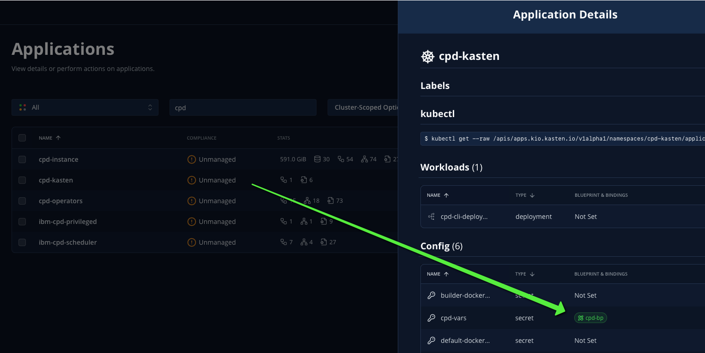
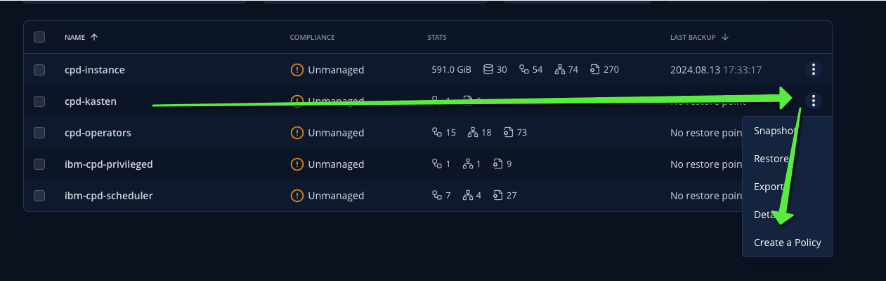

# Goal 

Implement backup and restore for Cloud Pak for Data (CPD) with Kasten.

## What is CPD

IBM Cloud Pak’s are containerized software solutions designed to accelerate application modernization with pre-integrated data, 
automation and security capabilities. This software delivers a comprehensive and unified hybrid cloud platform experience, enabling business and IT 
teams to build and modernize applications faster across any cloud or IT infrastructure. 

IBM currently offers 6 Cloud Pak’s and each of these Cloud Pak’s has their own unique capabilities and use cases it solves.

- IBM Cloud Pak for Data
- IBM Cloud Pak for Business Automation
- IBM Cloud Pak for AIOps
- IBM Cloud Pak for Integration
- IBM Cloud Pak for Network Automation
- IBM Cloud Pak for Applications

The blueprint and the guide that comes along is focussed on [CPD](https://www.ibm.com/docs/en/cloud-paks/cp-data/5.1.x?topic=installing-administering-cloud-pak-data) (Cloud Pak for Data)

# limitations and important considerations

This is the first version of this blueprint and it has this limitations :
   - We support only Online backup not Offline 
   - We support only component that does not require specfic backup procedure (most of them does not require specific procedures, for instance datastage or watson studio are covered)
   - We support only restore on the same cluster not on another cluster
   - We don't use the Kasten datamover but leverage the OADP datamover whih has a very important conscequence : 
   - **In case of disaster, if you loose the snapshot created by OADP, you won't be able to recover !**

## Why are we not using the kasten datamover ?

In the long term Kasten will replace entirely OADP (for backing up data and metadata) but not CPDBR which is the backup orchestration layer of CPD. For the moment CPDBR is too coupled to OADP to make this possible.

IBM is working on [defining interfaces that will let third party backup tool work with CPD](https://community.ibm.com/community/user/blogs/yip-hing-ng/2025/03/28/an-introduction-to-backup-and-restore-service-orch), 
but this is a long process and as soon as those interfaces will be defined we will adapt the blueprint so that OADP could be removed. 

Kasten will call the cpd-cli that will call on its turn CPDBR following this flow : `Kasten → cpd-cli → CPDBR → Service Orchestration → OADP → Storage Provider`

## Mid term remediation 

Today Kasten know how protect the snapshot that he created but protecting snapshot created by a third party (like OADP) is a new feature that we are scoping.

Unfortunately there is no ETA yet and this feature may even not be relevant when IBM will provide the interfaces for third party backup tool to work with CPD.

However this can be a mid term remediation depending of the progress IBM do on this matter.

## Then what Kasten brings ? 

Kasten bring several advantages in this integration 
- **No system setting**, you don't have to configure a specific machine to manage all the cpd commands line installation, all is provided in a single container image maintained and executed by Kasten
- **Single pane of glass**, you'll trigger your backup/restore/delete from the same Kasten UI that you already use for your applications backup
- **Policy Management**, You'll have all the features that kasten policies brings: 
  - advanced Grand-Father-Son Retention,
  - advanced Frequency management, 
  - Backup Window and staggering, 
  - multi application backup (synchonize your cpd backup with your application backup), 
  - policy invocation through API. 
- **Monitoring, alerting**, if the CPD backup fail, the failure will bubble up in the Kasten metrics and trigger your alerting system 
- **Auditing**, Every backup/restore/delete actions are audited 
- **No rest client**, When the backup is very long IBM [suggest](https://www.ibm.com/docs/en/software-hub/5.1.x?topic=cluster-backup-restore-software-hub-oadp-utility#reference_gj3_4dm_ddc__rest_mode__title__1) triggering the backup in "rest" mode. With Kasten the kasten service account token won't expire and you don't need the rest client.

# Installing CPD 

I install the 5.1.3 version of CPD.

Installing CPD is quite an install and will take some time but the documentation is exact and well maintained. I had no difficulties it was just long. I did my installation on an ARO cluster (Azure Redhat Openshift). 

You'll find my notes on installing CPD in [Install CPD](install-cpd-ws-cpdbr/install-cpd.md) but your reference is the [official documentation](https://www.ibm.com/docs/en/cloud-paks/cp-data/5.1.x?topic=installing-administering-cloud-pak-data) which was also my starting point.

# Use your own service or execute the watson studio tutorial 

In order to create some data to test backup and restore we propose a [watson studio tutorial](install-cpd-ws-cpdbr/watson-studio-tutorial.md), we'll install Watson Studio (ws) and we'll create some user/project/notebook.

# Installing CPDBR (CPD backup & Restore) 

Backing up CPD require a lot of pre-check, pre-action, filtering and post-check. IBM developped CPDDBR (CPD backup and restore) which leverage the CPD Service Orchestration.

The flow is `User → cpd-cli → CPDBR → Service Orchestration → OADP → Storage Provider`

Even if the blueprint will act as the cpd-cli we still need to install CPDBR and OADP on the cluster. This is covered in [my note](install-cpd-ws-cpdbr/install-cpdbr.md) but your reference is [the official documentation](https://www.ibm.com/docs/en/software-hub/5.1.x?topic=hub-installing-backup-restore-software).  

In my note I execute a full backup/restore worflow manually, we strongly advice that you do the same at least once in your cluster before execuiting in the bleuprint.


# Create the cpd-cli image for your registry or use the default one defined in the blueprint

This image embed the 
 - Kasten/Kanister tools
 - a bunch of kubernetes utility (helm, kubernetes)
 - cpd-cli and its plugins 
 - oc command line 

```
# change this according to your registry/image 
REGISTRY=docker.io
IMAGE=$REGISTRY/michaelcourcy/kasten-cpd

HELM_VERSION=3.7.1
KUBECTL_VERSION=1.32.0
KASTEN_VERSION=8.0.2

TAG=k10$KASTEN_VERSION-cpd5.1.x

docker build --platform linux/amd64 \
     -t $IMAGE:$TAG \
     --build-arg HELM_VERSION=$HELM_VERSION \
     --build-arg KUBECTL_VERSION=$KUBECTL_VERSION \
     --build-arg KASTEN_VERSION=$KASTEN_VERSION \
     docker/cpd5.1.x

docker push $IMAGE:$TAG
```

# Install the blueprint 

**Prerequisite** 
- [CPD is installed](install-cpd-ws-cpdbr/install-cpd.md) 
- [CPDBR is installed](install-cpd-ws-cpdbr/install-cpdbr.md) included the oadp operator and the DPA.
- A successful manual backup and restore has been tested, at least once


## Create the blueprint

The blueprint contains the 3 actions backup/restore/delete so that you'll be able manage your cpd restorepoints.

> If you rebuild your own image don't forget to change it in the blueprint `image: michaelcourcy/kasten-cpd:k108.0.2-cpd5.1.x` by editing the file cpd-bp.yaml.


```
oc create -f cpd-bp.yaml
```

## Create the namespace that will run the blueprint

Create a namespace cpd-kasten

```
oc create ns cpd-kasten
```

Create the secret and litteral key:value that will be used as export variable.

```
oc create secret generic cpd-vars -n cpd-kasten \
   --from-literal=PROJECT_CPD_INST_OPERANDS="cpd-instance" \
   --from-literal=PROJECT_CPD_INST_OPERATORS="cpd-operators" \
   --from-literal=PROJECT_SCHEDULING_SERVICE="ibm-cpd-scheduler" \
   --from-literal=OADP_PROJECT="openshift-adp"
```


Bind the cpd blueprint to the secret.
```
oc annotate secret cpd-vars -n cpd-kasten kanister.kasten.io/blueprint=cpd-bp
```

## Create a service account with cluster-admin role 

It is explicitly stated [in the IBM documenation](https://www.ibm.com/docs/en/software-hub/5.1.x?topic=cluster-backup-restore-software-hub-oadp-utility#reference_gj3_4dm_ddc__rest_mode__title__1) that the backups and restore operations must be executed as a cluster-admin. 

>  By default, the IBM Software Hub OADP backup and restore utility runs in Kubernetes mode. In this mode, you must log in to your Red Hat OpenShift cluster and **you must have Kubernetes cluster administrator privileges to use the utility**.

Hence the blueprint will have to execute as cluster-admin. For that we will give cluster-admin role to the default service account in the cpd-kasten namespace.
```
oc adm policy add-cluster-role-to-user cluster-admin -z default -n cpd-kasten
```

## Create a tool container 

The tool container is a deployment that will use the `kasten-cpd` image.

This will help you : 
- validate that the blueprint which will use the same image within the same namespace and the same service account is executing properly all the `cpd-cli oadp *` operations. 
- not recreate a host where you have to manage the installation and configuration of all the executable needed for the `cpd-cli oadp *` operations all that is already built in the `kasten-cpd` image.
- run maintenance or troubleshooting operations when needed


### Deploy the container 

We created a deployment that is using the same image than the blueprint's image.

```
oc create -f test-cpd-cli-deployment.yaml
```

### check that you can run cpd-cli command in the container 

Shell in the container 
```
oc rsh -n cpd-kasten deployments/cpd-cli-deployment
```

In the container check that you can list the tenant backup that you already created if you followed [install cpdbr](./install-cpdbr.md).

```
export HOME=/tmp
cd /tmp/
# change it if you use another namespace for OADP
OADP_PROJECT=openshift-adp
cpd-cli oadp client config set namespace=$OADP_PROJECT
cpd-cli oadp tenant-backup list
```

You should get an output similar to this one
```
NAME                            MODE    ORCHESTRATION   RESOLVED_NAMESPACES             STATUS          ERRORS  WARNINGS        START_TIME              END_TIME                CURRENT_ACTION
cpd-oadp-tenant-backup-2        online  service         cpd-operators,cpd-instance      Completed       0       0               2025-06-19 3:30:01 PM   2025-06-19 3:38:40 PM   -             
```

Check whether the services that you are using support platform backup and restore by [reviewing Services that support backup and restore](https://www.ibm.com/docs/en/SSNFH6_5.1.x/hub/admin/backup_restore_service_list.html). You can also run the following command:
```
cpd-cli oadp service-registry check \
--tenant-operator-namespace ${PROJECT_CPD_INST_OPERATORS} \
--verbose \
--log-level debug
```


# Create a backup policy and follow up the operations

Now you can create a backup policy for the namespace cpd-kasten.

Find the cpd-kasten app and check the blueprint is bound to the cpd-vars secret 


Then from the burger menu click on create a policy 


and do not forget to set up an export and a kanister profile.


Each time the policy will execute the backup of 
- The cpd scheduling project 
- The cpd operators project 
- the cpd operands project 
Using the cpd-cli utility.

If you need to follow up the logs of your backup operations you can simply follow the logs of the kanister kubetask pod.

```
oc logs -n cpd-kasten -l createdBy=kanister -f 
```

# Restore a backup

You need first to remove manually the cpd instance, operators and scheduling service. 

Follow the same process described in Test the [cpd-cli container](#test-the-container) and shell to it. 

In the container, follow the procedure described in the IBM documentation. [clean up the cpd-operators and cpd-instance](https://www.ibm.com/docs/en/software-hub/5.1.x?topic=cluster-backup-restore-software-hub-oadp-utility#reference_nll_kjz_tcc) namespace.

There is also instructions for [uninstalling the scheduling service](https://www.ibm.com/docs/en/software-hub/5.1.x?topic=services-uninstalling-scheduling-service) but 
they were not successful for us and it was simpler to remove entiremy and restore the scheduling service.

```
# create the env variable 
export PROJECT_CPD_INST_OPERANDS="cpd-instance" 
export PROJECT_CPD_INST_OPERATORS="cpd-operators" 
export PROJECT_SCHEDULING_SERVICE="ibm-cpd-scheduler" 
export OADP_PROJECT="openshift-adp"

# set up the cpd-cli oadp client
export HOME=/tmp
cd /tmp/
cpd-cli oadp client config set namespace=$OADP_PROJECT

# check no namespace are in terminating state otherwise restore fails
/cpd-kasten-script/no-ns-in-terminating-state.sh

# cleanup the cps namespaces operators, instance and scheduling before restoring
/cpd-kasten-script/cpd-pre-restore-cleanup.sh --additional-namespaces="$PROJECT_CPD_INST_OPERANDS,$PROJECT_CPD_INST_OPERATORS,$PROJECT_SCHEDULING_SERVICE"
```

Now in Kasten find the restore point and simply click restore this will restore the cpd operator, instance and scheduling namespace.

# Delete a backup

Delete the restores point and it will delete the cpd-oadp backup artifacts.

If your policy define a retention, deletion will happen automatically following the retention table.

# Nest steps 

The next steps will be 
- Offline backup (instead of online backup)
- Disaster recovery


Coming soon ...