# Watson studio tutorial 

[Documentation](https://www.ibm.com/docs/en/software-hub/5.1.x?topic=services-watson-studio)

Watson studio belong to the AI services umbrella. 

## Installing

[Documenation](https://www.ibm.com/docs/en/software-hub/5.1.x?topic=studio-installing)

The previous step let us meet all the prerequisite so now we can directly install the operator 

```
cpd-cli manage apply-olm \
--release=${VERSION} \
--cpd_operator_ns=${PROJECT_CPD_INST_OPERATORS} \
--components=ws
```

You should end up with this output 

```
...
utils : check for an existing subscription for package ibm-cpd-datarefinery --- 4.65s
utils : applying operator subscription ibm-cpd-datarefinery-operator with ibm-cpd-datarefinery-operator-catalog --- 3.38s
utils : The following command will download the following CASE package: ibm-elasticsearch-operator 1.1.2667. If you download the CASE package manually, wait for the download to complete before proceeding. --- 3.34s
utils : The following command will download the following CASE package: ibm-wsl 10.2.0. If you download the CASE package manually, wait for the download to complete before proceeding. --- 3.26s
running pre-validation routines (if any) for post_apply_olm..
Mon Jun 16 09:33:10 UTC 2025
[SUCCESS] 2025-06-16T11:33:10.746188Z You may find output and logs in the /Users/michaelcourcy/kasten.io/github/kasten-cpd/cpd-cli-workspace/work directory.
[SUCCESS] 2025-06-16T11:33:10.746283Z The apply-olm command ran successfully.
```

Now that operator is deployed we can create a CR (Custom resource)

```
cpd-cli manage apply-cr \
--components=ws \
--release=${VERSION} \
--cpd_instance_ns=${PROJECT_CPD_INST_OPERANDS} \
--block_storage_class=${STG_CLASS_BLOCK} \
--file_storage_class=${STG_CLASS_FILE} \
--license_acceptance=true
```

You should end up with this output 
```
2025-06-16 10:10:36,414 - INFO: register_perspectives_using_components_list:576 -- Registering perspective icp4data for component ws
2025-06-16 10:10:37,598 - INFO: register_single_perspective:339 -- Perspective icp4data has been successfully registered.
2025-06-16 10:10:37,601 - INFO: register_single_perspective:358 -- Uploading images, icons and logos to objectstore for perspective icp4data.
2025-06-16 10:10:37,601 - INFO: register_single_perspective:364 -- platform_route = https://cpd-cpd-instance.apps.se-lab-aro-prod.dev.azure.kasten.io
2025-06-16 10:10:39,253 - INFO: register_single_perspective:428 -- Successfully uploaded required images to objectstore for perspective icp4data
2025-06-16 10:10:39,254 - INFO: register_perspectives_using_components_list:590 -- Successfully registered perspective icp4data and uploaded required images for component ws
2025-06-16 10:10:39,255 - INFO: register_perspectives:656 -- Successfully processed/registered perspectives ['core'] for a specified list of components ws
2025-06-16 10:10:39,255 - INFO: <module>:787 -- The register_perspectives.py script ran successfully. End of the log.
2025-06-16 10:10:39,256 - INFO: <module>:788 -- =====================================================================
[SUCCESS] 2025-06-16T12:10:39.365223Z You may find output and logs in the /Users/michaelcourcy/kasten.io/github/kasten-cpd/cpd-cli-workspace/work directory.
[SUCCESS] 2025-06-16T12:10:39.365398Z The apply-cr command ran successfully.
```

If you want to confirm that the custom resource status is Completed, you can run the cpd-cli manage get-cr-status command:
```
cpd-cli manage get-cr-status \
--cpd_instance_ns=${PROJECT_CPD_INST_OPERANDS} \
--components=ws
```

You should see something like that in your ouput 
```
[INFO] The results of the command as a chart:
Components    CR Kind    CR Name    Creation Timestamp    Namespace     Expected Version    Reconciled Version      Operator Information  Progress    Progress Message               Reconcile History                                                               Status
------------  ---------  ---------  --------------------  ------------  ------------------  --------------------  ----------------------  ----------  -----------------------------  ------------------------------------------------------------------------------  ---------
ws            WS         ws-cr      2025-06-16T09:38:28Z  cpd-instance  10.2.0              10.2.0                                    24  100%        Last reconciliation succeeded  2025-06-16T09:57:55.35341Z The last reconciliation was completed successfully.  Completed
```

## Getting started with Watson Studio

Use the route cpd in the cpd-instance project and select the openshift authentication.

From the navigation menu, select Services > Services catalog.

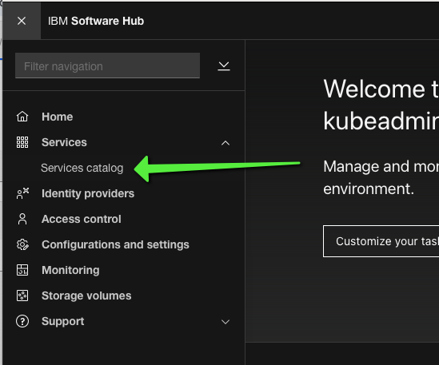

Then select watson studio 

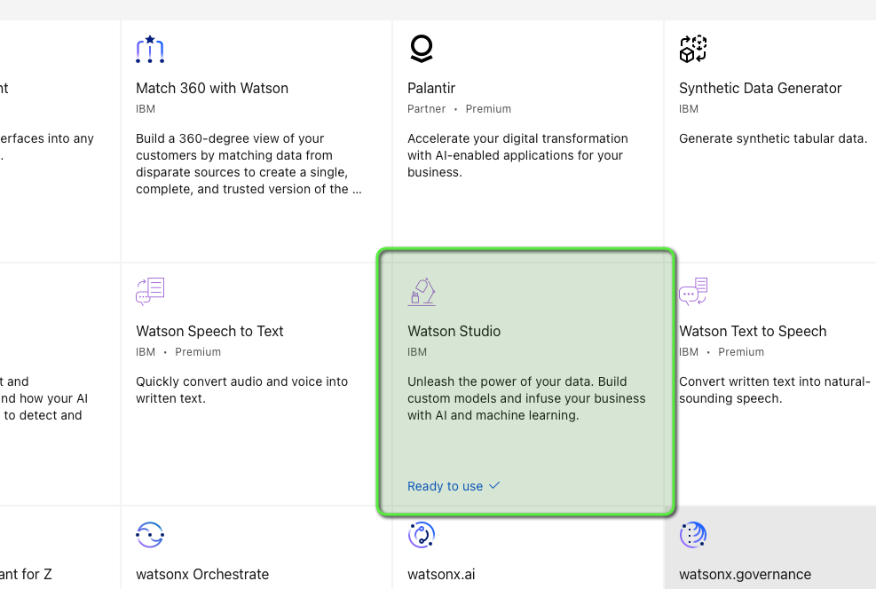

We need first to give authorization to a user to create project. In the top menu go to access control

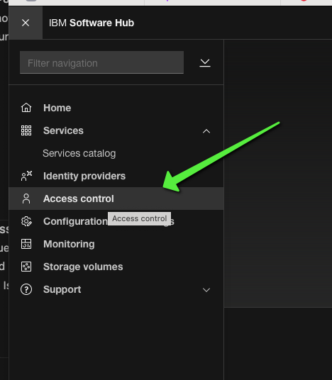

Click on Add User (actually you are not adding user but you are adding roles to user)

Select a user that exist in your openshift user 

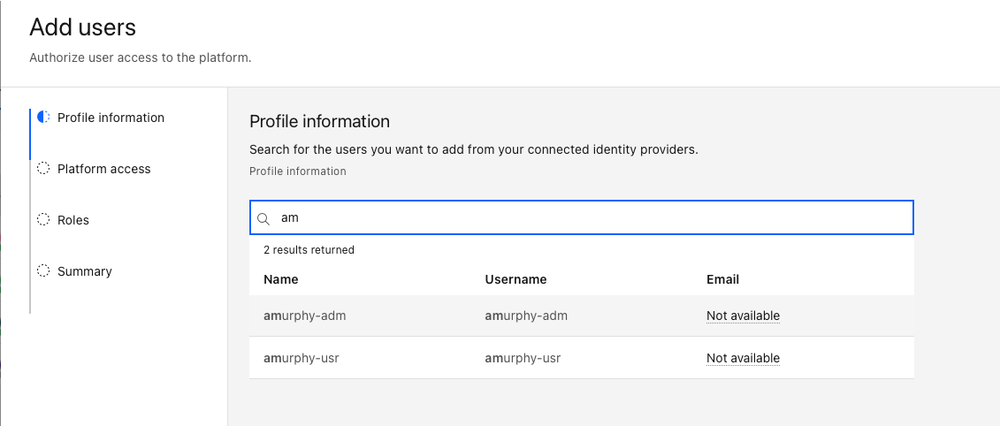

The click next and select assign roles directly 

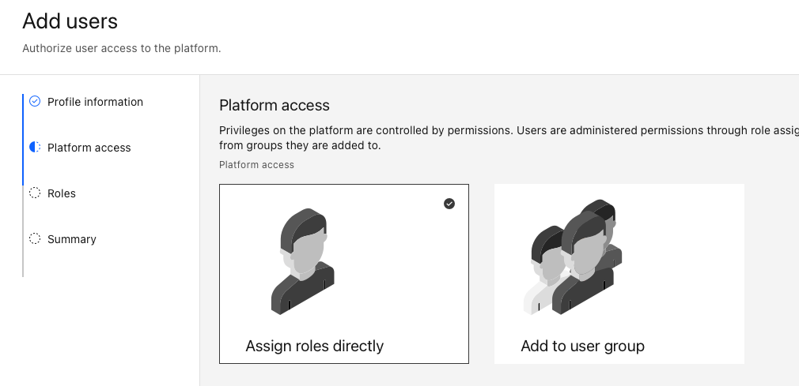

Then select all but administrator

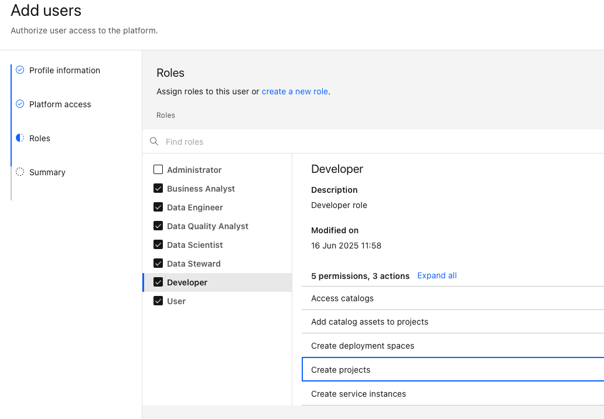

Click Next and Add. 

Open a private (incognito) windows and connect as amurphy-adm then select all projects 

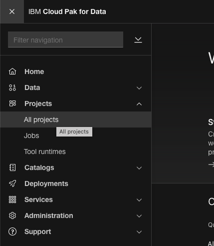

Click on create a new project. As watson studio is the only module installed, by default the project is a watson studio project. 

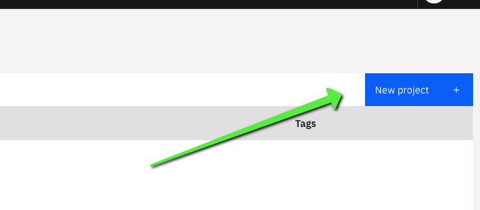

Give minimum of information and click create a notebook

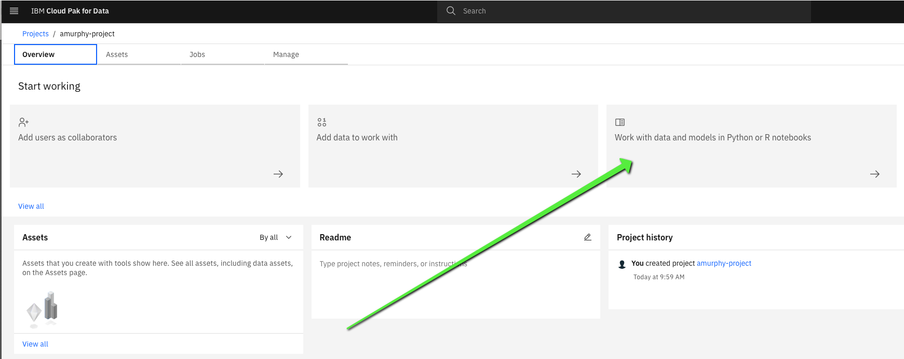

Choose the default for the notebook

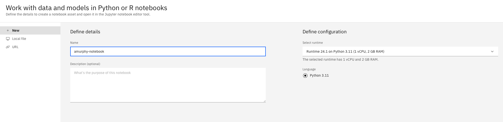

Click create and you should see a new notebook in the cpd-instance namespace 

```
oc get po -n cpd-instance -l type=jupyter-241n-py
NAME                                                              READY   STATUS    RESTARTS   AGE
jupyter-241n-py-d1a7ad6f-4f88-43c0-ad83-7ede1e8f7bf0-789684w74g   1/1     Running   0          6m8s

```

Now let's do some work with data 

Click on code snippet and choose data ingestion 

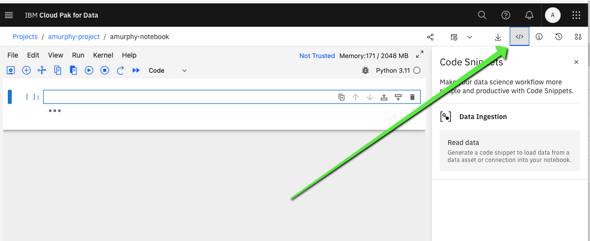

Upload this [volcano json file](./VolcanoData.json)

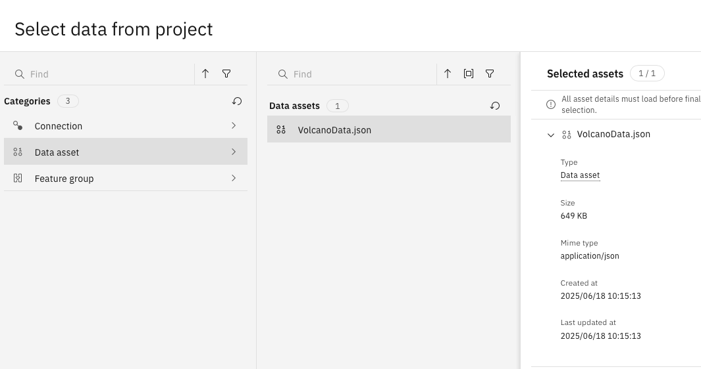

And choose the default the panda data frame 
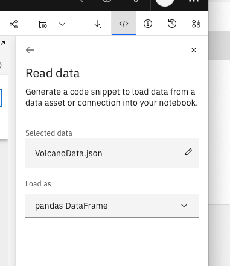

And click on "insert code to cell" and execute the code to see the data frame.

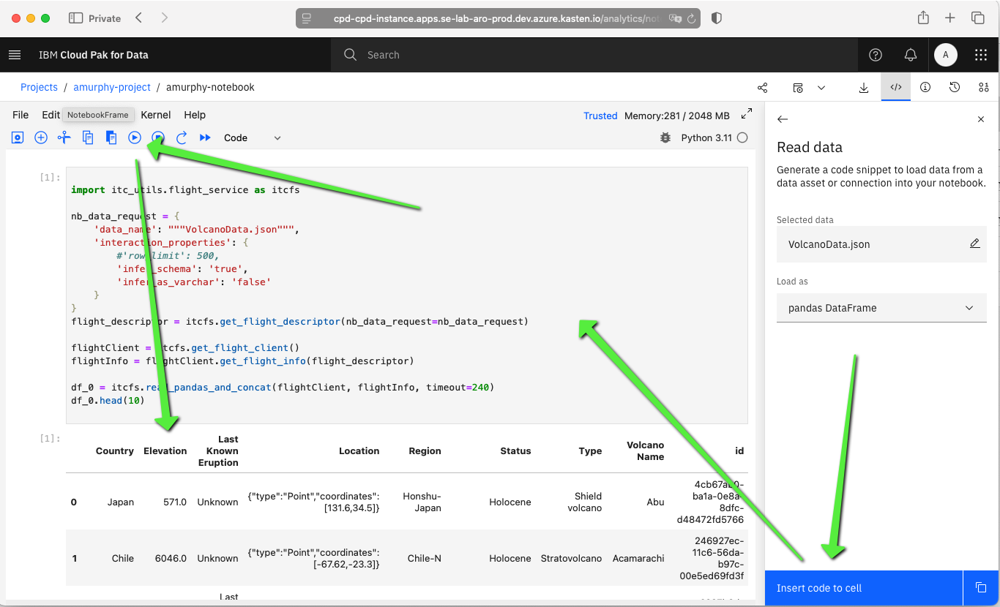

Now save the notebook 

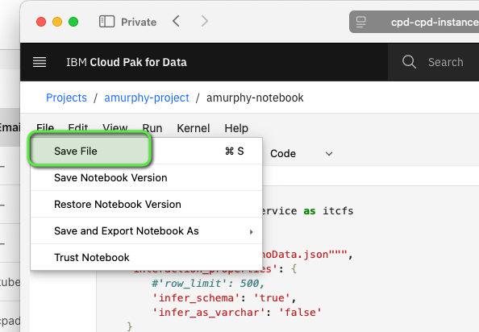

Congratualtion you have created your first notebook. Now let's see how we can backup and restore this. 