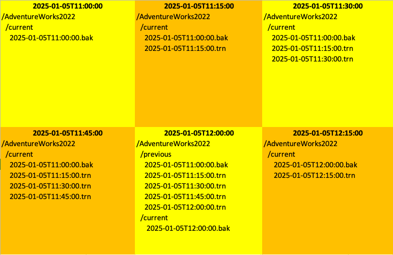
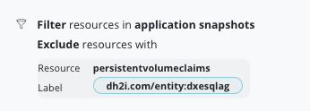

# Architecture Reference for Using DH2I MSSQL with Kasten by Veeam

## Goal

This document demonstrates how to integrate the DH2I MSSQL operator with Kasten by Veeam. The integration enables fast, consistent backups for an MSSQL cluster managed by DH2I’s operator, which creates an Availability Group and associated listeners on Kubernetes.

## Architecture Card

| Description                                   | Values                                                                                                                               | Comment                                                                                                                                                                          |
|-----------------------------------------------|--------------------------------------------------------------------------------------------------------------------------------------|----------------------------------------------------------------------------------------------------------------------------------------------------------------------------------|
| **Database**                                  | MSSQL                                                                                                                                | MSSQL with an Availability Group                                                                                                                                                |
| **Database Version Tested**                   | Microsoft SQL Server 2022 (RTM-CU16) (KB5048033) – 16.0.4165.4 (X64) <br> Nov 6 2024 19:24:49 Developer Edition on Linux (Ubuntu 22.04.5 LTS) | Docker image tag: `mcr.microsoft.com/mssql/server:latest`                                                                                                                       |
| **Operator Vendor**                           | [DH2I](https://dh2i.com)                                                                                                               | License required                                                                                                                                                                  |
| **Operator Vendor Validation**                | In progress                                                                                                                          |                                                                                                                                                                                  |
| **Operator Version Tested**                   | `docker.io/dh2i/dxoperator:1.0`                                                                                                        |                                                                                                                                                                                  |
| **High Availability**                         | Yes                                                                                                                                  | The database must be added to an Availability Group. See [install AdventureWorks2022 example](#lets-install-the-adventureworks2022-database-in-the-availability-group) for details. |
| **Unsafe Backup & Restore without Pod Errors**| Yes                                                                                                                                  | See [Unsafe Backup and Restore](#unsafe-backup-and-restore)                                                                                                                   |
| **PIT (Point In Time) Support**               | Yes                                                                                                                                  | Refer to the [limitations](#limitations) section for recovery point objective considerations                                                                                    |
| **Blueprint and BlueprintBinding Example**    | Yes                                                                                                                                  | Only applies to databases belonging to the Availability Group; see [limitations](#limitations) for details                                                                        |
| **Blueprint Actions**                         | Backup & Restore                                                                                                                     | Deletion is performed via restore point deletion as backup artifacts reside on a shared PVC                                                                                    |
| **Backup Performance Impact on the Database** | None                                                                                                                                | Backups occur on a secondary replica, ensuring no performance impact on the primary database                                                                                     |

## Limitations

- **PIT Restore Constraints:**  
  Point-in-time (PIT) restore is only possible between two backups—not after the last backup. Therefore, the recovery point objective (RPO) will depend on your backup frequency.
- **Scope of Blueprint:**  
  The blueprint supports backing up and restoring databases that belong to the Availability Group only.

## Architecture Diagrams

Below is an overview of the architecture:

```
+---------------------------+       +---------------------------+       +---------------------------+
|                           |       |                           |       |                           |
| SQL Server Instance 1     |       | SQL Server Instance 2     |       | SQL Server Instance 3     |
| (Primary Replica)         |       | (Secondary Replica)       |       | (Secondary Replica)       |
|                           |       |                           |       |                           |
| /var/opt/mssql            |       | /var/opt/mssql            |       | /var/opt/mssql            |
| (mssql-dxesqlag-0 pvc)    |       | (mssql-dxesqlag-1 pvc)    |       | (mssql-dxesqlag-2 pvc)    |
| /etc/dh2i                 |       | /etc/dh2i                 |       | /etc/dh2i                 |
| (dxe-dxesqlag-0 pvc)      |       | (dxe-dxesqlag-1 pvc)      |       | (dxe-dxesqlag-2 pvc)      |
| /backup                   |       | /backup                   |       | /backup                   |
| (shared backup pvc)       |       | (shared backup pvc)       |       | (shared backup pvc)       |
+-------------+-------------+       +-------------+-------------+       +-------------+-------------+
              |                                   |                                   |           ^
              |                                   |                                   |           |
              +-----------------------------------+-----------------------------------+           |
                                                  |                                               |                                   
                                                  |                                               |                                   
                                                  v                                               |                                   
                                        +---------------------+                                   |
                                        | Availability Group  |                                   |
                                        +---------------------+                                   |
                                                  |                                               |
                                                  |                                               |                                   
     +---------------------------+                v                                  Backup databases on /backup  
     | All PVCs in Namespace     |      +---------------------+                      (full backup and log backup)   
     |                           |      | Load Balancer       |                                   |
     | mssql-dxesqlag-0/1/2 pvc  |      | Listener 14033      |                                   |
     | dxe-dxesqlag-0/1/2 pvc    |      +---------------------+                                   |
     | shared backup pvc         |                ^                                               |
     +---------------------------+                |                                               |
                    ^                             | Restore databases on primary from /backup     |
                    |                             |                                               |
         Backup only backup PVC                   |                                               |
         Restore only backup PVC                  |                                               |
                    |                   +---------------------+                                   |
                    +-------------------| Kasten K10          |-------------------+---------------+
                                        | Backup & Restore    |
                                        +---------------------+
                                                  |
                                                  | export 
                                                  v
                                        +---------------------+
                                        | S3 Storage          |
                                        | (Backup Repository) |
                                        +---------------------+
```

- The DH2I operator deploys an MSSQL cluster with an Availability Group.  
- A **single shared PVC** is created and mounted on each instance at `/backup`.  
- **Backup Process:**  
  - Kasten runs backups (full and log) against the shared backup PVC on a secondary replica.  
  - Only the backup contents (from `/backup`) are protected and restored; database PVCs are managed by the operator.  
- **Restore Process:**  
  - A restoration operation involves restoring the backup PVC, after which the operator re-creates the database PVCs and the databases are restored from backup.

## Installation and Configuration

### 1. Install the Operator

Follow the [DH2I documentation](https://support.dh2i.com/dxoperator/guides/dxoperator-qsg/) to install the operator:

```bash
wget https://dxoperator.dh2i.com/dxesqlag/files/v1-cu2.yaml
kubectl apply -f v1-cu2.yaml
```

### 2. Create the Namespace and Configure Secrets

Create the namespace and set it as the current context:

```bash
kubectl create ns mssql
kubectl config set-context --current --namespace=mssql
```

Create the required secrets for the MSSQL instance and for DH2I:

```bash
kubectl create secret generic mssql --from-literal=MSSQL_SA_PASSWORD='MyP@SSw0rd1!'
kubectl create secret generic dxe --from-literal=DX_PASSKEY='MyP@SSw0rd1!' --from-literal=DX_LICENSE='AAAA-BBBB-CCCC-DDDD'
```

### 3. Create a Custom Configuration Map (Optional)

If custom configuration is needed, create a ConfigMap:

```bash
cat <<EOF | kubectl create -f -
apiVersion: v1
kind: ConfigMap
metadata:
  name: mssql-config    
data: 
  mssql.conf: |
    [EULA]
    accepteula = Y

    [network]
    tcpport = 1433

    [sqlagent]
    enabled = true
EOF
```

### 4. Create the Shared Backup PVC

This PVC must use a ReadWriteMany storage class and support volume snapshots. For example, using Azure Files:

```bash
cat <<EOF | kubectl create -f -
apiVersion: v1
kind: PersistentVolumeClaim
metadata:
  name: backup  
spec:
  accessModes:
    - ReadWriteMany
  resources:
    requests:
      storage: 20Gi
  storageClassName: azurefile
EOF
```

### 5. Create the DH2I MSSQL Cluster

Use a custom resource definition (CRD) to deploy your MSSQL cluster:

```bash
cat <<EOF | kubectl create -f -
apiVersion: dh2i.com/v1
kind: DxEnterpriseSqlAg
metadata:
  name: dxesqlag
spec:
  synchronousReplicas: 3
  asynchronousReplicas: 0
  configurationOnlyReplicas: 0
  availabilityGroupName: AG1
  availabilityGroupListenerPort: 14033
  availabilityGroupOptions: null
  availabilityGroupClusterType: EXTERNAL
  createLoadBalancers: true
  template:
    metadata:
      labels:
        label: example
      annotations:
        annotation: example
    spec:
      dxEnterpriseContainer:
        image: "docker.io/dh2i/dxe:latest"
        imagePullPolicy: Always
        acceptEula: true
        clusterSecret: dxe
        vhostName: VHOST1
        joinExistingCluster: false
        volumeMounts:
          - mountPath: /backup
            name: backup
        volumeClaimConfiguration:
          storageClassName: managed-premium
          resources:
            requests:
              storage: 1Gi
      mssqlServerContainer:
        image: "mcr.microsoft.com/mssql/server:latest"
        imagePullPolicy: Always
        mssqlSecret: mssql
        acceptEula: true
        mssqlPID: Developer
        mssqlConfigMap: mssql-config  # Only needed if you created a ConfigMap
        volumeMounts:
          - mountPath: /backup
            name: backup
        volumeClaimConfiguration:
          storageClassName: managed-premium
          resources:
            requests:
              storage: 2Gi
      containers:
        - name: mssql-tools
          image: "mcr.microsoft.com/mssql-tools"
          command: [ "/bin/sh" ]
          args: [ "-c", "tail -f /dev/null" ]
          volumeMounts:
            - mountPath: /backup
              name: backup
      volumes:
        - name: backup
          persistentVolumeClaim:
            claimName: backup
EOF
```

### 6. Create the Listener Service

Create a LoadBalancer service for the Availability Group listener:

```bash
cat <<EOF | kubectl create -f -
apiVersion: v1
kind: Service
metadata:
  name: dxemssql-cluster-lb
spec:
  type: LoadBalancer
  selector:
    dh2i.com/entity: dxesqlag
  ports:
    - name: sql
      protocol: TCP
      port: 1433
      targetPort: 1433
    - name: listener
      protocol: TCP
      port: 14033
      targetPort: 14033
    - name: dxe
      protocol: TCP
      port: 7979
      targetPort: 7979
EOF
```

### 7. Verify and Connect

Wait for all pods to become ready. Connect from the first pod to verify connectivity:

```bash
kubectl exec -it dxesqlag-0 -c mssql-tools -- /opt/mssql-tools/bin/sqlcmd -S localhost -U sa -P 'MyP@SSw0rd1!'
```

> **Tip:** In SQL commands executed via `sqlcmd`, each statement should be followed by the `GO` command.

### 8. Create an Alias for Simplicity

For easier access, you can create an alias that connects to the listener:

```bash
alias dx="kubectl exec dxesqlag-0 -c mssql-tools -it -- /opt/mssql-tools/bin/sqlcmd -S dxemssql-cluster-lb,14033 -U sa -P 'MyP@SSw0rd1\!'"
```

When you run `dx`, you connect to the primary database. To verify the primary node, run:

```sql
select @@servername;
```

### 9. Installing the AdventureWorks2022 Database

1. Find the primary server by executing:

   ```sql
   select @@servername;
   ```

2. Download the backup to the shared backup PVC:

   ```bash
   kubectl exec -it dxesqlag-0 -c mssql-tools -- /bin/bash
   curl -L -o /backup/AdventureWorks2022.bak https://github.com/Microsoft/sql-server-samples/releases/download/adventureworks/AdventureWorks2022.bak
   ```

3. Restore the database by discovering logical file names and running the restore via `sqlcmd` inside the container.

Discover the logical file name of the database 
```
RESTORE FILELISTONLY FROM DISK = '/backup/AdventureWorks2022.bak';
```
The 2 logical files we find from the output is AdventureWorks2022 and AdventureWorks2022_log
 
Now you can restore the database using this 2 virtual filename.
 ```
RESTORE DATABASE AdventureWorks2022 FROM DISK = '/backup/AdventureWorks2022.bak' WITH MOVE 'AdventureWorks2022' TO '/var/opt/mssql/data/AdventureWorks2022.mdf', MOVE 'AdventureWorks2022_log' TO '/var/opt/mssql/data/AdventureWorks2022.ldf', RECOVERY;
```

4. Add the database to the Availability Group:

In order to add the AdventureWorks2022 database in the availabilty group you need to swithc first in full recovery mode and take a backup. 

   ```sql
   ALTER DATABASE AdventureWorks2022 SET RECOVERY FULL;
   BACKUP DATABASE AdventureWorks2022 TO DISK = '/backup/AdventureWorks2022.bak';
   BACKUP LOG AdventureWorks2022 TO DISK = '/backup/AdventureWorks2022.trn';
   ```

Now we can add the database to the availability group 
   ```sql
   use master;
   ALTER AVAILABILITY GROUP AG1 ADD DATABASE AdventureWorks2022;
   ```

5. Verify replication on secondary replicas:

   ```bash
   kubectl exec dxesqlag-1 -c mssql -- ls /var/opt/mssql/data/AdventureWorks2022.mdf
   kubectl exec dxesqlag-2 -c mssql -- ls /var/opt/mssql/data/AdventureWorks2022.mdf
   ```

## Backup and Restore Workflow

### Backup Process

- **Pre-Backup:**  
  The blueprint uses a combination of full and log backups. A full backup is taken periodically, and incremental (log) backups are taken between full backups following a defined schedule (for example, a full backup every day and log backups every 15 minutes).

- **Storage Organization:**  
  The backup folder is organized into two directories, `current` and `previous`.  
  - The `current` directory holds the latest full backup and subsequent log backups.  
  - When it’s time for a new full backup, `current` is renamed to `previous`, and a new `current` is created.  
  - Only the most recent backup chain is maintained to control storage growth.

  

- **Annotation-Based Control:**  
  Annotations such as `kasten.io/numLogBackupsBeforeFullBackup` and `kasten.io/counterLogBackups` control when a full backup is triggered versus a log backup.

### Restore Options

- **Full Restore:**  
  Clicking “restore” in the Kasten dashboard triggers a full restore using the backup PVC.

- **Point in Time (PIT) Restore:**  
  For PIT restore, delete and recreate the target namespace, then create a ConfigMap (named `pit-restore`) with the desired UTC restore time. The blueprint automatically selects the correct backup chain based on this timestamp.
  ```
  kubectl create configmap pit-restore --from-literal=date='2025-02-12T04:32:12' 
  ```

  > Don't forget to delete this configmap at the end of the restore.

## Additional Considerations

- **Resource Impact:**  
  Backups run on secondary replicas to prevent performance degradation on primary nodes.  
- **Storage Requirements:**  
  The backup PVC must be sized to accommodate at least three times the size of a full backup, considering both `current` and `previous` directories.
- **Exclusion Filters:**  
  Use label-based exclusion filters in your backup policy to omit workload PVCs that are not needed during restore.

## Blueprint and Policy Deployment

### Deploying the Blueprints

1. **Create the DH2I Blueprint:**

   ```bash
   kubectl create -f mssql-bp.yaml
   kubectl create -f mssql-bp-binding.yaml
   ```

   These resources ensure that when Kasten backs up a DxEnterpriseSqlAg object, the blueprint is applied.

2. **Configure Your Backup Policy:**  
   Use your backup policy to include exclude filters (such as excluding PVCs with the label `dh2i.com/entity:dxesqlag`) 
   
   

## Testing and Troubleshooting

- **Testing Failover:**  
  Simulate a failover by deleting the primary pod and monitoring client connectivity through the listener.
- **Log Inspection:**  
  Use `kubectl logs` to inspect logs if pods are unhealthy. In many cases, simply deleting an unhealthy pod allows the operator to recreate it in the correct state.
- **PIT Restore:**  
  Test the PIT restore workflow by setting the proper ConfigMap value and verifying that the blueprint selects the correct restore chain.

## Conclusion

This blueprint provides:
- High Availability using an Availability Group for MSSQL.
- Backup on a secondary replica to avoid impacting the primary.
- Automated full and log backup/restore with support for PIT restore.
- A structured process using annotations to control backup frequency.

Before moving to production, thoroughly test your backup and restore processes in your environment to confirm all scenarios are handled as expected.

Happy backing up and restoring!