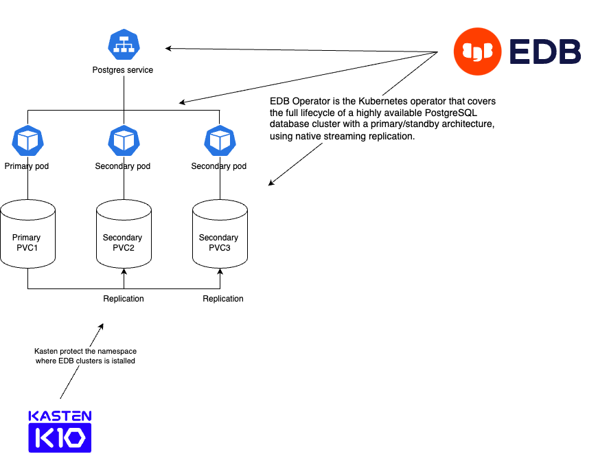
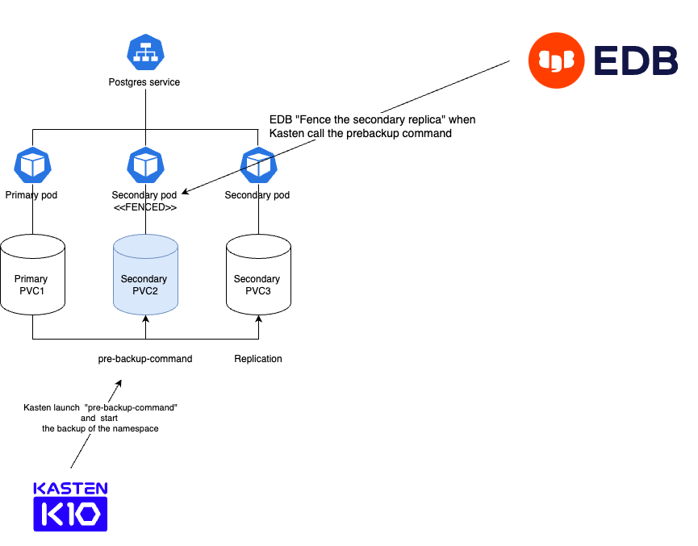
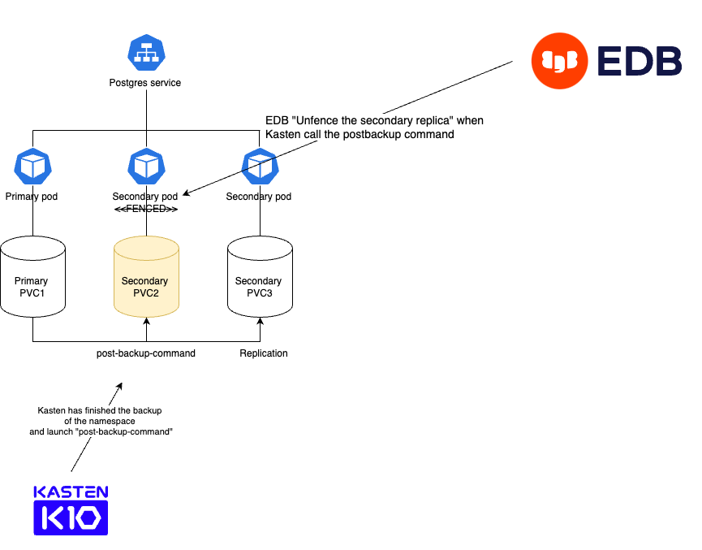
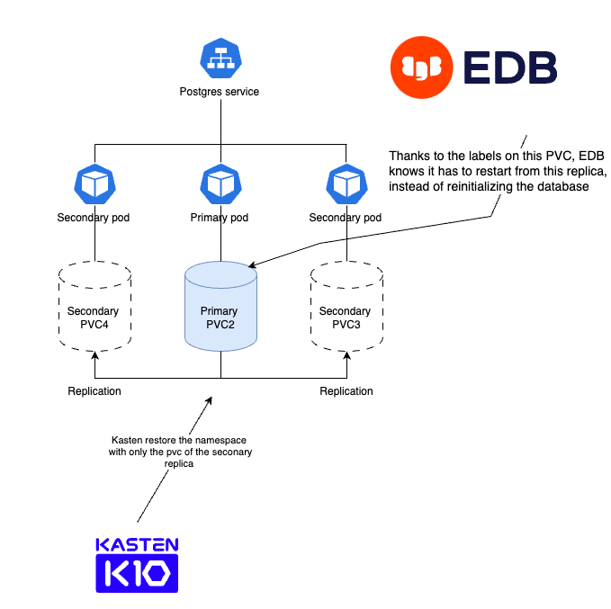
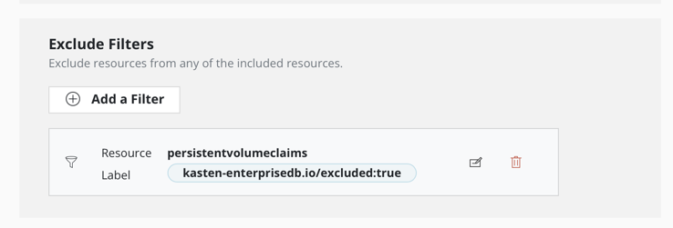
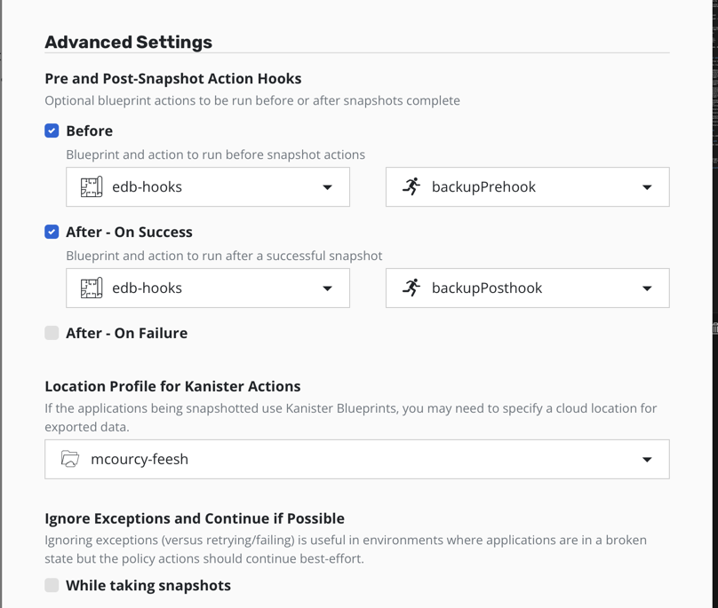
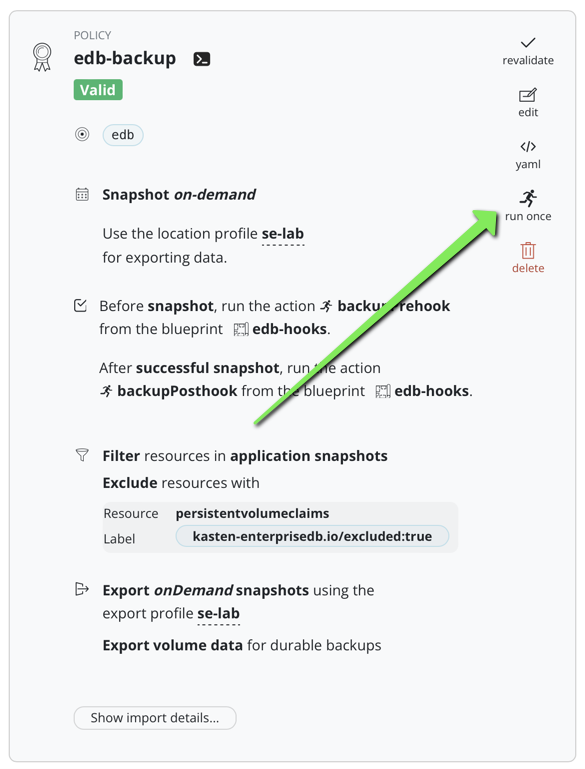
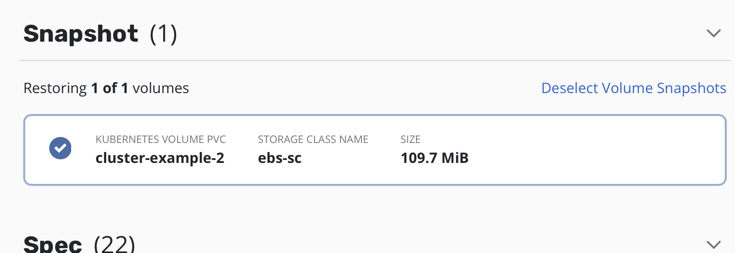
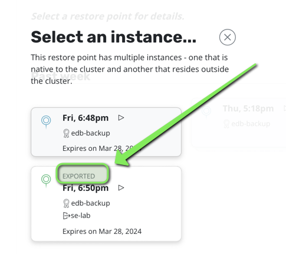

# EDB Kasten Integration

## Goals

This project demonstrates how to use Kasten with the EDB external backup adapter to create fast, consistent backups for an EDB cluster.

The [external backup adapter](https://www.enterprisedb.com/docs/postgres_for_kubernetes/latest/addons/) leverages annotations or labels to expose an API that third-party tools (such as Kasten) can invoke to perform a safe backup. This design takes full advantage of Kasten’s data management features to back up PVCs (with fully incremental and portable snapshots) while using the EDB API to obtain consistent backups of large clusters.

## Architecture Card

| Description                                   | Values                           | Comment                                    |
|-----------------------------------------------|----------------------------------|--------------------------------------------|
| **Database**                                  | Postgres                         | One primary, two replicas                  |
| **Database version tested**                   | Postgres 15.3                    |                                            |
| **Operator vendor**                           | [EDB](https://edb.com)           | License required                           |
| **Operator vendor validation**                | Fully validated                  |                                            |
| **Operator version tested**                   | 1.20.2                           |                                            |
| **High Availability**                         | Yes                              |                                            |
| **Unsafe backup & restore without pod errors**| Yes                              | See [Unsafe backup and restore](../#unsafe-backup-and-restore) |
| **PIT (Point in Time) support**               | No                               | See [limitations](#limitations) for RPO considerations |
| **Blueprint and BlueprintBinding example**    | Yes                              |                                            |
| **Blueprint actions**                         | Backup & Restore                 | Deletion is implemented via restorepoint deletion since backup artifacts reside on a shared PVC |
| **Backup performance impact**                 | None                             | Backups run on the secondary replica and do not affect the primary |

## Limitations

- This blueprint does not support point-in-time recovery.
- It does not implement incremental backup at the database level (though storage-level backups are incremental).

## How It Works

1. The EDB backup adapter applies annotations/labels on one of the replicas (not the primary) to specify the command required to switch the replica into backup mode (referred to as “fenced” in EDB terminology).
2. The Kasten pre-backup hook blueprint discovers this replica and calls the EDB pre-backup command on it. At this point, the replica is "fenced," and its PVC is in a fully consistent state for backup.
3. Kasten proceeds with the backup for the entire namespace following the configured policy. The policy excludes PVCs that carry the label `kasten-enterprisedb.io/excluded: "true"`, so only the PVC of the fenced replica is captured.
4. After the backup, the Kasten post-backup hook blueprint calls the EDB post-backup command to “unfence” the replica and return it to normal operation.
5. When Kasten restores the namespace, the EDB operator detects the PVC of the fenced replica, promotes it to primary, and rebuilds the remaining replica instances from it.

Below is a series of diagrams illustrating the workflow:

### Regular Operation


### Before Snapshot
When Kasten launches a backup, it first issues the command to "fence" a replica. This ensures that the primary instance remains unaffected and that transactions continue uninterrupted. The fencing process ensures a consistent snapshot of the replica’s PVC.



### After Snapshot
Once the snapshot is complete, the replica is "unfenced" and catches up with any transactions missed during fencing.



### Restore Process
During restore, Kasten restores the fenced PVC. Once restoration is complete, the operator promotes that replica to primary, and two read-only replicas are recreated from it.



## Getting Started

### Install the Operator

If you haven’t already installed the EDB operator on your Kubernetes cluster, run:

```bash
kubectl apply -f https://get.enterprisedb.io/cnp/postgresql-operator-1.20.2.yaml
```

This command creates the operator's namespace and deploys the controller.

### Create an EDB Cluster, Client, and Data

Create a new namespace and deploy your EDB cluster:

```bash
kubectl create ns edb
kubectl apply -f cluster-example.yaml -n edb
```

Wait until the cluster is fully ready:

```bash
kubectl get clusters.postgresql.k8s.enterprisedb.io -n edb
```

Example output:

```
NAME              AGE   INSTANCES   READY   STATUS                     PRIMARY
cluster-example   19m   3           3       Cluster in healthy state   cluster-example-1
```

Install the CNP plugin (if not already installed):

```bash
curl -sSfL https://github.com/EnterpriseDB/kubectl-cnp/raw/main/install.sh | sudo sh -s -- -b /usr/local/bin
```

Create a client certificate for your database:

```bash
kubectl cnp certificate cluster-app --cnp-cluster cluster-example --cnp-user app -n edb
```

Deploy your client:

```bash
kubectl create -f client.yaml -n edb
```

Load initial data:

```bash
kubectl exec -it deploy/cert-test -- bash
psql "$DATABASE_URL"
\c app
DROP TABLE IF EXISTS links;
CREATE TABLE links (
    id SERIAL PRIMARY KEY,
    url VARCHAR(255) NOT NULL,
    name VARCHAR(255) NOT NULL,
    description VARCHAR(255),
    last_update DATE
);
INSERT INTO links (url, name, description, last_update) VALUES('https://kasten.io','Kasten','Backup on Kubernetes',NOW());
SELECT * FROM links;
\q
exit
```

### Configure the Backup Annotations

If you created your cluster using `cluster-example.yaml`, the cluster already includes the Kasten addon. If not, add the following annotation to your cluster CR:

```yaml
"k8s.enterprisedb.io/addons": '["kasten"]'
```

### Install the EDB Blueprint

```bash
kubectl create -f edb-hooks.yaml
```

### Create a Backup Policy with Exclude Filters and Hooks

Define a Kasten policy for the `edb` namespace by setting up a location profile for export and Kanister actions.

#### Add the Exclude Filters

Set the following label to exclude PVCs that should not be backed up:

```yaml
kasten-enterprisedb.io/excluded: "true"
```



#### Add the Hooks

Configure the backup and restore hooks in the policy.



### Launch a Backup

Trigger a backup which will create two restore points: a local and a remote one.



In the restore point details, note that only one PVC is backed up—the one corresponding to the fenced replica.



### Testing a Restore

1. Delete the `edb` namespace:

   ```bash
   kubectl delete ns edb
   ```

   _Note: When you delete the namespace, any volume snapshots are also deleted. You must restore from the external location profile._

2. Perform a restore:

   

   Click "Restore" and wait for the EDB cluster to restart. You should see that the pod `cluster-example-2` starts immediately (without database initialization) and that `cluster-example-3` and `cluster-example-4` join shortly thereafter.

   Monitor pods:

   ```bash
   kubectl get po -n edb -w
   ```

3. Verify Your Data

   After restoration, check that your data is available by connecting to the client:

   ```bash
   kubectl exec -it deploy/cert-test -- bash
   psql "$DATABASE_URL"
   \c app
   SELECT * FROM links;
   \q
   exit
   ```

   Expected output:

   ```
    id |        url        |  name  |       description       | last_update 
   ----+-------------------+--------+-------------------------+-------------
     1 | https://kasten.io | Kasten | Backup on Kubernetes    | 2024-03-25
   ```

Happy backing up and restoring!