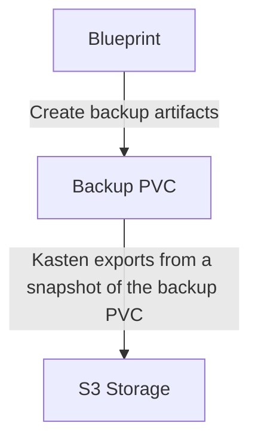

# Goal 

When building enterprise blueprint you often need a intermediate read/write/many (called RWX) storage to store your backup and that will be itself snapshotted to be protected by Kasten. This guide explain you how to build this storage if you don't have one already.

# Why do I need RWX storage with CSI snapshots for Enterprise Blueprint ?

If you already read the different enterprise blueprint you'll see many use cases that rely on a RWX CSI snaphotable storage .

For instances: 
- in the [dh2i](../dh2i/) blueprint the operator mount a shared folder between each pods where the mssql client can launch their full and log backup.
- in the [elasticsearch](../elasticsearch) blueprint each node in the elastic cluster need a common snapshot repository by mounting the same PVC





Having an intermediate storage to store the backup before having Kasten backing up this storage itself turns to be very practical:
- The kanister blueprint rely on it for backup and restore operation allowing the use of incremental dump or redo log streaming 
- Your DBA will be at home as he will face a directory built as usual and any "custom hotfix manual operation" is still possible if you don't want to run the kanister automation
- This intermediate backup location will be backed up itself by Kasten and incrementally. If you need to do some "custom hotfix manual operation" far in the past it's still possible, you just have to restore granulary the Kasten restorepoint and you'll retreive the "intermediate" backup location storage without executing the kanister automation.
- You'll be able to filter out the storage PVC used by the database because now the backup is living on this intermediate storage

# How do I build RWX storage with CSI snapshots ?

## Maybe you already have it ? 

You may already have a RWX storage with CSI Snapshot and you have nothing to do. For instance : 
- OpenShift Data Foundation (ODF) offers RWX capabilities and CSI snapshot support through CephFS and Kasten even supports shallow backup
- NetApp storage backends, including ONTAP, SolidFire, and Azure NetApp Files
- Dell EMC PowerFlex and Dell EMC PowerStore
- IBM Spectrum Scale
- Amazon EFS (Elastic File System) can be used with CSI (Container Storage Interface) and supports snapshots
- Azure File has recently provided support for CSI snapshot when using SMB protocol (snapshot is not supported with NFS protocol until now)
- Google Cloud Filestore is a managed file storage service that provides RWX capabilities and supports CSI snapshots
- LINSTOR provides RWX capabilities and supports CSI snapshots
- Portworx provides sharedV4 that supports CSI snapshots
- HPE storage backends, including HPE Nimble Storage and HPE 3PAR offers RWX capabilities and CSI snapshot support.

This list is not exhaustive and as a good practice we strongly advice to rely on a good storage provider. You should reach out your storage administrator and check with him if you're not just few minutes away from the solution.

## I only have an NFS sever

Maybe you don't have such storage and only have a NFS server. Then it's possible with the the 
[csi-driver-nfs](https://github.com/kubernetes-csi/csi-driver-nfs) project to build a "nearly" fully csi compliant storage. 

It works by using a NFS `share` that you defined at the level of the storage class
```
apiVersion: storage.k8s.io/v1
kind: StorageClass
metadata:
  name: nfs-csi
provisioner: nfs.csi.k8s.io
parameters:
  server: <my-nfs-server-adress>
  share: /
  # csi.storage.k8s.io/provisioner-secret is only needed for providing mountOptions in DeleteVolume
  # csi.storage.k8s.io/provisioner-secret-name: "mount-options"
  # csi.storage.k8s.io/provisioner-secret-namespace: "default"
reclaimPolicy: Delete
volumeBindingMode: Immediate
allowVolumeExpansion: true
mountOptions:
  - nfsvers=4.1
```

- Every time you create a PVC a directory with the name of the PV that is bound to the PVC will be created on the share
- Every time you create a Snapshot of the PVC a tar of this directory is created

## VERY IMPORTANT TO KNOW 

This driver is very practical if you have very limited storage however you must know that the snapshot of this specific
driver **are not crash consistent because it uses tar**. And tar is not a real snapshot solution. A snapshot solution 
ensure crash conistency which means that the data is in a state that would be consistent if the system crashed at any point during the backup process.

Creating a tar archive does not guarantee that the files being archived are in a consistent state, especially if the files are being modified during the tar process. To achieve crash consistency, you would need to ensure that the data is quiesced (i.e., all write operations are paused) before creating the tar archive.

**But for an intermediate backup storage when the blueprint finish its job and dump the data on the intermediate backup PVC  the data are indeed quiesced and it's safe to use tar for the "pseudo snapshot"**. Now your backup pvc can be fully managed 
by Kasten leveraging encryption, portability and immutability! 

# A full example on a kind cluster 


## Let's create one master and two worker nodes 

Let's create an environment where we have very limited storage option by creating a stand alone [kind cluster](https://kind.sigs.k8s.io) 

```
cat<<EOF | kind create cluster --config -
kind: Cluster
apiVersion: kind.x-k8s.io/v1alpha4
nodes:
  - role: control-plane
  - role: worker
  - role: worker
EOF
```

You should see this output 
```
Creating cluster "kind" ...
 ✓ Ensuring node image (kindest/node:v1.30.0) 🖼 
 ✓ Preparing nodes 📦 📦 📦  
 ✓ Writing configuration 📜 
 ✓ Starting control-plane 🕹️ 
 ✓ Installing CNI 🔌 
 ✓ Installing StorageClass 💾 
 ✓ Joining worker nodes 🚜 
Set kubectl context to "kind-kind"
You can now use your cluster with:

kubectl cluster-info --context kind-kind

Thanks for using kind! 😊
```

After the install you kube context is automatically updated to this new cluster. If you need to reconnect to the cluster 
```
kubectl config use-context kind-kind 
```

Let's verify what storage we have  
```
kubectl get storageclass
```

You'll see something like that 
```
NAME                 PROVISIONER             RECLAIMPOLICY   VOLUMEBINDINGMODE      ALLOWVOLUMEEXPANSION   AGE
standard (default)   rancher.io/local-path   Delete          WaitForFirstConsumer   false                  3m56s
```

The rancher.io/local-path provisioner is a simple Kubernetes storage provisioner that uses local storage on the node where the pod is scheduled. It is part of the Local Path Provisioner project by Rancher:
- When a PersistentVolumeClaim (PVC) is created, the Local Path Provisioner dynamically provisions a PersistentVolume (PV) by creating a directory on the local file system of the node where the pod is scheduled.
- The provisioner uses a predefined path on the host node to store the data.
- This provisioner is useful for development and testing environments where you want to use local storage instead of network-attached storage.


This provisioner is not a csi provisioner to verify you can check the installed CSI drivers using the following command:
```
kubectl get csidrivers.storage.k8s.io
```

If rancher.io/local-path is not listed, it confirms that it is not a CSI provisioner. In this specific situation we'll 
have 
```
no resources found
```

## Let's install the nfs-csi-driver 

### First let's make sure you have the snapshot APIs installed and the snapshot controller in your cluster.

```
kubectl get volumesnapshots
```

if you obtain
```
No resources found in default namespace.
```
You can skip this step, most likely the api and the snapshot controller is already installed on your cluster.


But If you obtain 
```
error: the server doesn't have a resource type "volumesnapshot"
```

It means that volumesnapshot api is not installed and most likely not the volume snapshot controller.

You need to install the VolumeSnapshot Custom Resource Definitions (CRDs) and the snapshot controller provided by the external-snapshotter project. 

Here is an example using Kubernetes manifests, but we advise to read the [external-snapshotter](https://github.com/kubernetes-csi/external-snapshotter) documentation. 

1. **Install the CRDs:**

   Apply the CRDs for VolumeSnapshot, VolumeSnapshotContent, and VolumeSnapshotClass. For instance, using version v6.2.1:

   ```bash
   kubectl apply -f https://raw.githubusercontent.com/kubernetes-csi/external-snapshotter/v8.2.0/client/config/crd/snapshot.storage.k8s.io_volumesnapshotclasses.yaml
   kubectl apply -f https://raw.githubusercontent.com/kubernetes-csi/external-snapshotter/v8.2.0/client/config/crd/snapshot.storage.k8s.io_volumesnapshotcontents.yaml
   kubectl apply -f https://raw.githubusercontent.com/kubernetes-csi/external-snapshotter/v8.2.0/client/config/crd/snapshot.storage.k8s.io_volumesnapshots.yaml
   ```

2. **Deploy the snapshot controller:**

   Download and apply the snapshot controller deployment manifest. For example:

   ```bash
   kubectl apply -f https://raw.githubusercontent.com/kubernetes-csi/external-snapshotter/v8.2.0/deploy/kubernetes/snapshot-controller/rbac-snapshot-controller.yaml
   kubectl apply -f https://raw.githubusercontent.com/kubernetes-csi/external-snapshotter/v8.2.0/deploy/kubernetes/snapshot-controller/setup-snapshot-controller.yaml
   ```

If everything work as expected you should see the snapshot-controller running in the kube-system namespace.
```
kubectl get deployment -n kube-system snapshot-controller 
```

output
```
NAME                  READY   UP-TO-DATE   AVAILABLE   AGE
snapshot-controller   2/2     2            2           66s
```

### Now you can install the NFS csi driver 

```
helm repo add csi-driver-nfs https://raw.githubusercontent.com/kubernetes-csi/csi-driver-nfs/master/charts
helm install csi-driver-nfs csi-driver-nfs/csi-driver-nfs --namespace kube-system
```

Check if the installation went fine 
```
kubectl --namespace=kube-system get pods --selector="app.kubernetes.io/instance=csi-driver-nfs" 
```

## We need a NFS server 

Now we need NFS Server to create our first storage class. Most likely you already have one and we strongly recommend to use it. 

But if you don't have one then you can create one on the same cluster for testing purpose.
```
kubectl create -f nfs-server.yaml
```

The nfs-service will be accessible from `nfs-server.nfs-storage.svc.cluster.local`

If you have no storage at all you can also build a solution based on host path as demonstrated [here](https://github.com/kubernetes-csi/csi-driver-nfs/blob/master/deploy/example/nfs-provisioner/nfs-server.yaml) 

## Create a storage class and a snapshotclass 

Adapt the adresss of the nfs server in `storage-snapshot-class.yaml` if you don't use the nfs server we created in the previous step and apply 
```
kubectl create -f storage-snapshot-class.yaml
```

## Create a sample application using a pvc created by the nfs provisionner 

```
kubectl create -f sample-application.yaml
```

And you can verify that a "pvc" has been created on the snf share 

```
kubectl -n nfs-storage exec -it  deploy/nfs-server -- ls -alhR /exports/
/exports/:
total 16K
drwxrwxrwx 3 root root 4.0K Apr 15 08:28 .
drwxr-xr-x 1 root root 4.0K Apr 15 08:28 ..
-rw-r--r-- 1 root root   16 Apr 15 08:28 index.html
drwxr-xr-x 2 root root 4.0K Apr 15 08:32 pvc-afbee30a-67c7-4e32-b063-08c6e532bf43

/exports/pvc-afbee30a-67c7-4e32-b063-08c6e532bf43:
total 12K
drwxr-xr-x 2 root root 4.0K Apr 15 08:32 .
drwxrwxrwx 3 root root 4.0K Apr 15 08:28 ..
-rw-r--r-- 1 root root 1.2K Apr 15 08:33 outfile
```

Now let's create a snapshot of the pvc of the sample application 
```
kubectl create -f sample-application-snapshot.yaml
```

You can check that the snapshot is ready 
```
kubectl get -n sample-application volumesnapshot
```

should output 
```
NAME                       READYTOUSE   SOURCEPVC         SOURCESNAPSHOTCONTENT   RESTORESIZE   SNAPSHOTCLASS       SNAPSHOTCONTENT                                    CREATIONTIME   AGE
pvc-nfs-dynamic-snapshot   true         pvc-nfs-dynamic                           2042          csi-nfs-snapclass   snapcontent-c708a63c-373d-4a38-9af1-2467ffa337bf   21s            21s
```

And if you check the `/exports` folder on the nfs server 
```
kubectl -n nfs-storage exec -it  deploy/nfs-server -- ls -alhR /exports/
/exports/:
total 20K
drwxrwxrwx 4 root root 4.0K Apr 15 08:45 .
drwxr-xr-x 1 root root 4.0K Apr 15 08:28 ..
-rw-r--r-- 1 root root   16 Apr 15 08:28 index.html
drwxr-xr-x 2 root root 4.0K Apr 15 08:32 pvc-afbee30a-67c7-4e32-b063-08c6e532bf43
drwxr-xr-x 2 root root 4.0K Apr 15 08:45 snapshot-c708a63c-373d-4a38-9af1-2467ffa337bf

/exports/pvc-afbee30a-67c7-4e32-b063-08c6e532bf43:
total 40K
drwxr-xr-x 2 root root 4.0K Apr 15 08:32 .
drwxrwxrwx 4 root root 4.0K Apr 15 08:45 ..
-rw-r--r-- 1 root root  26K Apr 15 08:47 outfile

/exports/snapshot-c708a63c-373d-4a38-9af1-2467ffa337bf:
total 12K
drwxr-xr-x 2 root root 4.0K Apr 15 08:45 .
drwxrwxrwx 4 root root 4.0K Apr 15 08:45 ..
-rw-r--r-- 1 root root 2.0K Apr 15 08:45 pvc-afbee30a-67c7-4e32-b063-08c6e532bf43.tar.gz
```

You can see that a unique `snapshot-c708a63c-373d-4a38-9af1-2467ffa337bf` folder contain a tar of the pvc at the moment of the snapshot.

This match the snapshotHandle field of the volumesnapshotcontent 
```
kubectl get volumesnapshotcontent snapcontent-c708a63c-373d-4a38-9af1-2467ffa337bf -o jsonpath='{.status.snapshotHandle}'
nfs-server.nfs-storage.svc.cluster.local##snapshot-c708a63c-373d-4a38-9af1-2467ffa337bf#snapshot-c708a63c-373d-4a38-9af1-2467ffa337bf#pvc-afbee30a-67c7-4e32-b063-08c6e532bf43
```


