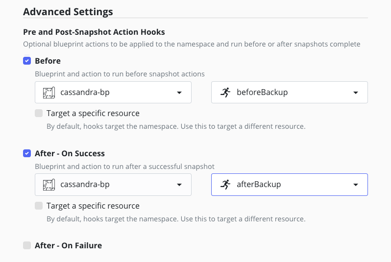
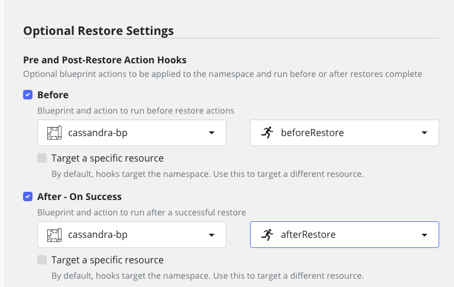
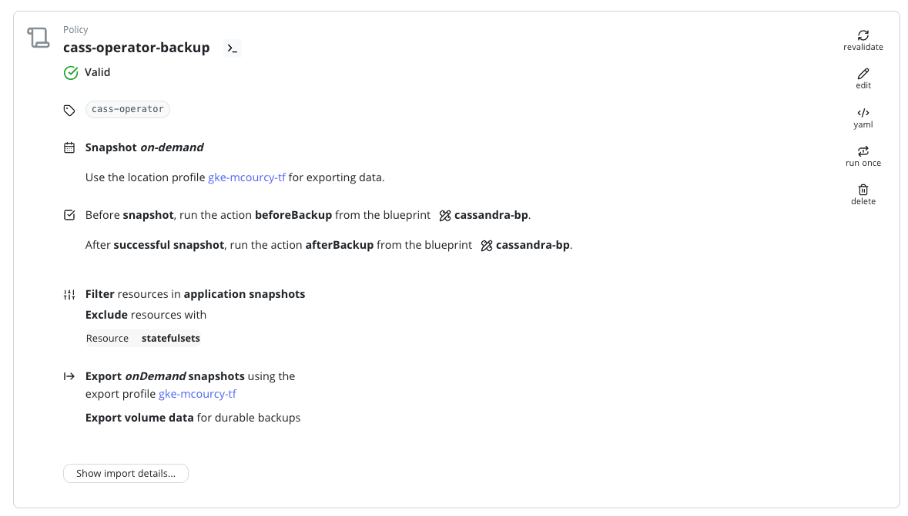

# Architecture Reference for Using cass-operator (K8ssandra) with Kasten by Veeam

## Goal

This document explains how to integrate the cass-operator (K8ssandra) with Kasten by Veeam to perform effective backup and restore operations for a Cassandra cluster.

## Architecture Card

| Description                                   | Values                                                                      | Comment                                                                                                                                                   |
|-----------------------------------------------|-----------------------------------------------------------------------------|-----------------------------------------------------------------------------------------------------------------------------------------------------------|
| **Database**                                  | Cassandra                                                                   |                                                                                                                                                           |
| **Database Version Tested**                   | Cassandra 4.0.1                                                             |                                                                                                                                                           |
| **Operator Vendor**                           | DataStax                                                                    | License is required for DSE                                                                                                                               |
| **Operator Vendor Validation**                | In progress                                                                 |                                                                                                                                                           |
| **Operator Version Tested**                   | Helm version 0.41.1, Cassandra Operator version v1.15.0                     |                                                                                                                                                           |
| **High Availability**                         | Yes by design                                                               | Cassandra is an active-active data service and features native data replication                                                                          |
| **Unsafe Backup & Restore**                   | No                                                                          | Unsafe backup/restore can lead to token errors. We do not recommend this approach. See [Unsafe Backup and Restore](../#unsafe-backup-and-restore)       |
| **PIT (Point In Time) Support**               | No                                                                          | We support incremental backups that provide a 5-minute RTO even for very large clusters                                                                   |
| **Blueprint and BlueprintBinding Example**    | Yes                                                                         |                                                                                                                                                           |
| **Blueprint Actions**                         | Backup & Restore                                                            | Deletion is done through restore point deletion since backup artifacts reside on their own PVC (one PVC per node)                                           |
| **Backup Performance Impact**                 | The backup is non incremental but very efficient in Cassandra                 | See [Understanding backup in Cassandra](#understanding-backup-in-cassandra) for details                                                                                           |

## Limitations

- **PIT Restore Not Implemented:**  
  Point-in-time restore is not available—not due to a Cassandra limitation, but because in this blueprint we deliberately choose a simpler workflow. We provide an [incremental approach](../k8ssandra/).
- **Sequential Backup within a Namespace:**  
  Datacenters in the same namespace are backed up sequentially. We recommend deploying one datacenter per namespace and using Kasten to parallelize backups.
- **Partial Support for K8ssandraCluster:**  
  The blueprint supports backup of CassandraDatacenter objects but not the entire K8ssandraCluster. The blueprint discovers and protects CassandraDatacenter resources even when created via a K8ssandraCluster. 

## Understanding backup in Cassandra 

We based our blueprint on insights from this excellent [DataStax Guide](https://support.datastax.com/s/article/Manual-Backup-and-Restore-with-Pointintime-and-tablelevel-restore). 

In Cassandra, when you run a snapshot (using the nodetool snapshot command), Cassandra creates a consistent point-in-time copy of its SSTables (data files). Instead of copying the entire file
content, Cassandra uses hardlinks to “mark off” the current version of each SSTable. This means:
- Space Efficiency: The snapshot directory contains hardlinks to the SSTable files. Because these are just additional directory entries for the same data blocks, the snapshot consumes very little 
additional disk space.
- Consistency: The snapshot is frozen at the moment it’s taken, so even if the table files change later (for example, through compaction or additional writes), the snapshot still references the state 
of the files at that point in time.
- Backup and Restore: These snapshots can be used as a backup source. To restore a snapshot, Cassandra uses the hardlinked files to rebuild the database state without needing to duplicate and 
transfer large amounts of data.

This combination of hardlinks and the snapshot mechanism makes Cassandra backups both fast and storage efficient.

## Backup workflow 

Non incremental Backup: 
1. Before Policy Hook
  - backup schema 
  - clear snapshot
  - create snapshot 
2. let kasten take care of the protection of the pvc 
3. After Policy Hook
  - clear snapshot (so that the next clear snapshot in (1) speed up)

But the restore process is more challenging because at restore we need to clean the dirty table directory by replacing them with the snapshots directory created previously:
1. Before Restore Hook 
  - nothing do do 
2. Kasten restore the pvc and the manifest 
2. After restore Hook
  - discover existing keyspaces that remains after pvc restore and remove them, this will remove the data in the `<table-name>-<old-uuid>/` directory but not in the `<table-name>-<old-uuid>/snapshots`
  directory.
  - recreate the schema 
  - find out the new directory (created by the restore of the schema) copy the snapshots sub directory (with the uid we saved previously) of the old directory to the new directory : copy  `<table-name>-<old-uuid>/snapshots` to  `<table-name>-<new-uuid>/`
  - call nodetool refresh on the directory
        


## Installation Overview

There are two operators available:
- **k8ssandra operator:**  
  Manages CassandraDatacenter resources across multiple clusters and supports cross-cluster replication via a K8ssandraCluster custom resource.
- **cassandra operator:**  
  Manages CassandraDatacenter within a single cluster.

Although Kasten includes a built-in blueprint that leverages **Medusa** (the backup tool for k8ssandra), we do not use it because we focus on fast, granular restores based on snapshots. Medusa is not available when using just the cassandra operator.

When you install the k8ssandra operator, the cassandra operator is automatically installed. However, you can install the cassandra operator independently if desired. You can also install the k8ssandra operator and create only CassandraDatacenter resources—skipping the K8ssandraCluster.

## Installing Only the Cassandra Operator

1. **Add the k8ssandra Helm Repository:**

   ```bash
   helm repo add k8ssandra https://helm.k8ssandra.io/stable
   helm repo update
   ```

2. **Install cert-manager (if not already installed):**

   ```bash
   helm install \
     cert-manager jetstack/cert-manager \
     --namespace cert-manager \
     --create-namespace \
     --set installCRDs=true
   ```

3. **Install the Cassandra Operator:**

   ```bash
   helm install cass-operator k8ssandra/cass-operator -n cass-operator --create-namespace --version 0.41.1
   ```

4. **Create a CassandraDatacenter Cluster:**

   ```bash
   kubectl create -f datacenter.yaml
   ```

5. **Create Data:**

   Retrieve the superuser credentials:

   ```bash
   kubectl get secret dse-superuser -n cass-operator -o go-template='{{ .data.username | base64decode }}'
   kubectl get secret dse-superuser -n cass-operator -o go-template='{{ .data.password | base64decode }}'
   ```

   Then, connect to the first Cassandra pod:

   ```bash
   kubectl -n cass-operator exec -it -c cassandra dse-cass-prd-default-sts-0 -- bash
   cqlsh -u dse-superuser -p <password>
   ```

   Example CQL commands to create data:

   ```cql
   CREATE KEYSPACE restaurants WITH replication = {'class':'SimpleStrategy', 'replication_factor': 3};
   CREATE TABLE restaurants.guests (
       id UUID PRIMARY KEY,
       firstname text,
       lastname text,
       birthday timestamp
   );
   INSERT INTO restaurants.guests (id, firstname, lastname, birthday) VALUES (uuid(), 'Michael', 'Courcy', '1972-11-22');
   INSERT INTO restaurants.guests (id, firstname, lastname, birthday) VALUES (uuid(), 'Michael', 'Cycour', '1972-11-22');
   INSERT INTO restaurants.guests (id, firstname, lastname, birthday) VALUES (uuid(), 'Mic', 'Cour', '1972-11-22');
   SELECT * FROM restaurants.guests;
   ```


## Manual Backup and Restore Process

It is recommended to test the backup and restore process manually before running it via Kasten. This helps in troubleshooting and ensures that you understand the blueprint’s behavior.

### Backup

1. **Pre-Backup:** Run the pre-backup script:

   ```bash
   bash ./scripts/cassandra_before_backup.sh cass-operator
   ```

   This script creates [cassandra snapshots](#understanding-backup-in-cassandra) on each PVC.   


2. **Post-Backup:** Run the post-backup script:

   ```bash
   bash ./scripts/cassandra_after_backup.sh cass-operator
   ```

   We just clear cassandra snapshots after the PVC has been fully exported this speed up the next backup which is also clearing the cassandra snapshots.

   Add the pre-backup and post-backup hooks to your backup policy:
   
   

### Restore

After the backup PVCs are restored by Kasten, execute the following scripts:

1. **Pre-Restore:** Run the pre-restore script:

   ```bash
   bash ./scripts/cassandra_before_restore.sh cass-operator
   ```

   (This script is currently a placeholder.)

2. **Post-Restore:** Run the post-restore script:

   ```bash
   bash ./scripts/cassandra_after_restore.sh cass-operator
   ```

   This script wipe the database that is restored by the restoration of the pvc, recreate the schema and copy the content of the snapshots directory.

   Add the pre-restore and post-restore hooks to your restore policy:

   

## Deploying the Blueprints

1. **Install the Kasten Blueprints for Cassandra:**  
   Override the built-in Cassandra blueprint since we do not use the Medusa approach:

   ```bash
   kubectl create -f k10-k8ssandra-bp-0.0.4.yaml
   kubectl create -f k10-k8ssandra-bp-0.0.4-binding.yaml
   ```

   or 
   
   ```bash
   kubectl create -f k10-k8ssandra-bp-0.0.5.yaml
   kubectl create -f k10-k8ssandra-bp-0.0.5-binding.yaml
   ```


2. **Install the Cassandra Hooks Blueprint:**

   ```bash
   kubectl create -f cassandradatacenter-bp.yaml
   ```

## Building the Backup Policy

**Exclude the Following:**

  
- **StatefulSets:**  
  Exclude StatefulSets created by the operator to prevent conflicts between Kasten and the operator’s management.

**Hooks:**  
Include before/after backup hooks in your backup policy.


Refer to the policy example below:



## Building Your Restore Action

To test your restore, you can delete the CassandraDatacenter resource, which will remove all PVCs created by the operator:

```bash
kubectl delete -f datacenter.yaml
```

For restore, simply add the pre-restore and post-restore hooks to your policy:


### Granular Restore of a Keyspace or Table

You can perform a granular restore of a specific keyspace or table using the "Volume Clone Restore" option in the restore point. This creates timestamp-appended clones of the selected volumes without replacing the existing ones, enabling you to selectively copy data into the `server-data-*` PVC.  
**Warning:** This operation requires advanced Cassandra knowledge and should be performed only by experienced users.

Happy backing up and restoring!


### What if the cassandra datacenter does not restart because dirty writes were taken at backup

Even if the blueprint erase the cassandra data to reinstall the data from the snapshots directory this data may be dirty and prevents cassandra from restarting.

You'll see error in the cassandra logs that cassandra cannot recover. But the conscequence is because of that the execution of the blueprint to replace the data is blocked ...

For this reason we created a cleaner job that proceed pvc per pvc that you must apply manually following this steps :

- Delete the cassandradatacenter `kubectl delete -f datacenter.yaml`
- From the restore point restore only the volumes and nothing else 
- Apply the cleaner job for each volume :
  * `/clean-up-launcher.sh server-data-dse-cass-prd-default-sts-0 cass-operator`
  * `/clean-up-launcher.sh server-data-dse-cass-prd-default-sts-1 cass-operator`
  * `/clean-up-launcher.sh server-data-dse-cass-prd-default-sts-2 cass-operator`
- Now from the restore point restore the rest of the namespace (except the statefulset)

Your datacenter will restart. 