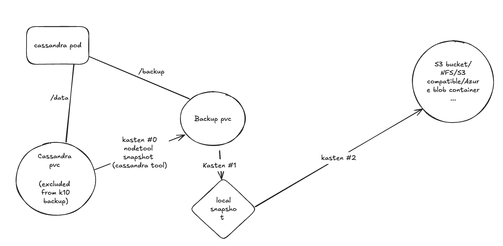
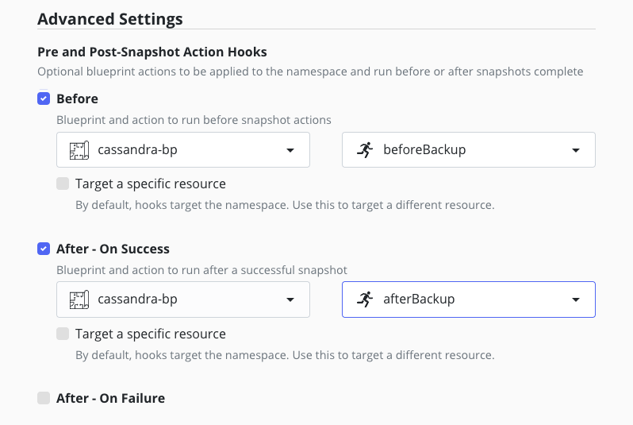
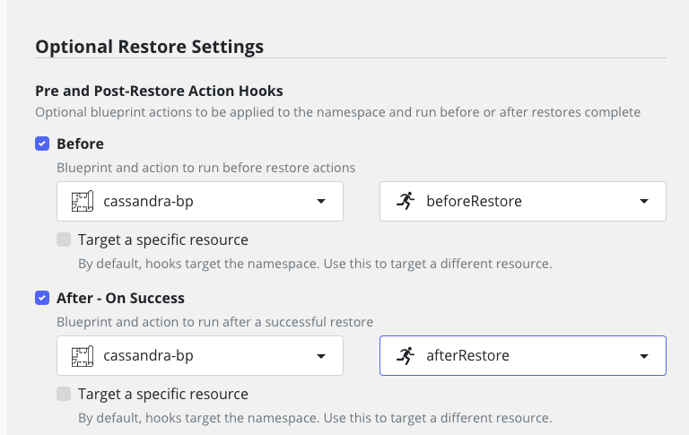
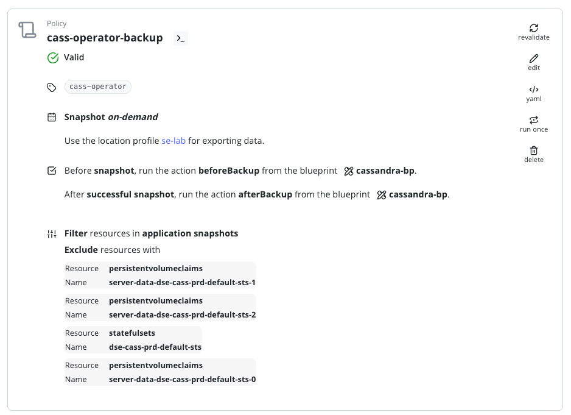
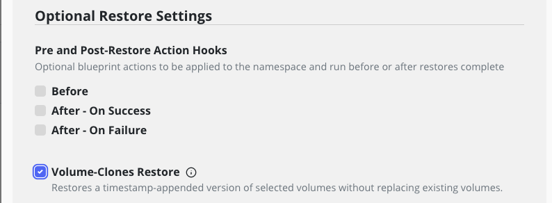

# Architecture Reference for using cass-operator (K8ssandra) with Kasten By Veeam

## Goal 

An architecture reference that explains how to use the cass-operator (k8ssandra) and Kasten by Veeam together.


## Architecture card


| Description                                   | Values                           | Comment                   |
|-----------------------------------------------|----------------------------------|---------------------------|
| Database                                      | cassandra                        |                           | 
| Database version tested                       | cassandra 4.0.1                  |                           |
| Operator vendor                               | Datastax                         | License required for DSE  |
| Operator vendor validation                    | In progress                      |                           |
| Operator version tested                       | helm version 0.41.1 cassandra operator version v1.15.0 |     |
| High Availability                             | Yes by design                    | Cassandra is an active active data service that feature data replication |
| Unsafe backup & restore without pods errors   | No                               | Unsafe backup/restore lead to token errors we do not recommend this approach  |
| PIT (Point In Time) supported                 | No                               | But we support incremental backup that can give you a 5 mins RTO even on a very big database  |
| Blueprint and BlueprintBinding example        | Yes                              |                           |
| Blueprint actions                             | Backup & restore                 | Delete is done through restorepoint deletion as backup artifacts are living in their own PVC (one PVC per node) |
| Backup performance impact on the database     | Full backup have much bigger impacts than incremental | see [architecture diagrams](#architecture-diagrams) |


# Limitations 

Make sure you understand the limitations of this architecture reference:

- PIT restore is not implemented but this is not because of cassandra limitation, we made this choice because on the field we observe that incremental backup was enough and we wanted to avoid increasing the complexity of the blueprint
- In the same namespace datancenters will be backed up sequentially. We recommend one datacenter per namespace and use kasten to parrallelize backups.
- Similar to the previous we support the backup of CassandraDatacenter but not the backup of K8ssandraCluster. The blueprint will discover and protect CassandraDatacenter even if they are created by a K8ssandraCluster. We did not test if the K8ssandraCluster will not try to overwrite the annotations put by the blueprint.

# Architecture diagrams

At the heart of our implementation we found this [Guide](https://support.datastax.com/s/article/Manual-Backup-and-Restore-with-Pointintime-and-tablelevel-restore) from datastax
absolutely insightful and if you need to understand how this blueprint works we strongly advice reading it. 

**The blueprint is built on top of this guide.**

In a nutshell we use an intermediate storage to move the backups and snapshots that Kasten will protect.



Cassandra operator Custom Resource (CassandraDatacenter) let you define an additional storage for your backup operations 
```
...
  storageConfig:
      additionalVolumes:
      - mountPath: /backups
        name: backup
        pvcSpec:
          accessModes:
          - ReadWriteOnce
          resources:
            requests:
              storage: 10Gi
...
```

Check the [datacenter.yaml](./datacenter.yaml) for a complete example.

## Full vs Incremental backup

- Each time we do an incremental backup we flush the table and we copy the backups directory of each tables 
- Each time we do a full backup we create a cassandra snapshot and clean up the backup directory

taken from the [Guide](https://support.datastax.com/s/article/Manual-Backup-and-Restore-with-Pointintime-and-tablelevel-restore) we referenced above :

> The incremental backups and the snapshots are both hardlinks to the live data sstables, so, once you have a snapshot of a keyspace, you can clear the contents of the incremental backups folder for that keyspace - all the files in it will be in the keyspace, and it might also have older files if you don’t clean it out regularly.
> You really only should retain the incrementals until your next snapshot is taken, in other words. Again, this is not a retention guideline recommendation, only a practical note about the redundancy of the backup layers.


To make incremental backup possible you need to enable it in the cassandra-yaml spec of cassandradatacenter custom resource 
```
    cassandra-yaml:
      ...
      incremental_backups: true
      ...
```

Along the incremental backups we are always copying the sstable in the same directory than the snapshots. **You could do a full backup once and incremental backup forever but the risk is that the backup directory will grow up indefinetly**. It's why you need at some point a full backup. 

A full backup will remove all the backup artifact you created before and restart from a new cassandra snapshot for each table.

On the other hand full backup is disk intensive and may have impact on cassandra itself. It's why you must set up a strategy that balance between incremental and full backup. This strategy depends of your throughput and you activity.

In both case full or incremental backup we always remove the data on the cassandra disk once it has been copied to the backup disk.

> Even if we remove the backup data from the data disk to the backup disk, **your data disk must have enough capacity to handle this temporary storage occupation**.

## How we control full vs incremental backup 

Full and incremental backup are controlled by two annotations that you set up on the cassandradatacenter Custom resource
```
annotations:
  "kasten.io/counterIncrementalBackups": "5",
  "kasten.io/numIncrementalBackupsBeforeFullBackup": "24"
```

At each backup we increment the counter annotation `kasten.io/counterIncrementalBackups`. 

We do a full backup if :
- the annotation `kasten.io/counterIncrementalBackups`is not defined OR
- the value of `kasten.io/counterIncrementalBackups`is greater or equal to the value of `kasten.io/numIncrementalBackupsBeforeFullBackup` and we reset `kasten.io/counterIncrementalBackups` to zero

So if you want to trigger a full backup you just have to remove the `kasten.io/counterIncrementalBackups` annotation

```
kubectl annotate -n cass-operator cassandradatacenters.cassandra.datastax.com cass-prd kasten.io/counterIncrementalBackups-
```

> Every time we restore we remove this annotation to make sure that the next backup is a full backup.

# Install overview 

There is two operator `k8ssandra operator` and `cassandra operator`.

cassandra operator let you manage CassandraDatacenter in a single kubernetes cluster but `k8ssandra operator` let you manage CassandraDatacenter across multiple kubernetes cluster 
where you can define replication strategy between CassandraDatacenter in a CR called K8ssandraCluster. 

> Kasten comes with a built in blueprint that leverage **Medusa** (the backup tool for k8ssandra) but we don't use it because we want fast and granular restore based on snapshot and `Medusa`is not 
> available with just the `cassandra operator`

When you install k8ssandra operator it automatically install cassandra operator. Cassandra operator (known as cass-operator) is included in k8ssandra operator. But you can also install cass-operator without k8ssandra operator, that's what we're going to do in this guide.

You can also install k8ssandra operator and never create a K8ssandraCluster CR but only CassandraDatacenter CR.

## Installing just the release of cass operator 


```
helm repo add k8ssandra https://helm.k8ssandra.io/stable
helm repo update
```

We need to install cert manager before installing the caas-operator.

```
helm install \
  cert-manager jetstack/cert-manager \
  --namespace cert-manager \
  --create-namespace \
  --set installCRDs=true
helm install cass-operator k8ssandra/cass-operator -n cass-operator --create-namespace --version 0.41.1
```

Now let's create a cluster 
```
k create -f datacenter.yaml 
```

and create some data 

find out the username and password of the superuser and connect to the first pod
```
kubectl get secret dse-superuser -n cass-operator -o go-template='{{ .data.username | base64decode }}'
kubectl get secret dse-superuser -n cass-operator -o go-template='{{ .data.password | base64decode }}'
kubectl exec -it dse-cass-prd-default-sts-0 -- bash 
```

and connect to the cql shell. 
The user and password used here are ephemeral and you must use your own.
```
user="dse-superuser"
password="Lx78701gN2-BqM_Jud5yBtrSrbZ-bsAUiTNYXpz1NlftSL3nKyDJwQ"
cqlsh -u $user -p $password 
```


Create the data 
```
create keyspace restaurants with replication  = {'class':'SimpleStrategy', 'replication_factor': 3};
create table restaurants.guests (id UUID primary key, firstname text, lastname text, birthday timestamp);
insert into restaurants.guests (id, firstname, lastname, birthday)  values (5b6962dd-3f90-4c93-8f61-eabfa4a803e2, 'Michael', 'Courcy', '1972-11-22');
insert into restaurants.guests (id, firstname, lastname, birthday)  values (5b6962dd-3f90-4c93-8f61-eabfa4a803e3, 'Michael', 'Cycour', '1972-11-22');
insert into restaurants.guests (id, firstname, lastname, birthday)  values (f0c5eb20-8ad4-4c5f-bf1f-091af6324097, 'Mic', 'Cour', '1972-11-22');
select * from restaurants.guests;
```

Cassandra strictly validates that a UUID follows RFC 4122. If you need to generate uid for inserting use 
```
generated_uuid=$(uuidgen | tr '[:upper:]' '[:lower:]')
echo $generated_uuid
```

# Repro the backup and restore process manually 

In order to troubleshoot your blueprint always execute your backup and restore process manually so that you can discover the issue or changes that may cause failure.
Doing so will help you to understand the blueprint as well.

# Backup

For the backup you can execute [cassandra_before_backup.sh](./scripts/cassandra_before_backup.sh).
```
bash ./scripts/cassandra_before_backup.sh cass-operator
```
That will create the backup data in the backup pvc of each cluster 

And [cassandra_after_backup.sh](./scripts/cassandra_after_backup.sh)
```
bash ./scripts/cassandra_after_backup.sh cass-operator
```
This part of the script will only handle the incremental counter annotation and is executed if all the previous steps are successfull. 

Those scripts has been ported in the blueprint [cassandradatacenter-bp.yaml](./cassandradatacenter-bp.yaml) under the respective `beforeBackup` and `afterBackup` action.

To use it with Kasten you need to create those 2 hooks in the kasten policy :



## Restore 

The restore script has to be executed once the backup PVCs has been restored. Which will happen when you restore with Kasten. 

Execute [cassandra_before_restore.sh](./scripts/cassandra_before_restore.sh) with 
```
bash ./scripts/cassandra_before_restore.sh cass-operator
```
This script don't do anything it's just a place holder for the moment.

Then execute [cassandra_after_restore.sh](./scripts/cassandra_after_restore.sh) with 
```
bash ./scripts/cassandra_after_restore.sh cass-operator
```
This script copy the backup folder in the right place in the cassandra filesytem and call `nodetool refresh` 

Those scripts has been ported in the blueprint [cassandradatacenter-bp.yaml](./cassandradatacenter-bp.yaml) under the respective `beforeRestore` and `afterRestore` action.

It should be used in your restore action :



# Install the blueprint 

We need to overwrite the built in kassadra blueprint because we don't take the `medusa` approach.

```
kubectl create -f k10-k8ssandra-bp-0.0.4.yaml
kubectl create -f k10-k8ssandra-bp-0.0.4-binding.yaml
```

Then install the cassandra hooks blueprint
```
kubectl create -f cassandradatacenter-bp.yaml
```

# Build the backup policy 

## exlude the server-data-* pvc 
In your backup policy always exclude the `server-data-*` for 2 reasons :
1. We won't use it for the restore, by excluding them you save space on the backup location and on the snapshots
2. When restoring we want cassandra to restart empty so that we can recreate the schema and load the data

## Exlude the statefulset related to the cassandra datacenter 
Exclude the statefulset created by the operator, we don't want kasten conflict with the operator for it's management.

## Add the before and after restore action 
You also need to add the 2 actions before and after backup. 


Here is a pic of my policy as an example 



# Build your restore action 

There is nothing special to do for the restore action just add the 2 hooks before and after restore 


## Do granular restore of a keyspace or a table 

It's actually possible to do a granular restore of a specific keypspace or a table 

In the restore point select the volume clone restore option 



This will create timestamp-appended version of selected volumes without replacing existing volumes.

With that you'll be able to copy the selected keyspace or table data in the `server-data-*` volume. (this is what the [cassandra_after_restore.sh](./scripts/cassandra_after_restore.sh) do but for all tables in all keyspaces)

This operation need some knowledge on Cassandra and is beyond the scope of this guide. Do it only if you know what you're doing.


