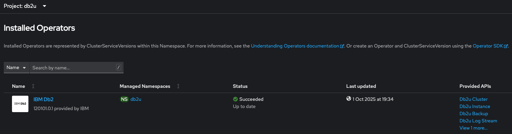

# Goal 

Repro an environment close to db2

## Prerequisite

(Skip this step if you already install cpd or maximo)

You can install the Db2U Operator from the IBM Operator Catalog. However, in order to pull the Db2 container images, you need to configure the access to the IBM Container Entitled Registry.

### 1. Retrieve an entitled key from the Entitled registry

- Log into [MyIBM](https://myibm.ibm.com/products-services/containerlibrary)
- Copy the `Entitled Key`

### 2. Create an Image Pull Secret using the Entitled Key

```bash
#
## Set the variables to the correct values
#
## Use cp for the value of the docker-username field
#
ENTITLEDKEY="Use the Entitled Key value from Step 1"
EMAIL="Use the email value"
NAMESPACE="Use the targeted namespace value"
CASE_NAME=ibm-db2uoperator

oc create secret docker-registry ibm-registry   \
    --docker-server=cp.icr.io                   \
    --docker-username=cp                        \
    --docker-password=${ENTITLEDKEY}            \
    --docker-email=${EMAIL}                     \
    --namespace=${NAMESPACE}
```

### 3. Modify the OpenShift Global Image Pull Secret (Optional)

```bash
#
## Set the variable to the correct value
#
NAMESPACE="Use the targeted namespace value"

echo $(oc get secret pull-secret -n openshift-config --output="jsonpath={.data.\.dockerconfigjson}" | base64 --decode; \
oc get secret ibm-registry -n ${NAMESPACE} --output="jsonpath={.data.\.dockerconfigjson}" | base64 --decode) | \
jq -s '.[0] * .[1]' > dockerconfig_merged

oc set data secret/pull-secret -n openshift-config --from-file=.dockerconfigjson=dockerconfig_merged
```

NOTE:
This step requires cluster administrator privileges. Once the global pull secret has been modified, OpenShift will propagate the update to the entire cluster. Before deploying Db2, all OpenShift workers need to be in a Ready state. 

# Install the db2 operator

We followed this [documentation](https://www.ibm.com/docs/en/db2/12.1.0?topic=operator-installing-from-command-line)

## Install the IBM Operator 

```
cat <<EOF | oc apply -f -
apiVersion: operators.coreos.com/v1alpha1
kind: CatalogSource
metadata:
  name: ibm-operator-catalog
  namespace: openshift-marketplace
spec:
  displayName: "IBM Operator Catalog" 
  publisher: IBM
  sourceType: grpc
  image: icr.io/cpopen/ibm-operator-catalog
  updateStrategy:
    registryPoll:
      interval: 45m
EOF
```

## install IBM Pak (an oc wrapper of cloudctl)

[Documenation](https://github.com/IBM/ibm-pak/blob/main/docs/download-github.md)

```
wget https://github.com/IBM/ibm-pak/releases/download/v1.19.1/oc-ibm_pak-darwin-arm64.tar.gz
tar xvzf oc-ibm_pak-darwin-arm64.tar.gz
sudo mv oc-ibm_pak-darwin-arm64 /usr/local/bin/oc-ibm_pak
oc ibm-pak --help
```

## Install the case bundle for db2 

First, check available versions:
```
export CASE_NAME=ibm-db2uoperator
# List available versions (this will show all available CASE bundles)
oc ibm-pak list | grep ${CASE_NAME}
```


Then install the specific version:
```
export CASE_VERSION=7.3.2+20250813.223525.16645 # Use version from list above
oc ibm-pak get ${CASE_NAME} --version ${CASE_VERSION}
```

Install the Db2 catalog:
```
oc ibm-pak launch ${CASE_NAME}         \
    --version ${CASE_VERSION}          \
    --namespace openshift-marketplace  \
    --inventory db2uOperatorSetup      \
    --action installCatalog
```

Now you can install the db2 operator 
```
oc create ns db2u
export NAMESPACE=db2u
oc ibm-pak launch ${CASE_NAME}                \
    --version ${CASE_VERSION}                 \
    --namespace ${NAMESPACE}                  \
    --inventory db2uOperatorStandaloneSetup   \
    --action installOperator
```


> **Important Note**:  the install did not work well. Strangely (cloudctl bug ?) the susbcription was pointing to the wrong channel and the wrong csv leading to a permanent "Waiting for a Successful State" the only solution was to find the right channel and right csv with this command
>
> To get the available channel:
> ```
> oc get packagemanifest db2u-operator -o jsonpath='{.status.channels[*].name}'
> ```
> 
> I got 
> ```
> v110508.0 v110509.0 v120100.0 v120101.0 v2.0 v2.1 v2.2 v3.0 v3.1 v3.2 v4.0 v4.1 v4.2 v5.0 v5.1 v5.2 v5.3 v6.0 v6.1 v7.1 v7.2 v7.4
> ```
> 
> I selected the highest channel `v120101.0` and grab the currentCSV in this channel 
> 
> ```
> oc get packagemanifest db2u-operator -o json | jq -r '.status.channels[] | select(.name=="v120101.0") | "Channel: \(.name), Current CSV: \(.> currentCSV)"'
> ```
> 
> I got 
> ```
> Channel: v120101.0, Current CSV: db2u-operator.v120101.0.1
> ```
> 
> Then I deleted the subscription and recreated with the right values 
> ```
> oc delete subscriptions -n db2u ibm-db2uoperator-catalog-subscription
> cat <<EOF | oc create -f -
> apiVersion: operators.coreos.com/v1alpha1
> kind: Subscription
> metadata:
>   labels:
>     operators.coreos.com/db2u-operator.db2u: ""
>   name: ibm-db2uoperator-catalog-subscription
>   namespace: db2u  
> spec:
>   channel: v120101.0
>   installPlanApproval: Automatic
>   name: db2u-operator
>   source: ibm-db2uoperator-catalog
>   sourceNamespace: openshift-marketplace
>   startingCSV: db2u-operator.v120101.0.1
> EOF
> ```

Then at this point the operator installed properly and the api were available 


## Kubelet config 

We were able to deploy the simple example without this configuration. See [Documentation](https://www.ibm.com/docs/en/db2/11.5.x?topic=lpdus-configuring-red-hat-openshift-set-ipc-kernel-parameters)

## Create a db2u cluster 

[Documentation](https://www.ibm.com/docs/en/db2/11.5.x?topic=resource-deploying-db2-using-db2ucluster-custom)


```
oc create -f mas-masdev-masdev-manage-db2ucluster.yaml
```

Check your instance is deployed and ready 
```
oc get db2ucluster -n db2u
```

should return 
```
NAME                       STATE   MAINTENANCESTATE   AGE
mas-masdev-masdev-manage   Ready   None               25h
```

and when checking the pod 
```
oc get po -n db2u
```

you should see the operator pods, the etcd and db2 pods running.
```
NAME                                                READY   STATUS      RESTARTS   AGE
c-mas-masdev-masdev-manage-db2u-0                   1/1     Running     0          25h
c-mas-masdev-masdev-manage-etcd-0                   1/1     Running     0          25h
c-mas-masdev-masdev-manage-instdb-h5jnb             0/1     Completed   0          25h
c-mas-masdev-masdev-manage-restore-morph-px5lh      0/1     Completed   0          25h
db2u-day2-ops-controller-manager-5bdcbfd869-vtl6w   1/1     Running     0          34h
db2u-operator-manager-fdc864bd7-9nv59               1/1     Running     0          36h
```

## Create some test data

Connect to your DB2 instance and create sample data for testing backup and restore:

### 1. Connect to the DB2 pod

```bash
# Connect to the DB2 pod
oc exec -it c-mas-masdev-masdev-manage-db2u-0  -n db2u -- bash

# Switch to db2inst1 user
su - db2inst1

# Connect to the BLUDB database
db2 connect to BLUDB
```

### 2. Create sample tables and data

```sql
-- Create a sample employees table
db2 "CREATE TABLE employees (
    id INT NOT NULL PRIMARY KEY,
    first_name VARCHAR(50),
    last_name VARCHAR(50),
    email VARCHAR(100),
    department VARCHAR(50),
    salary DECIMAL(10,2),
    hire_date DATE
)"

-- Create an orders table
db2 "CREATE TABLE orders (
    order_id INT NOT NULL PRIMARY KEY,
    customer_id INT,
    product_name VARCHAR(100),
    quantity INT,
    order_date DATE,
    total_amount DECIMAL(10,2)
)"

-- Insert sample employee data
db2 "INSERT INTO employees VALUES 
(1, 'John', 'Smith', 'john.smith@company.com', 'Engineering', 75000.00, '2023-01-15'),
(2, 'Jane', 'Doe', 'jane.doe@company.com', 'Marketing', 65000.00, '2023-02-20'),
(3, 'Mike', 'Johnson', 'mike.johnson@company.com', 'Sales', 70000.00, '2023-03-10'),
(4, 'Sarah', 'Wilson', 'sarah.wilson@company.com', 'HR', 60000.00, '2023-04-05'),
(5, 'David', 'Brown', 'david.brown@company.com', 'Engineering', 80000.00, '2023-05-12')"


-- Insert sample order data
db2 "INSERT INTO orders VALUES
(1001, 1, 'Laptop', 2, '2024-01-15', 2500.00),
(1002, 2, 'Monitor', 1, '2024-01-16', 300.00),
(1003, 3, 'Keyboard', 3, '2024-01-17', 150.00),
(1004, 1, 'Mouse', 2, '2024-01-18', 50.00),
(1005, 4, 'Headphones', 1, '2024-01-19', 200.00)"


-- Create indexes for better performance
db2 "CREATE INDEX idx_emp_dept ON employees(department)"
db2 "CREATE INDEX idx_order_date ON orders(order_date)"

-- Commit the changes
db2 commit
```

### 3. Verify the data

```sql
-- Check employee data
db2 "SELECT COUNT(*) as employee_count FROM employees"
db2 "SELECT * FROM employees ORDER BY hire_date"

-- Check order data
db2 "SELECT COUNT(*) as order_count FROM orders"
db2 "SELECT * FROM orders ORDER BY order_date"

-- Run some sample queries
db2 "SELECT department, COUNT(*) as emp_count, AVG(salary) as avg_salary 
     FROM employees 
     GROUP BY department"

db2 "SELECT customer_id, COUNT(*) as order_count, SUM(total_amount) as total_spent
     FROM orders 
     GROUP BY customer_id"
```

Now you have a DB2 database with sample data that you can use to test backup and restore operations. 

