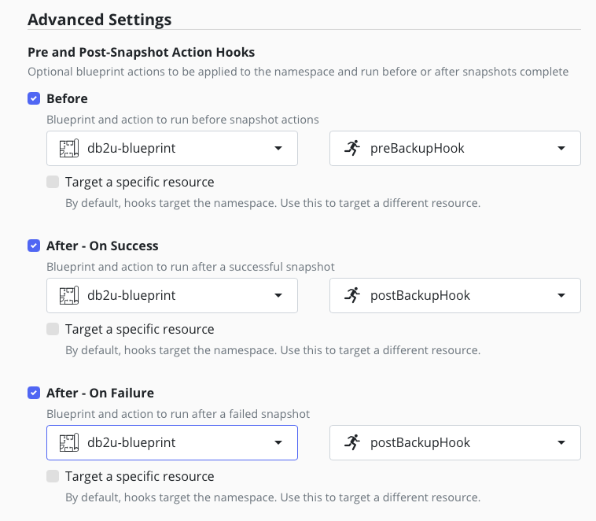
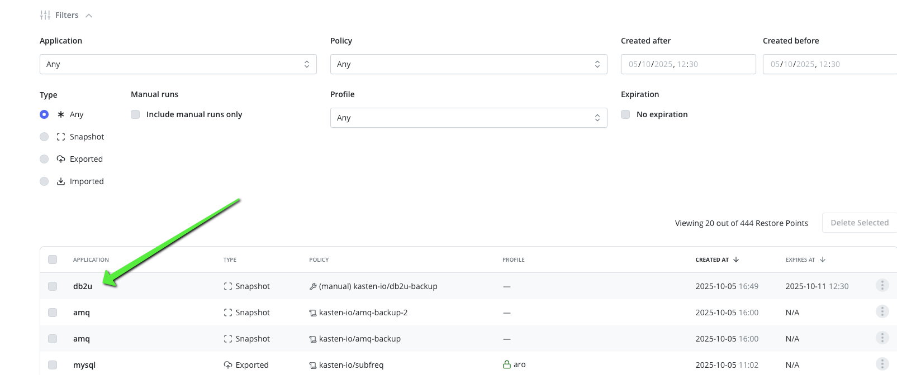
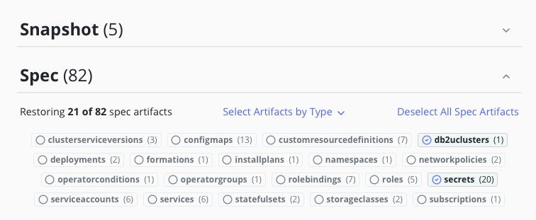
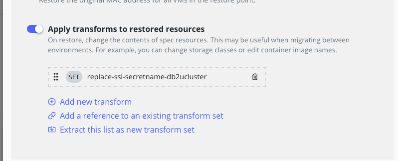
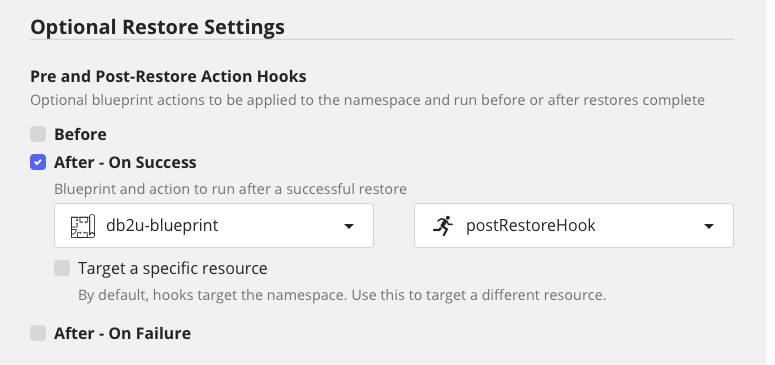
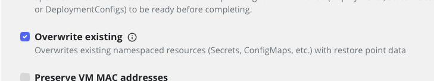
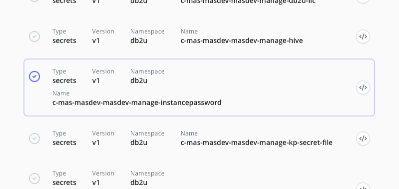

# Goal 

A blueprint to backup the db2 database in the db2u namespace 

# How does it work ? 

We follow the IBM documentation for [backing up and restoring manage](https://www.ibm.com/docs/en/masv-and-l/cd?topic=manage-databases) -> [Backing up and restoring Db2](https://www.ibm.com/docs/en/db2/11.5.x?topic=ad-backing-up-restoring-db2) -> [Backing up a Db2 database](https://www.ibm.com/docs/en/db2/11.5.x?topic=db2-backing-up-database) which finally leads to [Performing a snapshot backup with Db2 container commands](https://www.ibm.com/docs/en/db2/11.5.x?topic=database-performing-snapshot-backup-db2-container-commands)

Where IBM recommand to perform a snapshot of the storage between a suspend and resume operation.

# Repro the environment

If you need to repro an environment close to the db2u [we provide a guide](./db2-repro/db2-repro.md) that set up the db2u operator and create a db2ucluster with a very similar configuration than the one you'll find in maximo.

## Preliminary test 

In order to validate the blueprint execute the following command 
```
# adapt the name of the pod to your environment
oc exec -n db2u -it c-mas-masdev-masdev-manage-db2u-0 -- /bin/sh
manage_snapshots --action suspend
# confirm HA monitoring is disabled 
wvcli system status

# here we suppose Kasten will take a snspshot of the PVCs

manage_snapshots --action resume
# confirm HA monitoring is enabled
wvcli system status
```

# Install and execute the blueprint 

## If you pull from a private registry or docker hub

Create a pull secret to pull the mongo:6.0 image.
```
kubectl create secret docker-registry my-dockerhub-secret \
  --docker-username=<your-username> \
  --docker-password=<your-password> \
  --docker-email=<your-email> \
  -n mongoce
```

Now link this pull secret to the default service account  
```
oc secrets link default my-dockerhub-secret --for=pull -n mongoce
```

If you need to add docker pull secret to the global openshift check the [documentation](https://docs.redhat.com/en/documentation/openshift_container_platform/4.14/html/images/managing-images#images-update-global-pull-secret_using-image-pull-secrets).

## Allow discovery of the `db2ucluster` name 

We need to discover the name of the db2ucluster that we want to backup, always make sure you created the configmap db2ucluster-id in the db2u namespace

```
oc create configmap -n db2u db2ucluster-id --from-literal db2ucluster-id=mas-masdev-masdev-manage
```

Review the blueprint [db2u-blueprint.yaml](./db2u-blueprint.yaml) for the
`preBackupHook` and `postBackupHook` action and apply it.

```
oc apply -f db2u-blueprint.yaml 
```

The `preBackupHook` and `postBackupHook` must be configured in the policy before and after the snapshot execute.

the `postBackupHook` action should also be applied in case of an error, if an error happens during policy run we should still 
be able to resume the write on the database.



Run once the policy to check there is no error during backup.


## Restoring db2 

We should follow this steps :[Using container commands - Db2uInstance](https://www.ibm.com/docs/en/db2/11.5.x?topic=restores-using-container-commands-db2uinstance) to restore from a previous backup.

While this process work a simpler approach can be taken : 

## With the kasten UI 

1. review edit and create the transformset `replace-ssl-secretname-db2ucluster.yaml`. 
You need to provide the name of the secret that will be used to build certificate used by the manage clients. It's a secret with 3 entries : ca.crt, tls.crt, tls.key.

```
oc create -f replace-ssl-secretname-db2ucluster.yaml
```

2. delete the db2cluster :
```
oc delete db2uclusters.db2u.databases.ibm.com mas-masdev-masdev-manage 
```
It will remove all artifacts created by the operator (pvc included)

3. Find your restore point 



4. Configure your restoreaction to: 

  * only select pvc, secret and db2ucluster
  
  

  * Apply the transformset 

  

  * Add the post restore hook action for db2u 
  

5. Connect to db2u and check all your data are up and running

## With the Kasten API 

Even simpler, edit the file [db2ucluster-restore-action.yaml](./db2ucluster-restore-action.yaml) by changing line 11 by the name of the restore point.

Then you just have to apply it 
```
oc create -f db2ucluster-restore-action.yaml
```

## About the instance password

On some environment we noticed that the `c-<db2ucluter name>-instancepassword` secret is regenerated to another value. 

This not the case with the operator version `db2u-operator.v120101.0.1` we use for the test.

However if that happen just restore the password with kasten using the overwrite option 



And deselect all artifacts except the instance password 



Then delete the `c-<db2ucluter name>--db2u-0` pod, it will restart with the appropriate secret.

```
oc delete po -n db2u c-<db2ucluter name>-db2u-0
```