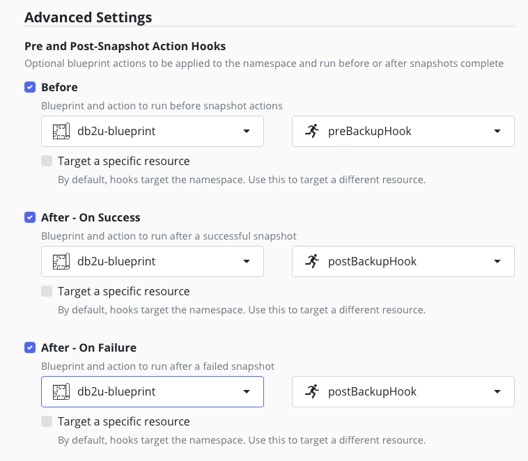

# Goal 

A blueprint to backup the db2 database in the db2u namespace using non logical dump. 

**Warning** This approach is only for test environment and does not support disaster recovery.

# How does it work ? 

We follow the IBM documentation for [backing up and restoring manage](https://www.ibm.com/docs/en/masv-and-l/cd?topic=manage-databases) -> [Backing up and restoring Db2](https://www.ibm.com/docs/en/db2/11.5.x?topic=ad-backing-up-restoring-db2) -> [Backing up a Db2 database](https://www.ibm.com/docs/en/db2/11.5.x?topic=db2-backing-up-database) which finally leads to [Performing a snapshot backup with Db2 container commands](https://www.ibm.com/docs/en/db2/11.5.x?topic=database-performing-snapshot-backup-db2-container-commands)

Where IBM recommand to perform a snapshot of the storage between a suspend and resume operation.

# Repro the environment

If you need to repro an environment close to the db2u [we provide a guide](./db2-repro/db2-repro.md) that set up the db2u operator and create a db2ucluster with a very similar configuration than the one you'll find in maximo.

## Preliminary test 

In order to validate the blueprint execute the following command 
```
# adapt the name of the pod to your environment
oc exec -n db2u -it c-mas-masdev-masdev-manage-db2u-0 -- /bin/sh
manage_snapshots --action suspend
# confirm HA monitoring is disabled 
wvcli system status

# here we suppose Kasten will take a snspshot of the PVCs

manage_snapshots --action resume
# confirm HA monitoring is enabled
wvcli system status
```

# important consideration about ceph FS 

If your installation use CephFS volume you may have some serious performance issue for cloning the cephFS snapshot during export. 

Thanks to shallow volume this problem can be overcome but you need to [follow this guide](../../../managing-cephfs/readme.md) to configure it properly in your kasten policy.

# Install and execute the blueprint 

## If you pull from a private registry or docker hub

Create a pull secret to pull the mongo:6.0 image.
```
kubectl create secret docker-registry my-dockerhub-secret \
  --docker-username=<your-username> \
  --docker-password=<your-password> \
  --docker-email=<your-email> \
  -n mongoce
```

Now link this pull secret to the default service account  
```
oc secrets link default my-dockerhub-secret --for=pull -n mongoce
```

If you need to add docker pull secret to the global openshift check the [documentation](https://docs.redhat.com/en/documentation/openshift_container_platform/4.14/html/images/managing-images#images-update-global-pull-secret_using-image-pull-secrets).


## Apply the blueprint and configure the policy

```
oc apply -f db2u-blueprint.yaml 
```

The `preBackupHook` and `postBackupHook` must be configured in the policy before and after the snapshot execute.

the `postBackupHook` action should also be applied in case of an error, if an error happens during policy run we should still 
be able to resume the write on the database.



Run once the policy to check there is no error during backup.


## Restoring db2 

Scale down all the deployments in the manage namespace 
```
oc scale --replicas 0 deployment --all -n mas-${MAS_INSTANCE_ID}-manage
```

Then we follow this steps in IBM documentation [using container commands - Db2uInstance](https://www.ibm.com/docs/en/db2/11.5.x?topic=restores-using-container-commands-db2ucluster).

Suspend reconciliation with the operator

```
DB2U_CLUSTER=$(oc get db2ucluster --no-headers | head -n1 | awk '{print $1}'); echo $DB2U_CLUSTER
oc annotate db2ucluster $DB2U_CLUSTER db2u.databases.ibm.com/maintenance-pause-reconcile=true --overwrite
```

Scale down the statefulsets and deployment
```
DB2U_STS=$(oc get sts --selector="app=${DB2U_CLUSTER},type=engine" --no-headers | awk '{print $1}'); echo $DB2U_STS
ETCD_STS=$(oc get sts --selector="app=${DB2U_CLUSTER},component=etcd" --no-headers | awk '{print $1}'); echo $ETCD_STS
LDAP_DEP=$(oc get deployment --selector="app=${DB2U_CLUSTER},role=ldap" --no-headers | awk '{print $1}'); echo $LDAP_DEP
NUM_REPLICAS=$(oc get sts ${DB2U_STS} -ojsonpath={.spec.replicas}); echo $NUM_REPLICAS
oc scale sts ${DB2U_STS} --replicas=0
oc scale sts ${ETCD_STS} --replicas=0
oc scale deploy ${LDAP_DEP} --replicas=0
```

Make sure all pods are fully terminated before proceeding — PVCs cannot be replaced while they are still mounted. Only the 2 operator pods should remain:
```
oc get pods -w
```

Delete any pods in `Completed` state as they also hold PVC attachments:
```
oc get pods --field-selector=status.phase==Succeeded -o name | xargs oc delete
```

The PVCs to restore are:

| PVC | Role |
|---|---|
| `data-c-mas-masdev-masdev-manage-db2u-0` | Database data files (encrypted) |
| `c-mas-masdev-masdev-manage-meta` | Keystore (`keystore.p12` + `keystore.sth`) |
| `activelogs-c-mas-masdev-masdev-manage-db2u-0` | Active transaction logs |
| `c-mas-masdev-masdev-manage-backup` | Db2 native backup storage |
| `tempts-c-mas-masdev-masdev-manage-db2u-0` | Temporary tablespace |

> **Important:** `data` and `meta` PVCs are inseparable — the data PVC is encrypted with the key stored in the meta PVC. Always restore them from the same restore point, otherwise Db2 will fail to decrypt the database files.

**Now use Kasten to restore all PVCs from the same restore point**

Scale up the workload
```
oc scale sts ${ETCD_STS} --replicas=1
oc scale sts ${DB2U_STS} --replicas=${NUM_REPLICAS}
oc scale deploy ${LDAP_DEP} --replicas=1
```

Make sure all the pods are up and running, the db2u-0 pod often need 2 to 3 minutes to fully restart 
```
NAME                                                READY   STATUS    RESTARTS   AGE
c-mas-masdev-masdev-manage-db2u-0                   1/1     Running   0          2m30s
c-mas-masdev-masdev-manage-etcd-0                   1/1     Running   0          4m35s
c-mas-masdev-masdev-manage-ldap-6bfd556456-jvp4m    1/1     Running   0          4m15s
db2u-day2-ops-controller-manager-5bdcbfd869-vtl6w   1/1     Running   0          6d5h
db2u-operator-manager-fdc864bd7-9nv59               1/1     Running   0          6d7h
```

Bring the database out of write-suspend after restoring. The PVC snapshot was taken while the database was in write-suspend (via `manage_snapshots --action suspend`); this command releases that state:
```
CATALOG_POD=$(oc get po -l name=dashmpp-head-0,app=${DB2U_CLUSTER} --no-headers | awk '{print $1}'); echo $CATALOG_POD
oc exec -it ${CATALOG_POD} -- manage_snapshots --action resume
```

Restart operator reconciliation:
```
oc annotate db2ucluster $DB2U_CLUSTER db2u.databases.ibm.com/maintenance-pause-reconcile- --overwrite
```

Verify the database is healthy:
```
oc exec -it ${CATALOG_POD} -- db2 connect to bludb
oc exec -it ${CATALOG_POD} -- db2 "select count(*) from syscat.tables"
```

Scale up all the deployments in the manage namespace 
```
oc scale --replicas 1 deployment --all -n mas-${MAS_INSTANCE_ID}-manage
```