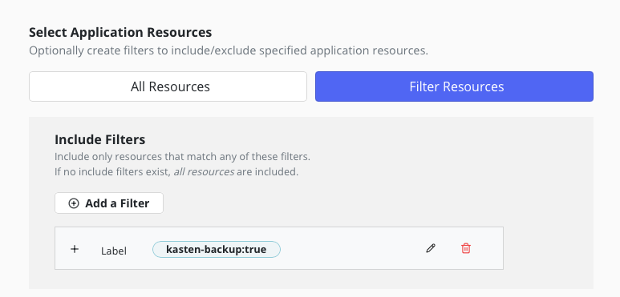
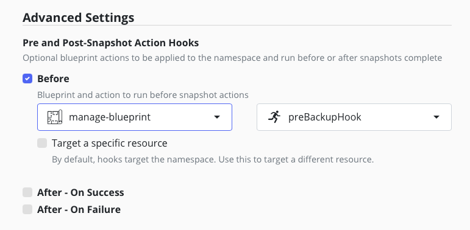

# Goal 

A blueprint to label all the components that need to be backed up in the namespace `mas-$MAS_INSTANCE_ID-manage`

# How does it work 

The [documentation](https://www.ibm.com/docs/en/masv-and-l/cd?topic=manage-namespace) leads to backing up the `mas-$MAS_INSTANCE_ID-manage` namespace with a [script](https://www.ibm.com/docs/en/masv-and-l/cd?topic=namespace-backing-up-maximo-manage-script) that can be found in [github](https://github.com/ibm-mas/cli/blob/master/image/cli/mascli/backup-restore/manage-backup-restore.sh)  


## Preliminary test 

We have changed the script : instead of creating the resource manisfest yaml files in your machine we just label the resources with `kasten-backup=true`.

```
cd maximo/manage
manage-backup-restore.sh -i <MAS_INSTANCE_ID> -w <MAS_WORKSPACE_ID>  -f ./ -m backup
```

Now, We only have to create a policy of the `mas-$MAS_INSTANCE_ID-manage` namespace that include only resources that have the label `kasten-backup:true`.



## Allow discovery of the `MAS_INSTANCE_ID`and `MAS_WORKSPACE_ID` in the namespace `mas-$MAS_INSTANCE_ID-manage` 

we need to find a way to discover the `MAS_INSTANCE_ID` and  `MAS_WORKSPACE_ID`, always make sure you created the configmap manage-instance-id in the `mas-$MAS_INSTANCE_ID-manage` namespace

```
MAS_INSTANCE_ID=<My mas instance id>
MAS_WOKSPACE_ID=<My workspace id>
oc create configmap mas-instance-id \
   -n mas-$MAS_INSTANCE_ID-manage  \
   --from-literal mas-instance-id=$MAS_INSTANCE_ID \
   --from-literal mas-workspace-id=$MAS_WORKSPACE_ID
```

Then deploy the blueprint

```
oc create -f manage-blueprint.yaml 
```

Only the The `preBackupHook` need to be configured in the policy.



# Restoring 

Find the kasten restore point that contains the component you want to restore using the overwrite option.

[Overwrite](./overwrite.png)

Follow the [IBM documentation to validate](https://www.ibm.com/docs/en/masv-and-l/cd?topic=manage-validating-restoration-maximo) the restoration.


