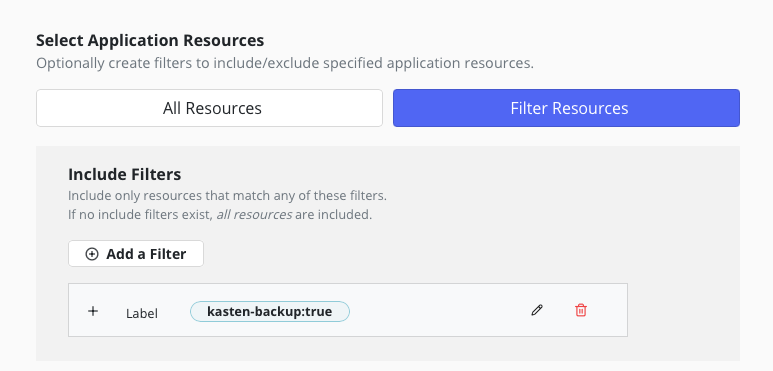
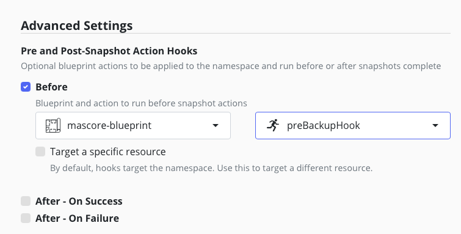
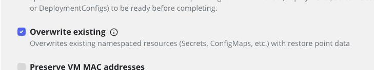

# Goal 

A blueprint to label all the components that need to be backed up in the namespace `mas-$MAS_INSTANCE_ID-core`

# How it works 

We follow the documentation for [backing up](https://www.ibm.com/docs/en/masv-and-l/cd?topic=namespace-backing-up-resources-manually) and [restoring](https://www.ibm.com/docs/en/masv-and-l/cd?topic=core-namespace) the application suite core that leads to a [backup and restore script](https://github.com/ibm-mas/cli/blob/master/image/cli/mascli/backup-restore/mascore-backup-restore.sh).

# Preliminary test 

We change the script : instead of creating the resource manisfest yaml files in your machine we just label the resources with `kasten-backup=true`.

```
cd maximo/mascore
# replace <MAS_INSTANCE_ID> with your instance id eg. masdev
./mascore-backup-restore.sh -i <MAS_INSTANCE_ID> -f ./ -m backup
```

Now, we only have to create a policy for the `mas-$MAS_INSTANCE_ID-core` namespace that include only resource that have the label `kasten-backup:true`.



## If you have a custom cert manager

If you have a custom cert manager you need to back it up in another policy.

To check if you are using a custom cert-manager, run the following command:
```
oc get Suite  $MAS_INSTANCE_ID -n $MAS_CORE_NAMESPACE -o yaml | yq '.spec | has("certificateIssuer")') 
```

If the result is `true` then review [mas-certmanager-policy.yaml](./mas-certmanager-policy.yaml) and apply it 
```
oc create -f mas-certmanager-policy.yaml
```

Edit the policy to add frequency, retention and a backup location.

# Install and execute the blueprint 

## If you pull from a private registry or docker hub

Create a pull secret to pull the mongo:6.0 image.
```
kubectl create secret docker-registry my-dockerhub-secret \
  --docker-username=<your-username> \
  --docker-password=<your-password> \
  --docker-email=<your-email> \
  -n mongoce
```

Now link this pull secret to the default service account  
```
oc secrets link default my-dockerhub-secret --for=pull -n mas-<MAS_INSTANCE_ID>-core
```

If you need to add docker pull secret to the global openshift check the [documentation](https://docs.redhat.com/en/documentation/openshift_container_platform/4.14/html/images/managing-images#images-update-global-pull-secret_using-image-pull-secrets).

## Allow discovery of the `MAS_INSTANCE_ID`

we need to find a way to discover the MAS_INSTANCE_ID, always make sure you created the configmap mas-instance-id in the mas-<MAS_INSTANCE_ID>-core namespace

```
oc create configmap -n mas-<MAS_INSTANCE_ID>-core mas-instance-id --from-literal mas-instance-id=masdev
```

Then deploy the blueprint

```
oc create -f mascore-blueprint.yaml 
```

Only the The `preBackupHook` need to be configured in the policy.



# Restoring

Find the kasten restore point that contains the component you want to restore. It will only contains the required component to restore. 

Use the overwite option



Follow the [IBM documentation to validate](https://www.ibm.com/docs/en/masv-and-l/cd?topic=core-validating-restoration-maximo-application-suite) the restoration.


