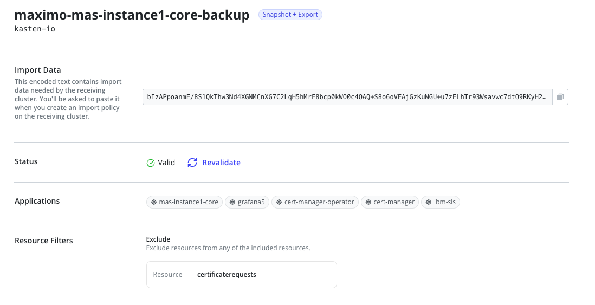

# Goal 

Explain how the namespace `mas-$MAS_INSTANCE_ID-core` should be backed up

# A single backup policy 

You need to create a policy that will capture this list of namespaces

- mas-$MAS_INSTANCE_ID-core
- cert-manager
- cert-manager-operator (optional)
- ibm-sls 
- grafana

**But you must exclude CertificateRequest** : CertificateRequest objects are ephemeral — they're transient objects created by cert-manager to fulfill a Certificate, then typically completed/garbage-collected. They shouldn't be restored at all, they should not be backed up at all. their webhook rejects any PUT that tries to change spec. K10's overwriteExisting path calls Update (PUT) on all unstructured resources, hitting this webhook validation.



## Why backing up those namespaces

These backups are very useful for retrieving manifests that have been changed either directly with
kubectl or by action on the UI. You often use them for comparison or to fix manipulation errors.

### Why backing up the mas-$MAS_INSTANCE_ID-core 

This namespace contains a top definition object `core.mas.ibm.com.Suite` object which play an important role in the global configuration of Maximo. 

It contains also a lot of secrets and `config.mas.ibm.com.jdbccfgs` that must be protected and other derived resources.

A lot of derived resources will be rebuilt after operator reconcilation, but by restoring them directly with Kasten you can get back Maximo working in 7 minutes instead of waiting for the 2.5 hours rebuild.

### Why backing up cert-manager 

Backing up the cert-manager namespace is important because:

- Certificate Authorities (CAs): It stores Issuer and ClusterIssuer resources, including private CA keys stored in Secrets. If lost, you cannot reissue certificates signed by the same CA — all downstream TLS trust breaks.
- Issued Certificates & Secrets: The TLS Secrets (key pairs) referenced by Ingresses, Services, and workloads live here or are managed from here. Losing them means all TLS endpoints fail until certificates are re-created and re-distributed.
- Avoid mass re-issuance: Without a backup, restoring a cluster means cert-manager must re-request every certificate from external issuers (e.g., Let's Encrypt), which can hit rate limits and cause extended downtime.
- Internal PKI continuity: In environments like Maximo/MAS, many components rely on internal certificates for mTLS between services. Restoring the same CA and certs ensures restored workloads in other namespaces still trust each other without reconfiguration.

### Why cert-manager-operator is optional

The `cert-manager-operator` namespace only contains the OLM-managed operator (Subscription, ClusterServiceVersion, InstallPlan). It is stateless — all the valuable state (CAs, certificates, issuers, TLS secrets) lives in the `cert-manager` namespace. Reinstalling the operator via OLM is straightforward and more reliable than restoring it, since OLM-managed resources often conflict with OLM when restored.

### Why backing up the ibm-sls namespace 

IBM SLS (Suite License Service) is the licensing backbone of Maximo Application Suite. Backing it up is critical because:

- **License entitlement secret** (`ibm-sls-sls-entitlement`): Contains the entitlement key that activates MAS. If lost, MAS cannot validate its license and all Suite applications stop working until a new entitlement is re-applied.
- **Suite registration** (`sls-suite-registration`): Holds the `registrationKey` and the CA certificate that MAS core uses to connect to SLS. If this is lost the `mas-$MAS_INSTANCE_ID-core` namespace can no longer communicate with SLS, breaking license validation.
- **MongoDB credentials** (`ibm-sls-mongo-credentials`): SLS stores license usage and token data in MongoDB. Losing these credentials disconnects SLS from its database.
- **TLS certificates and issuers** (`sls-cert-api`, `sls-cert-ca`, `sls-cert-client`, `sls-ca-issuer`, `sls-issuer`): SLS has its own internal PKI for mTLS between the API server, clients, and the MAS core. Losing these certificates breaks trust between SLS and all registered suites.
- **LicenseService CR** (`licenseservice.sls.ibm.com/sls`): This is the top-level custom resource that defines the SLS instance configuration. Restoring it avoids a full re-installation of the license service.

Without a backup, recovering SLS requires re-creating the entitlement, re-registering the suite, and re-establishing trust — a process that can take significant time and requires access to the original IBM entitlement key.

### Why backing up the grafana5 namespace

The Grafana PVC stores the Grafana database (SQLite by default), which contains:

- Dashboard definitions
- Datasource configurations
- User accounts and preferences
- Alert rules
- Folder structure

It does not store metrics/monitoring data — that lives in the datasource (typically Prometheus, which has its own PVC).

This is important for backup: the Grafana PVC is worth backing up because it holds the dashboard definitions that may have been customized. If you only back up manifests and not the PVC, you lose any dashboards created or modified via the UI.

# How to restore 

## For mas-${MAS_INSTANCE_ID}-core 

First restore the top object Suite (core.mas.ibm.Suite) with "overwrite existing" selected.

Then scale down all the deployments 
```
oc scale --replicas 0 deployment --all -n mas-${MAS_INSTANCE_ID}-core
```

And restore again, but this time  all the resource with  "overwrite existing" selected but exclude "pods" and "certificateRequest" if present in the restore point.

## ibm-sls 

First restore the top objects LicenseServices (sls.ibm.come.LicenseService) and LicenseClient (sls.ibm.com.LicenseClient) with "overwrite existing" selected.

Then scale down all the deployments 
```
oc scale --replicas 0 deployment --all -n ibm-sls
```

And restore again, but this time  all the resource with  "overwrite existing" selected but exclude "pods" and "certificateRequest" if present in the restore point.

## For cert-manager and grafana 

each time you restore one of this namespace, scale down all the deployments in the namespace 
```
oc scale --replicas 0 deployment --all -n <NAMESPACE>
```

Then restore all with  "overwrite existing" selected but exclude "pods" and "certificateRequest" if present in the restore point.


