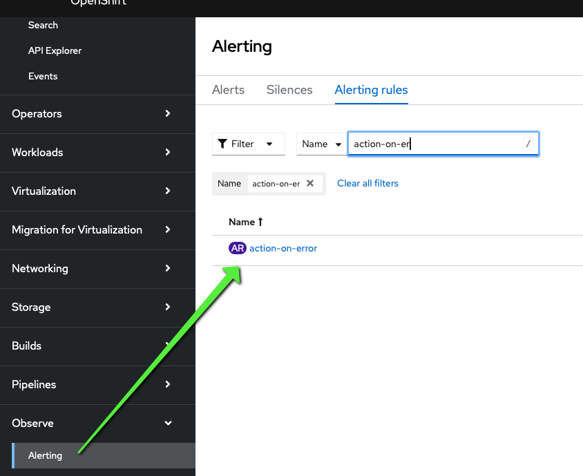

# OpenShift Integration

You can apply the [alerting rules](./kasten-rules.yaml) directly in OpenShift
if user workload monitoring is activated. Both the Prometheus stack and the
OpenShift monitoring stack use the `prometheusrules.monitoring.coreos.com` CRD.

## Configure OpenShift User Workload Monitoring

1. Make sure the ConfigMap `cluster-monitoring-config` in the `openshift-monitoring` namespace has
`enableUserWorkload: true`

For instance, this is the ConfigMap in my OpenShift cluster:
```
kind: ConfigMap
apiVersion: v1
metadata:
  name: cluster-monitoring-config
  namespace: openshift-monitoring
data:
  config.yaml: |
    enableUserWorkload: true
```

2. Make sure the ConfigMap `user-workload-monitoring-config` in the `openshift-user-workload-monitoring` namespace has Alertmanager enabled.

For instance, this is the ConfigMap in my OpenShift cluster:
```
kind: ConfigMap
apiVersion: v1
metadata:
  name: user-workload-monitoring-config
  namespace: openshift-user-workload-monitoring
data:
  config.yaml: |
    alertmanager:
      enabled: true
      enableAlertmanagerConfig: true
```

You should then see the pods `alertmanager-user-workload-0` and `alertmanager-user-workload-1` in the `openshift-user-workload-monitoring` namespace restarting.

## Apply the Alerting Rule

```
oc apply -f kasten-rules.yaml
```

## Openshift monitoring use service monitor not scrape config 

Openshift monitoring is not using scrape config it uses service monitor instead. You have to create them:

```
cat <<EOF | oc create -f - 
apiVersion: monitoring.coreos.com/v1
kind: ServiceMonitor
metadata:
  labels:
    k8s-app: kasten-io
  name: catalog-metrics
  namespace: kasten-io
spec:
  endpoints:
  - interval: 30s
    port: http
    scheme: http
  selector:
    matchLabels:
      component: catalog
---
apiVersion: monitoring.coreos.com/v1
kind: ServiceMonitor
metadata:
  labels:
    k8s-app: kasten-io
  name: controllermanager-metrics
  namespace: kasten-io
spec:
  endpoints:
  - interval: 30s
    port: http
    scheme: http
  selector:
    matchLabels:
      component: controllermanager
---
apiVersion: monitoring.coreos.com/v1
kind: ServiceMonitor
metadata:
  labels:
    k8s-app: kasten-io
  name: metering-metrics
  namespace: kasten-io
spec:
  endpoints:
  - interval: 30s
    port: http
    scheme: http
  selector:
    matchLabels:
      component: metering
---
apiVersion: monitoring.coreos.com/v1
kind: ServiceMonitor
metadata:
  labels:
    k8s-app: kasten-io
  name: dashboardbff-metrics
  namespace: kasten-io
spec:
  endpoints:
  - interval: 30s
    port: http
    scheme: http
  selector:
    matchLabels:
      component: dashboardbff
---
apiVersion: monitoring.coreos.com/v1
kind: ServiceMonitor
metadata:
  labels:
    k8s-app: kasten-io
  name: crypto-metrics
  namespace: kasten-io
spec:
  endpoints:
  - interval: 30s
    port: http
    scheme: http
  selector:
    matchLabels:
      component: crypto
```


## Check the Alerting Rules Are Activated

Now check that the new configuration has been injected in Thanos:

```
oc get cm -n openshift-user-workload-monitoring thanos-ruler-user-workload-rulefiles-0 -o yaml
```

You should see something like this:

```
apiVersion: v1
data:
  kasten-io-kasten-rules-8e3029a6-e1f5-4c2f-9905-bbd1a421d90c.yaml: |
    groups:
    - name: ./kasten.rules
      rules:
      - alert: catalog-over-50-percent
        annotations:
          description: 'The size of the catalog is over 50 % : {{ $value }} %.'
          runbook_url: https://docs.kasten.io/latest/references/best-practices.html#monitoring-and-alerting
          summary: The size of the catalog is over 50 %.
        expr: 100 - catalog_persistent_volume_free_space_percent{namespace="kasten-io"}
          > 50
        labels:
          namespace: kasten-io
          severity: warning
      - alert: action-on-error
        annotations:
          description: The action of type {{ $labels.type}} executed on policy {{ $labels.policy}}
            for the namespace {{ $labels.namespace}} is on error.
          runbook_url: https://docs.kasten.io/latest/operating/support.html
          summary: Action on error
        expr: increase(catalog_actions_count{namespace="kasten-io",status="failed"}[1h])
          > 0
        labels:
          namespace: kasten-io
          severity: critical
      - alert: license-non-compliant
        annotations:
          description: Your license is non compliant, please check on the dashboard Settings
            > Licensing.
          runbook_url: https://docs.kasten.io/latest/multicluster/concepts/license.html
          summary: License non compliant
        expr: metering_license_compliance_status{namespace="kasten-io"} == 0
        labels:
          namespace: kasten-io
          severity: warning
      - alert: kasten-service-down
        annotations:
          description: The kasten service {{ $labels.service }} is down.
          runbook_url: https://docs.kasten.io/latest/operating/support.html
          summary: A kasten service is down
        expr: up{application="k10",namespace="kasten-io"} == 0
        labels:
          namespace: kasten-io
          severity: critical
      - alert: kasten-executor-down
        annotations:
          description: The kasten service {{ $labels.service }} is down.
          runbook_url: https://docs.kasten.io/latest/operating/support.html
          summary: A kasten service is down
        expr: up{app="k10",namespace="kasten-io"} == 0
        labels:
          namespace: kasten-io
          severity: critical
      - alert: kasten-event-group
        annotations:
          description: The kasten event {{ $labels.action }} has been emitted.
          runbook_url: https://docs.kasten.io/latest/operating/support.html
          summary: A kasten critical event is detected
        expr: events_service_event_groups{namespace="kasten-io"} > 0
        labels:
          namespace: kasten-io
          severity: critical
```

You can also find them in the UI:



## Configure a receiver to send the alert somewhere

```
cat <<EOF | oc create -f -
kind: Secret
apiVersion: v1
metadata:
  name: alertmanager-user-workload
  namespace: openshift-user-workload-monitoring
  labels:
    app.kubernetes.io/name: alertmanager
stringData:
  alertmanager.yaml: |
                     global:
                       smtp_smarthost: "smtp-relay.brevo.com:587"
                       smtp_from: "michael@kasten.com"
                       smtp_auth_username: "michael.courcy@veeam.com"
                       smtp_auth_password: "xxxxx"
                       smtp_require_tls: false
                     route:
                       receiver: "email-notifications"
                     receivers:
                     - name: "email-notifications"
                       email_configs:
                       - to: "support@kasten.io"

type: Opaque
EOF
```