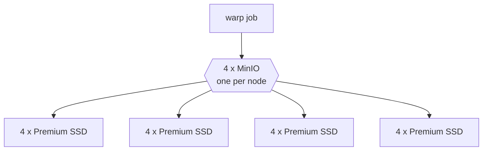

# Goal

The [main tutorial](../readme.md) deliberately deploys the simplest possible MinIO — one pod, one
`emptyDir` on a node disk — and spends a whole section warning you that its numbers are a
validation artefact rather than a storage measurement.

This is the follow-up: **how fast can a self-hosted S3 endpoint actually go on infrastructure you
already own?** Same cluster, same warp job, same parameters. The only thing that changes is how
MinIO is deployed.

The short answer, measured on the validation cluster:

| | PUT (export) | GET (restore) |
|---|---|---|
| Single pod on a node disk (main tutorial) | 143 MiB/s | 1359 MiB/s |
| **Properly deployed and tuned** | **1005 MiB/s** | **2603 MiB/s** |
| AWS S3 `eu-west-3`, for reference | 1338 MiB/s | 717 MiB/s |

**7x on writes**, and reads end up **3.6x faster than AWS S3**. Writes still fall ~25% short of
AWS. Everything below is how we got there and which levers actually mattered — several of the
obvious ones did nothing.

# What gets deployed



- A `StatefulSet` of 4 MinIO pods, **one per node** via `requiredDuringScheduling` anti-affinity.
  This is the point of the whole exercise: each pod gets its own node's disk and network budget,
  instead of four pods contending for one node's budget and teaching you nothing.
- **4 PVCs per pod, 16 drives total**, forming a single erasure set.
- A headless Service so the pods can find each other, plus a normal Service as the S3 endpoint.
  `publishNotReadyAddresses: true` is required on the headless one: the pods must resolve each
  other *before* any can become ready, because readiness depends on a quorum that does not exist
  yet.

| File | Contents |
|---|---|
| [00-storageclass.yaml](00-storageclass.yaml) | Premium SSD class with host caching disabled |
| [01-minio-distributed.yaml](01-minio-distributed.yaml) | Headless + client Services, StatefulSet |
| [02-minio-single-pod-pvc.yaml](02-minio-single-pod-pvc.yaml) | Control A: 1 pod, 1 Premium disk |
| [03-minio-single-node-4drives.yaml](03-minio-single-node-4drives.yaml) | Control B: 1 pod, 4 Premium disks, one node |

## Why a dedicated StorageClass

On this cluster the default `managed-csi` is already `Premium_LRS`, so the SKU was never the
problem. The reason to define our own class is `cachingMode: None`: the Azure disk CSI driver
defaults to `ReadOnly` host caching, which lets the VM serve reads out of the host's cache. That is
the same flattering effect as the page cache, and it would make the GET numbers meaningless.

Check what your own default class actually is before assuming — note the parameter key is
lowercase, which is easy to miss:

```
kubectl get sc managed-csi -o jsonpath='{.parameters}'
```

```
{"skuname":"Premium_LRS"}
```

# Running it

```
kubectl apply -f 00-storageclass.yaml -f 01-minio-distributed.yaml
kubectl -n warp rollout status sts/minio-dist --timeout=420s
```

Confirm the topology is what you think it is — 4 pods, 4 *different* nodes:

```
kubectl -n warp get pods -l app=minio-dist \
  -o 'custom-columns=NAME:.metadata.name,NODE:.spec.nodeName'
```

Then point the benchmark at it and run the jobs from the main tutorial:

```
kubectl -n warp patch secret s3-target --type merge \
  -p '{"stringData":{"S3_ENDPOINT":"http://minio-dist.warp.svc.cluster.local:9000"}}'
kubectl -n warp delete job warp-put --ignore-not-found
kubectl apply -f ../05-warp-put.yaml && kubectl -n warp logs -f job/warp-put
```

## :moneybag: This one costs real money — delete it afterwards

16 Premium disks is not free, and unlike the egress in the main tutorial it bills for as long as
the PVCs exist, whether or not you are benchmarking:

| Disk size | SKU | Total provisioned | Rough cost |
|---|---|---|---|
| 128 GiB | P10 | 2 TiB | ~$0.45/hour |
| 512 GiB | P20 | 8 TiB | ~$1.60/hour |

`reclaimPolicy: Delete` means deleting the PVCs deletes the Azure disks, but **deleting the
StatefulSet does not delete the PVCs**. You have to do it explicitly:

```
kubectl -n warp delete sts minio-dist
kubectl -n warp delete pvc --all          # <-- the part people forget
kubectl -n warp delete svc minio-dist minio-hl
kubectl delete sc warp-premium-nocache
kubectl -n warp get pvc                   # confirm nothing is left billing
```

# The tuning ladder

Every row is a real run: `OBJ_SIZE=64MiB`, `DURATION=30s`, one variable changed at a time.

| # | Configuration | PUT | Gain |
|---|---|---|---|
| 0 | Single pod, node disk `emptyDir` *(main tutorial)* | 143 MiB/s | — |
| 1 | 4 nodes x 4 drives (P10), EC:4, 4 CPU, via ClusterIP Service | **742.87 MiB/s** | **5.2x** |
| 2 | ...parity lowered to EC:2 | 789.63 MiB/s | +6.3% |
| 3 | ...MinIO CPU limit 4 -> 12 | 824.77 MiB/s | +4.4% |
| 4 | ...warp addressing all 4 nodes directly | 836.37 MiB/s | +1.4% |
| 5 | ...disks 128 GiB -> 512 GiB (P10 -> P20) | **1005.43 MiB/s** | +20.2% |
| 6 | ...concurrency 8 -> 32 | 1019.91 MiB/s | +1.4% |

And reads, on the same topology:

| Configuration | GET |
|---|---|
| Single pod, cross-node *(main tutorial)* | 1359 MiB/s |
| Distributed, 16 x P10 | 1986.19 MiB/s |
| Distributed, 16 x P20 | **2603.26 MiB/s** |

## What the ladder says

**Almost all of the win is in step 1 — just spreading across nodes and drives.** Going from one pod
on one disk to 16 drives on 4 nodes is a 5.2x jump. Everything afterwards adds 37% combined. If you
take one thing away: the topology matters far more than the tuning.

But step 1 changes *two* things at once — pod count and the backing device — so on its own it does
not prove topology is what mattered. That needed a separate control, below.

# Is topology really the lever?

Step 1 replaced one pod on an `emptyDir` with four pods on sixteen Premium disks. The gain could
have come from the topology, or simply from moving off the node's OS disk onto dedicated Premium
SSDs. Two more runs separate them, both with `OBJ_SIZE=64MiB`, `CONCURRENT=8`, `DURATION=30s`:

| Control | Pods | Drives | Amplification | PUT | GET |
|---|---|---|---|---|---|
| **Baseline** — `emptyDir` on the node OS disk | 1 | 1 | 1x | 143 MiB/s | 1359 MiB/s |
| **A** — one dedicated Premium P20 | 1 | 1 | 1x | **147.20 MiB/s** | — |
| **B** — four Premium P20, *same* node | 1 | 4 | 2x | **263.05 MiB/s** | **1313.34 MiB/s** |
| **Distributed** — 16 Premium P20, four nodes | 4 | 16 | 1.14x | 1005.43 MiB/s | 2603.26 MiB/s |

[02-minio-single-pod-pvc.yaml](02-minio-single-pod-pvc.yaml) and
[03-minio-single-node-4drives.yaml](03-minio-single-node-4drives.yaml) are those two controls.

### The backing device was irrelevant

**143 MiB/s on the OS disk, 147.20 MiB/s on a dedicated Premium P20.** A 2.9% difference, inside
run-to-run noise, with a spread of 145.8–149.8 MiB/s and a request-time standard deviation of 24 ms
— a textbook hard device limit.

The reason is arithmetic: a 512 GiB Premium P20 is rated ~150 MBps ≈ 143 MiB/s, and the node's OS
disk happened to be in the same throughput class. **One disk was the ceiling in both cases.** So
none of the 5.2x came from switching to Premium storage, and the original conclusion survives the
control.

### Drives are a lever, but only up to one VM's budget

Four drives on the same node took PUT from 147 to **263.05 MiB/s — 1.8x, not 4x.** The reason shows
up when you convert to actual disk I/O, correcting for the 2x write amplification of a 4-drive
EC:2 set:

```
263.05 MiB/s payload  x  2 (amplification)  =  526 MiB/s  =  552 MB/s of disk I/O
```

A `Standard_D16s_v5` is rated for ~600 MBps of uncached disk throughput, so that single node was at
**92% of its VM-level disk budget** — saturated. Adding a fifth or sixteenth disk to that node
would have achieved nothing. This is the ceiling that makes topology unavoidable.

### So yes — node count is the real lever for writes

Going from one node to four, at the same 4 drives per node, took PUT from 263.05 to
**1005.43 MiB/s: 3.8x for 4x the nodes**, close to linear. Each additional node brings its own
~600 MBps disk budget, and that is the only way past the per-VM cap.

With one honest caveat, visible once you normalise for amplification again:

| | Disk I/O achieved | Per node | % of the ~600 MBps VM cap |
|---|---|---|---|
| 1 node, 4 drives | 552 MB/s | 552 MB/s | **92%** |
| 4 nodes, 16 drives | 1202 MB/s | 300 MB/s | **50%** |

**Distributed MinIO extracts about half as much from each node as a single node does.** Four times
the hardware bought 2.2x the disk I/O, roughly 55% scaling efficiency — the cost of erasure-coding
shards across the network and coordinating them. Part of the headline 3.8x payload gain is not extra
I/O at all but *better parity economics*: a 16-drive set at EC:2 wastes 1.14 bytes per byte stored
where a 4-drive set at EC:2 wastes 2. Both effects are real benefits of more drives on more nodes;
they are just not the same effect.

### Reads never involved the disks at all

**1359 MiB/s on one disk, 1313.34 MiB/s on four.** Quadrupling the drives changed reads by −3%.

Those four P20s can supply ~600 MB/s of reads between them, yet the pod served 1313 MiB/s
(~1377 MB/s) — more than twice what the disks can deliver. The reads were coming out of the page
cache, which is available for reads even though MinIO's erasure-coded *writes* use `O_DIRECT` and
bypass it.

Adding *pods* is what moved reads: 1313 → 2603 MiB/s, about 2x for 4x the pods. This independently
confirms the retraction in the next section — the ~1350 MiB/s plateau seen repeatedly in the main
tutorial was **one MinIO pod's serving capacity**, not the node's network card. Two different
backends, one and four disks, both land on ~1350; only adding pods breaks through it.

## Summary: where the 7x comes from

| Step | Multiplier | Why |
|---|---|---|
| Dedicated Premium disk instead of `emptyDir` | **1.03x** | Nothing. One disk is one disk. |
| 1 → 4 drives on that node | **1.8x** | Real, until the ~600 MBps per-VM disk cap stops it at 92% |
| 1 → 4 nodes at 4 drives each | **3.8x** | Each node adds its own disk budget; the only way past the cap |
| Parity, CPU, host list, disk size | **1.37x** | Worthwhile tuning, none of it decisive |

Topology is the lever. Not because pods are magic, but because **the per-VM disk throughput cap is
the binding constraint, and nodes are the only way to buy more of it.**

**Erasure coding parity is a real but modest lever (+6.3%).** With 16 drives MinIO defaults to
`EC:4` — 12 data + 4 parity, so every byte written costs 1.33 bytes of disk I/O. `EC:2` gives
14 + 2 and 1.14x amplification, a 17% reduction in disk writes that bought only 6.3% of
throughput — the first clue that disks were not the whole story. Note this trades redundancy for
speed: `EC:2` survives 2 drive failures, `EC:4` survives 4. **Do not lower parity on anything
holding real backups** to win 6%.

Drive count changes the arithmetic, so it is a design decision and not a detail: a 16-drive set at
EC:4 costs 1.33x, but an 8-drive set at EC:4 is 4+4 and costs **2x**.

**Disk size is the biggest single lever after topology (+20%).** Azure Premium SSD throughput
scales with capacity, not just count — ~100 MBps for a 128 GiB P10 against ~150 MBps for a 512 GiB
P20. Provisioning bigger disks than you need for *space* is a legitimate way to buy *throughput*.

**Concurrency is not a lever at all.** 8 to 32 streams moved nothing (789.63 -> 790.30 at step 2,
1005 -> 1020 at step 5) while per-stream latency grew proportionally: 101 MiB/s per stream at 8
became 24.7 at 32. That is the signature of a saturated resource rather than an unfilled pipe —
worth contrasting with the AWS GET in the main tutorial, where the arithmetic showed the exact
opposite and more streams *would* have helped.

**MinIO's CPU barely matters here (+4.4%)** even though erasure coding is CPU work, and bypassing
the ClusterIP Service to address all four nodes directly barely matters either (+1.4%). Both are
worth trying and neither is where the money is.

## What we could not establish

At 1005 MiB/s the disks are carrying about `1005/4 x 1.14 = 286 MiB/s` per node against a nominal
`4 x 150 MBps = 600 MBps` — roughly 50%, and well under the ~600 MBps per-VM uncached ceiling of a
`Standard_D16s_v5`. So we are **not** cleanly disk-saturated, yet no software lever moved the
number much. The most likely explanation is the efficiency of MinIO's `O_DIRECT` write path
combined with erasure-coding overhead, but we did not prove it, and it is stated here as an open
question rather than a conclusion.

The obvious experiment — swap the disks for tmpfs, as the main tutorial does for the single pod —
**is impossible**, which is itself worth knowing:

```
FATAL Unable to initialize backend: Unable to write to the backend
      > Please ensure your drive supports O_DIRECT
      HINT:
        Drive '/data-0' does not support O_DIRECT flags,
        MinIO erasure coding requires filesystems with O_DIRECT support
```

Erasure-coded MinIO requires `O_DIRECT` and tmpfs does not provide it. There is a useful corollary:
because MinIO writes with `O_DIRECT`, it **bypasses the page cache entirely**, so every write figure
on this page is honest in a way the single-pod `emptyDir` numbers were not.

# :warning: This experiment corrected the main tutorial

The GET result forced a retraction. The [main tutorial](../readme.md) originally argued that several
measurements landing near 1300–1400 MiB/s were all hitting the node's network card, since
`Standard_D16s_v5` is rated at 12.5 Gbit/s and 1359 MiB/s is 91% of it. It even offered that
agreement as evidence the numbers were trustworthy.

Then a single warp pod, on one node, read at **2603 MiB/s — 21.8 Gbit/s**, comfortably past the
published figure.

| Measurement | MiB/s | Gbit/s |
|---|---|---|
| Distributed MinIO GET | 2603 | **21.8** |
| Azure's published figure for `Standard_D16s_v5` | ~1490 | 12.5 |

So the NIC was never the ceiling, and Azure's number is a conservative expectation rather than a
hard cap. Each of those earlier endpoints had its *own* limit that happened to land in the same
range: the single MinIO pod was bounded by being a single pod, and the AWS PUT by something on
AWS's side or in the egress path.

The lesson is worth more than the correction: **numbers that agree with each other invite a false
common cause.** Three measurements clustering around 1350 MiB/s looked like proof of a shared
hardware limit. They were three unrelated limits that happened to coincide. Finding a plausible
documented figure to match your result is satisfying, and it is exactly when you should be most
suspicious — the way to test it is to try to *exceed* it, not to admire the agreement.

# Reading this against AWS

| | PUT | GET |
|---|---|---|
| AWS S3 `eu-west-3` | **1338 MiB/s** | 717 MiB/s |
| Distributed MinIO, tuned | 1005 MiB/s | **2603 MiB/s** |

Self-hosted MinIO on this cluster reads **3.6x faster than AWS S3** and writes about **25% slower**.

That read gap is not surprising once stated: the MinIO drives are metres away on the same switch
fabric, while S3 reads cross a cloud boundary and are the metered, shaped direction. The write gap
is the price of erasure coding on 16 Premium disks versus a fleet that spreads writes across far
more devices than you own.

For an enterprise blueprint the practical consequence is about **restores**, which is where the
asymmetry bites. Sizing 1 TiB with the numbers above:

| | Export (PUT) | Restore (GET) |
|---|---|---|
| AWS S3 | 13 min | 24 min |
| Distributed MinIO | 17 min | **7 min** |

A well-built local MinIO turns a 24-minute restore into a 7-minute one, at the cost of 4 minutes on
the backup — and backups are scheduled while restores happen under pressure. That is the trade the
measurement lets you argue for, with numbers instead of intuition.

None of which means "self-host everything": these figures come from one cluster, 16 disks and a
30-second benchmark, and they say nothing about durability, replication, immutability or operational
cost. They say what the *bandwidth* trade looks like. Run it on your own infrastructure before
quoting any of it.
