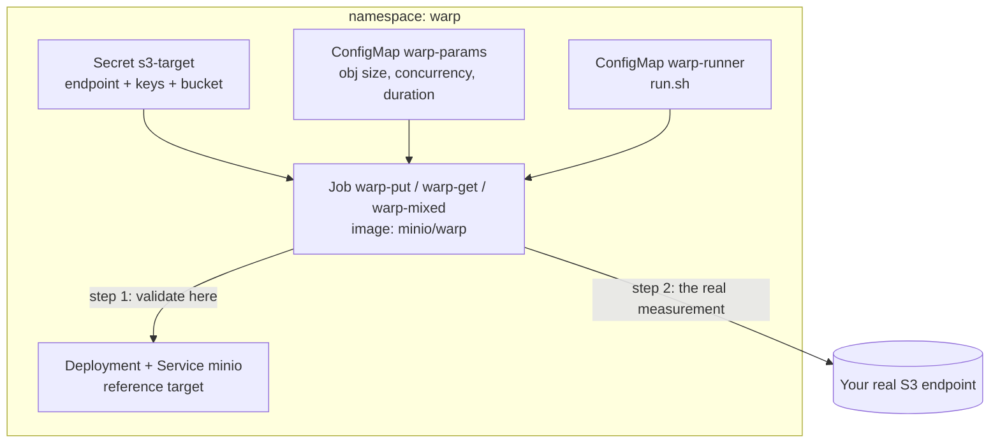

# Goal

Measure the **bandwidth between your Kubernetes cluster and your S3 endpoint** by applying a
few YAML files, and get a readable report in the logs of a Job.

No client tooling, no port-forward, no laptop in the middle: the measurement runs **inside** the
cluster, from a pod, on a node — which is exactly where Kasten runs when it exports your backups.

Everything lives in a single `warp` namespace, including a throw-away MinIO server used as a
reference target, so you can validate the whole thing end to end before pointing it at your real
object storage.

# Why do I care about the bandwidth to my S3 endpoint?

Every enterprise blueprint in this repository ends the same way: a snapshot is exported to an
object store. That export is the part of the chain that crosses the network, and it is almost
always the part that decides whether you meet your backup window.


Two very concrete questions come up in every design review:

- *"We have 8 TiB to export and a 6 hour backup window. Is that even possible?"*
- *"The restore took 9 hours. Is Kasten slow, or is the link slow?"*

You cannot answer either one without knowing what the link between the cluster and the bucket
actually delivers. And you want that number **before** you build the backup policy, not after the
first missed window.

A quick sizing rule, using the number this tutorial gives you:

```
export duration  =  amount of data to export  /  measured PUT bandwidth
```

On the cluster used for this tutorial, 1 TiB (1048576 MiB) works out very differently depending on
which endpoint you ask:

| Target | Measured PUT | 1 TiB export |
|---|---|---|
| AWS S3 in the same city | 1338 MiB/s | **13 minutes** |
| A MinIO pod in the same namespace | 136 MiB/s | **2 h 8 min** |

Yes, that way round — and the reason why is the most useful thing in this tutorial, so we come back
to it in [Step 5](#warning-step-5--understand-what-the-minio-number-is-and-is-not) and
[the comparison](#what-this-comparison-actually-says). The point for now: guessing this number is
not an option, and neither is assuming that "closer" means "faster".

> Note that Kasten will not necessarily reach the bandwidth measured here: it also reads the
> snapshot, deduplicates, compresses and encrypts. What warp gives you is the **ceiling**. It tells
> you what is possible, and it tells you whether a disappointing export time is caused by the
> network or by something else.

# What is warp?

[warp](https://github.com/minio/warp) is MinIO's open source S3 benchmarking tool. It is a single
static binary, published as a container image, that talks plain S3 to any S3-compatible endpoint —
AWS S3, MinIO, Ceph RGW, NetApp StorageGRID, Dell ECS, Azure via an S3 gateway, and so on.

It matters for us that warp:

- measures **throughput over time**, not just an average, so you see whether the link is stable or
  collapses after a few seconds (throttling, shared uplink, QoS)
- separates **PUT** (upload, the export direction) from **GET** (download, the restore direction),
  which are very often asymmetric
- reads its connection settings from **environment variables**, which makes it trivial to drive
  from a Secret and a ConfigMap
- runs unprivileged, needs no persistent storage, and is done in 30 seconds

This tutorial was validated with **warp 1.3.1**.

# :warning: Read this before you run anything

**warp empties the bucket it benchmarks, before and after every run.**

That is not a side effect, it is by design: warp needs a clean bucket to produce comparable
numbers. Its own help text says it plainly:

```
--bucket value   Bucket to use for benchmark data. ALL DATA WILL BE DELETED IN BUCKET!
```

So:

- Point `S3_BUCKET` at a **dedicated, empty bucket**.
- **Never** point it at a bucket that holds Kasten exports, or any other data you care about.
- If you cannot get a dedicated bucket, do not run this. Ask for one, it costs nothing.

A second, milder warning: a benchmark by definition tries to saturate the link. If the uplink is
shared with production traffic, run it during a maintenance window, or cap it with
`EXTRA_FLAGS: "--rps-limit=50"`.

# What is in this directory

| File | Role | Do I edit it? |
|---|---|---|
| [00-namespace.yaml](00-namespace.yaml) | The `warp` namespace, holds everything | no |
| [01-minio.yaml](01-minio.yaml) | Throw-away MinIO server used as reference target | no |
| [02-s3-target.yaml](02-s3-target.yaml) | **Which endpoint to measure**: URL, keys, bucket | **yes** |
| [03-warp-params.yaml](03-warp-params.yaml) | Benchmark tuning: object size, concurrency, duration | sometimes |
| [04-warp-runner.yaml](04-warp-runner.yaml) | Script gluing the env vars to the warp CLI | no |
| [05-warp-put.yaml](05-warp-put.yaml) | Job: **upload** bandwidth (export direction) | no |
| [06-warp-get.yaml](06-warp-get.yaml) | Job: **download** bandwidth (restore direction) | no |
| [07-warp-mixed.yaml](07-warp-mixed.yaml) | Job: GET/PUT/STAT/DELETE all at once | no |

The architecture is deliberately boring:



# Prerequisites

- A Kubernetes or OpenShift cluster and `kubectl`, with the right to create a namespace.
- The cluster must be able to pull `minio/warp:latest` and `minio/minio:latest`.
- No storage class needed: MinIO uses an `emptyDir`, so the tutorial cannot be blocked by a
  storage problem.

A word on security contexts: both images default to running as root, and both are also perfectly
happy with an arbitrary UID. The manifests therefore drop all capabilities, forbid privilege
escalation and set `seccompProfile: RuntimeDefault`, but deliberately do **not** set `runAsUser` or
`runAsNonRoot`, so that:

- on OpenShift, the `restricted-v2` SCC assigns a random UID and everything works,
- on vanilla Kubernetes, the image default works too.

`HOME` is redirected to a writable `emptyDir` in both pods, which is what makes the random-UID case
work.

# Step 1 — Create the namespace, MinIO and the configuration

```
kubectl apply -f 00-namespace.yaml \
              -f 01-minio.yaml \
              -f 02-s3-target.yaml \
              -f 03-warp-params.yaml \
              -f 04-warp-runner.yaml
```

```
namespace/warp created
secret/minio-root created
deployment.apps/minio created
service/minio created
secret/s3-target created
configmap/warp-params created
configmap/warp-runner created
```

Out of the box, [02-s3-target.yaml](02-s3-target.yaml) points at the MinIO service you just
created:

```yaml
  S3_ENDPOINT: "http://minio.warp.svc.cluster.local:9000"
  S3_REGION: ""
  S3_ACCESS_KEY_ID: "minio"
  S3_SECRET_ACCESS_KEY: "minio123"
  S3_BUCKET: "warp-benchmark-bucket"
```

You do not have to wait for MinIO to be ready. The benchmark jobs wait for the endpoint to accept
TCP connections (up to `WAIT_ENDPOINT_SECONDS`, 180s by default) before starting, so you can apply
everything in one go.

# Step 2 — Measure the upload bandwidth

This is the direction that matters for a Kasten export.

```
kubectl apply -f 05-warp-put.yaml
kubectl -n warp logs -f job/warp-put
```

Real output, on an OpenShift 4.18 cluster running in Azure `francecentral`:

```
waiting for minio.warp.svc.cluster.local:9000 to accept connections (0s)...
waiting for minio.warp.svc.cluster.local:9000 to accept connections (5s)...
TCP connect to minio.warp.svc.cluster.local:9000 ... OK
==========================================================================
 warp S3 bandwidth benchmark
==========================================================================
 benchmark     : put
 endpoint      : http://minio.warp.svc.cluster.local:9000
 warp --host   : minio.warp.svc.cluster.local:9000 (TLS: false)
 region        : <none>
 bucket        : warp-benchmark-bucket   <-- EMPTIED BEFORE AND AFTER THE RUN
 access key    : minio
 object size   : 64MiB
 concurrent    : 8
 duration      : 30s
 measured from : pod warp-put-9bsqg on node ocp-b28rt-worker-francecentral1-7r2xw
==========================================================================
+ warp put --bucket=warp-benchmark-bucket --obj.size=64MiB --concurrent=8 --duration=30s --no-color

Report: PUT. Concurrency: 8. Ran: 31s
 * Average: 136.58 MiB/s, 2.13 obj/s
 * Reqs: Avg: 3782.2ms, 50%: 3847.0ms, 90%: 3872.0ms, 99%: 3872.1ms, Fastest: 3483.6ms, Slowest: 3946.7ms, StdDev: 94.3ms

Throughput, split into 31 x 1s:
 * Fastest: 147.0MiB/s, 2.30 obj/s
 * 50% Median: 135.7MiB/s, 2.12 obj/s
 * Slowest: 129.8MiB/s, 2.03 obj/s
```

## How to read this report

| Line | What it tells you |
|---|---|
| `Average: 136.58 MiB/s` | **The number you came for.** 136 MiB/s ≈ 1.15 Gbit/s. Use it in the sizing formula. |
| `2.13 obj/s` | Objects per second. With 64MiB objects this is just bandwidth restated; with small objects it becomes the interesting metric. |
| `Reqs: Avg / 50% / 90% / 99%` | Per-request latency. A 99th percentile far above the median means the endpoint stutters under load. |
| `TTFB` (GET only) | Time to first byte, i.e. endpoint responsiveness independent of size. High TTFB with good bandwidth means a far-away or busy endpoint. |
| `Throughput, split into 31 x 1s` | **The most useful part.** Bandwidth per second slice. |
| `Fastest / Median / Slowest` | Here 147 / 135.7 / 129.8 MiB/s: a 13% spread, so the link is steady. If `Slowest` is a fraction of `Fastest`, you are being throttled or you are sharing the uplink. |

The banner also tells you **which node** the measurement was taken from. That matters: nodes in
different subnets, availability zones or with different instance types will not give the same
number. Run the job a few times and compare the node names.

# Step 3 — Measure the download bandwidth

This is the direction that matters for a Kasten restore.

> **Run one benchmark at a time.** The three jobs share a single bucket, and warp empties that
> bucket before and after each run. Running them concurrently makes them fight over the same
> bucket and every number comes out wrong — we measured PUT dropping from 136 to 49 MiB/s that
> way. Always delete the previous job first.

```
kubectl -n warp delete job warp-put
kubectl apply -f 06-warp-get.yaml
kubectl -n warp logs -f job/warp-get
```

warp first uploads `OBJECTS x OBJ_SIZE` (48 x 64MiB = 3 GiB by default) as an unmeasured
preparation phase, then reads it back for `DURATION` and reports only on the reads.

```
Report: GET. Concurrency: 8. Ran: 27s
 * Average: 1359.10 MiB/s, 21.24 obj/s
 * Reqs: Avg: 370.7ms, 50%: 371.1ms, 90%: 417.9ms, 99%: 446.3ms, Fastest: 197.1ms, Slowest: 470.7ms, StdDev: 36.5ms
 * TTFB: Avg: 6ms, Best: 2ms, 25th: 3ms, Median: 7ms, 75th: 8ms, 90th: 9ms, 99th: 19ms, Worst: 48ms StdDev: 3ms

Throughput, split into 27 x 1s:
 * Fastest: 1365.0MiB/s, 21.33 obj/s
 * 50% Median: 1359.0MiB/s, 21.23 obj/s
 * Slowest: 1355.0MiB/s, 21.17 obj/s
```

1359 MiB/s ≈ **11.4 Gbit/s**, and look at how tight the spread is: 1355 to 1365 MiB/s over 27
one-second slices. That flatness is the signature of a hard limit being hit cleanly, rather than a
congested or throttled path — and the limit is identifiable: these are `Standard_D16s_v5` nodes,
rated for up to 12.5 Gbit/s. We are measuring the node's network interface, at 91% of its spec.

That is the kind of corroboration to look for. A number that lands just under a documented hardware
or contractual limit is a number you can trust; a number with no explanation usually means something
in the middle is shaping the traffic.

Note the asymmetry: **1359 MiB/s down versus 136 MiB/s up**, a factor of 10 against the same
endpoint. This is extremely common, and it is why you measure both directions. Sizing a restore
with an upload number (or the reverse) is how people end up off by an order of magnitude.

You may also see this line at the end of a GET report:

```
Skipping PUT too few samples. Longer benchmark run required for reliable results.
```

That is warp declining to report on the preparation-phase uploads. It is not an error.

# Step 4 — Measure a mixed workload

A real backup tool does not only upload. It lists, checks, writes and deletes at the same time.
The `mixed` benchmark runs GET, STAT, PUT and DELETE concurrently and is the best way to see
whether your endpoint degrades when operations compete.

```
kubectl -n warp delete job warp-get
kubectl apply -f 07-warp-mixed.yaml
kubectl -n warp logs -f job/warp-mixed
```

```
Report: GET. Concurrency: 8. Ran: 27s
 * Average: 458.36 MiB/s, 7.16 obj/s
 * Reqs: Avg: 482.9ms, 50%: 308.9ms, 90%: 1165.1ms, 99%: 2497.6ms, Fastest: 37.9ms, Slowest: 2932.7ms, StdDev: 550.3ms

Report: PUT. Concurrency: 8. Ran: 28s
 * Average: 138.17 MiB/s, 2.16 obj/s
 * Reqs: Avg: 2065.0ms, 50%: 2295.4ms, 90%: 3203.7ms, 99%: 3230.3ms, Fastest: 452.4ms, Slowest: 3312.6ms, StdDev: 739.6ms

Report: STAT. Concurrency: 8. Ran: 26s
 * Average: 5.00 obj/s

Report: DELETE. Concurrency: 8. Ran: 26s
 * Average: 0.92 obj/s

Report: Total. Concurrency: 8. Ran: 28s
 * Average: 600.63 MiB/s, 15.53 obj/s

Throughput, split into 28 x 1s:
 * Fastest: 1139.3MiB/s, 35.80 obj/s
 * 50% Median: 703.4MiB/s, 16.02 obj/s
 * Slowest: 177.7MiB/s, 2.78 obj/s
```

Two things to read here:

- **PUT holds up** (138 MiB/s mixed versus 136 MiB/s alone): writes are not hurt by concurrent
  reads on this endpoint.
- **GET collapses** (458 MiB/s mixed versus 1359 MiB/s alone) and its 99th percentile latency
  explodes from 446 ms to 2497 ms. Reads are what suffers when the endpoint is busy.

The `Total` line spread — 177 to 1139 MiB/s — is much wider than in the pure GET run. That is the
honest picture of what your endpoint does under a realistic, messy load.

# :warning: Step 5 — Understand what the MinIO number is, and is not

The MinIO server in this namespace exists to **validate the pipeline**, not to measure your
network. Before you quote any of the numbers above, you need to know what limited them.

We ran the experiment on the validation cluster, changing one variable at a time.

First, a **controlled A/B on the storage medium**. Identical object size, concurrency, CPU limits
and duration on both sides; the only difference is where MinIO keeps its data:

| Run | MinIO data on | CPU | Concurrency | PUT average | Per-second spread |
|---|---|---|---|---|---|
| **A** | **RAM** (`medium: Memory`) | 6 | 16 | **1280.67 MiB/s** | 1252 – 1308 MiB/s |
| **B** | **Node disk** (plain `emptyDir`) | 6 | 16 | **143.29 MiB/s** | 142.2 – 144.3 MiB/s |

**A factor of 8.9, from one field in the volume definition.**

Then the same PUT under other conditions, and the GET runs:

| Run | Setup | Result |
|---|---|---|
| PUT, shipped defaults | Node disk, 2 CPU, 8 concurrent, 30 s | **136 MiB/s** |
| PUT, more CPU | Node disk, 6 CPU, 16 concurrent, 20 s | **162 MiB/s** |
| GET, same node | warp scheduled on the same node as MinIO | **2718 MiB/s** |
| GET, different node | warp scheduled on another node | **1359 MiB/s** |

The conclusions are unambiguous:

1. **The 136 MiB/s PUT was the node's disk, not the network.** Look at how little the disk figure
   moves across every configuration we tried — 134, 136, 143, 162 MiB/s — whether given 2 CPU or 6,
   8 streams or 16, 6 seconds or 30. Meanwhile a single change of storage medium moves it nearly
   nine-fold, reproducibly (1282 and 1281 MiB/s in two independent runs). A number that refuses to
   respond to CPU and concurrency but jumps an order of magnitude when you change the device *is*
   the device.

   Two details that make this solid rather than suggestive. The per-second spread in run B is
   142.2 to 144.3 MiB/s — a hard, clean ceiling, not congestion. And in run B, MinIO happened to be
   scheduled on a *different* node from warp while in run A they shared one; that confound is
   immaterial precisely because we know the cross-node network sustains over 1300 MiB/s, so at
   143 MiB/s the network is nowhere near involved.
2. **The pod network here sustains at least 1282 MiB/s (10.8 Gbit/s)** between two nodes. Note
   "at least": this is still a MinIO measurement, so it is a floor for the network, not a ceiling.
   [Step 7](#step-7--worked-example-an-aws-s3-bucket-in-paris-from-a-cluster-in-paris) goes on to
   beat it against a bucket in another cloud.
3. **Pod placement changes the answer by 2x.** The 2718 MiB/s GET never left the node and was
   served from the page cache. The 1359 MiB/s GET crossed the network. Same manifests, same
   MinIO — only the scheduler differed. Always check the `measured from` line in the banner.

So use the MinIO run to answer *"is my YAML correct, are my credentials right, does the report
look sane?"*. Then move on to the endpoint you actually care about, where the storage backend is
someone else's problem and the network is genuinely the variable under test.

## An `emptyDir` is a disk, unless you say otherwise

This confuses people, and the whole experiment above hinges on it:

```yaml
        - name: data
          emptyDir:
            sizeLimit: 20Gi        # <-- backed by the NODE'S DISK
```

```yaml
        - name: data
          emptyDir:
            medium: Memory         # <-- backed by RAM (a tmpfs)
            sizeLimit: 6Gi
```

An `emptyDir` with no `medium` is a directory on the node's filesystem — on this Azure cluster, the
VM's disk, which is exactly the ~136 MiB/s ceiling we kept hitting. Only `medium: Memory` gives you
a tmpfs in RAM. [01-minio.yaml](01-minio.yaml) ships the **disk** version, because that is the
safe default: it survives a long benchmark without eating the node's memory.

## How to reproduce the RAM-backed run

Two things have to change together — the medium *and* the memory limit, because a memory-backed
volume is charged against that limit. Check your node has the RAM to spare first
(`kubectl describe node <node> | grep -A5 "Allocated resources"`):

```
kubectl -n warp patch deploy minio --type=json -p='[
  {"op":"replace","path":"/spec/template/spec/volumes/0/emptyDir",
   "value":{"medium":"Memory","sizeLimit":"12Gi"}},
  {"op":"replace","path":"/spec/template/spec/containers/0/resources/limits/memory",
   "value":"16Gi"},
  {"op":"replace","path":"/spec/template/spec/containers/0/resources/limits/cpu",
   "value":"6"}
]'
kubectl -n warp rollout status deploy/minio
kubectl -n warp exec deploy/minio -- df -h /data     # expect: tmpfs  12G
```

Then run a **short** PUT — this is the important part:

```
kubectl -n warp patch configmap warp-params --type merge \
  -p '{"data":{"DURATION":"8s","CONCURRENT":"16"}}'
kubectl -n warp delete job warp-put --ignore-not-found
kubectl apply -f 05-warp-put.yaml && kubectl -n warp logs -f job/warp-put
```

```
Report: PUT. Concurrency: 16. Ran: 5s
 * Average: 1280.67 MiB/s, 20.01 obj/s
 * Fastest: 1307.6MiB/s   50% Median: 1296.1MiB/s   Slowest: 1252.4MiB/s
```

**`DURATION` must stay small, and the tmpfs must be big enough to absorb it.** At 1.3 GiB/s you
write about 10 GiB in 8 seconds, which is why `sizeLimit` is 12 GiB here. Our first attempt used a
6 GiB tmpfs and reported `1 errors` — the volume filled mid-run and MinIO began failing writes.
That is the trade you are making: you removed the disk ceiling by accepting a very small budget of
total bytes.

To compare fairly, re-run the identical benchmark on disk — same CPU, same concurrency, same
duration, only the medium differs:

```
kubectl -n warp delete deploy minio
kubectl apply -f 01-minio.yaml
kubectl -n warp patch deploy minio --type=json -p='[
  {"op":"replace","path":"/spec/template/spec/containers/0/resources/limits/cpu","value":"6"}
]'
kubectl -n warp rollout status deploy/minio
kubectl -n warp exec deploy/minio -- df -h /data     # expect: /dev/sdaN, not tmpfs
kubectl -n warp delete job warp-put --ignore-not-found
kubectl apply -f 05-warp-put.yaml && kubectl -n warp logs -f job/warp-put
```

```
Report: PUT. Concurrency: 16. Ran: 12s
 * Average: 143.29 MiB/s, 2.24 obj/s
 * Fastest: 144.3MiB/s   50% Median: 144.3MiB/s   Slowest: 142.2MiB/s
```

That pair — 1280.67 against 143.29 with every other variable pinned — is the A/B in the table above.

> **A memory-backed `emptyDir` is charged to the container's memory limit.** Write more than the
> limit and the kubelet kills or evicts the pod; the data is also lost on every restart. So
> `sizeLimit` must stay below `resources.limits.memory`, and on a cluster running real workloads
> you are taking 8 GiB of RAM away from a node to do it. This is a **diagnostic trick for
> establishing a ceiling, not a way to deploy MinIO.**

## Always verify which medium you are actually on

Do not trust the manifest, ask the pod:

```
kubectl -n warp exec deploy/minio -- df -h /data
```

RAM-backed:

```
Filesystem      Size  Used Avail Use% Mounted on
tmpfs           6.0G   24K  6.0G   1% /data
```

Disk-backed (the shipped configuration):

```
Filesystem      Size  Used Avail Use% Mounted on
/dev/sda4       512G  148G  364G  29% /data
```

## :warning: Reverting needs `delete`, not `apply`

This one bites, and it silently inflates your results:

```
kubectl apply -f 01-minio.yaml        # DOES NOT remove medium: Memory
```

Because `medium` was added with `kubectl patch`, it never entered the deployment's
`last-applied-configuration` annotation, so `kubectl apply` does not know it is supposed to delete
it. The field survives, and you carry on benchmarking a tmpfs while believing you are on disk —
reading a ~1300 MiB/s network figure as if it were a ~136 MiB/s storage figure.

Recreate the Deployment instead:

```
kubectl -n warp delete deploy minio
kubectl apply -f 01-minio.yaml
kubectl apply -f 03-warp-params.yaml
kubectl -n warp rollout status deploy/minio
kubectl -n warp exec deploy/minio -- df -h /data      # confirm it is a real filesystem again
```

The general rule: a field set imperatively can only be removed imperatively (`delete`, or an
explicit `{"op":"remove"}` patch). This is not specific to warp — it applies to anything you patch
onto a resource you otherwise manage with `apply`.

# Step 6 — Point it at your real S3 endpoint

This is the whole point of the exercise. Edit [02-s3-target.yaml](02-s3-target.yaml) — it is the
only file you need to touch.

| Secret key | Meaning | warp equivalent |
|---|---|---|
| `S3_ENDPOINT` | Full URL, **scheme included**. `https://` selects TLS, `http://` selects plain HTTP. No scheme means HTTPS. Any path is ignored. | `--host` + `--tls` |
| `S3_REGION` | Region. Empty for most on-prem stores, required by AWS. | `--region` |
| `S3_ACCESS_KEY_ID` | Access key | `--access-key` |
| `S3_SECRET_ACCESS_KEY` | Secret key | `--secret-key` |
| `S3_BUCKET` | **Dedicated, empty** bucket. Created by warp if the credentials allow it. | `--bucket` |

Credentials are passed to warp through `WARP_ACCESS_KEY` / `WARP_SECRET_KEY` environment
variables, never on the command line, so they do not appear in the banner or in the pod's process
list.

### Example: AWS S3

```yaml
  S3_ENDPOINT: "https://s3.eu-west-3.amazonaws.com"
  S3_REGION: "eu-west-3"
  S3_ACCESS_KEY_ID: "AKIA................"
  S3_SECRET_ACCESS_KEY: "........................................"
  S3_BUCKET: "my-dedicated-warp-bucket"
```

The endpoint and the region must agree, and both must match the bucket's real region.
[Step 7](#step-7--worked-example-an-aws-s3-bucket-in-paris-from-a-cluster-in-paris) walks through
this case in full, with the IAM policy, the egress cost and the interpretation of the results.

### Example: on-prem object storage with a private CA

```yaml
  S3_ENDPOINT: "https://s3.storage.internal:9000"
  S3_REGION: ""
  S3_BUCKET: "warp-benchmark-bucket"
```

and in [03-warp-params.yaml](03-warp-params.yaml):

```yaml
  INSECURE_TLS: "true"   # skip certificate verification
  LOOKUP: "path"         # most on-prem S3 needs path-style addressing
```

### Then re-run

```
kubectl apply -f 02-s3-target.yaml
kubectl -n warp delete job warp-put --ignore-not-found
kubectl apply -f 05-warp-put.yaml
kubectl -n warp logs -f job/warp-put
```

A Job's pod template is immutable, so you must delete a job before re-running it. Editing the
Secret or the ConfigMap is enough — the new values are read when the next pod starts.

# Step 7 — Worked example: an AWS S3 bucket in Paris, from a cluster in Paris

This is the case most people actually have: a bucket in the nearest region, and a cluster that is
*also* in that city. It looks like a local setup. It usually is not, and the distinction decides
how you read the numbers.

## First: check where your cluster really is

Do not assume. Ask the cluster:

```
kubectl get nodes -o jsonpath='{range .items[*]}{.metadata.name}{"  region="}{.metadata.labels.topology\.kubernetes\.io/region}{"  zone="}{.metadata.labels.topology\.kubernetes\.io/zone}{"  instance="}{.metadata.labels.node\.kubernetes\.io/instance-type}{"\n"}{end}' | sort -u
```

On the cluster used for this tutorial:

```
ocp-b28rt-worker-francecentral1-7r2xw  region=francecentral  zone=francecentral-1  instance=Standard_D16s_v5
ocp-b28rt-worker-francecentral2-cxvlb  region=francecentral  zone=francecentral-2  instance=Standard_D16s_v5
ocp-b28rt-worker-francecentral3-2gxht  region=francecentral  zone=francecentral-3  instance=Standard_D16s_v5
```

```
kubectl get infrastructure cluster -o jsonpath='{.status.platform}{"\n"}'
```

```
Azure
```

So this cluster is on **Azure, region `francecentral`** — Paris. The target bucket is on **AWS,
region `eu-west-3`** — also Paris.

**Same city, different cloud.** That is not "same region", and it changes three things:

| | Intra-region (cluster and bucket in the same cloud region) | Cross-cloud, same city (this case) |
|---|---|---|
| Network path | Provider backbone, private | Leaves the provider, transits a peering point / the public internet |
| Bandwidth | Governed by the instance NIC | Governed by the *narrowest* of: NIC, egress shaping, peering capacity |
| Cost | Usually free | **Egress billed on both sides** |

If your cluster is *not* in the same city as the bucket, expect the latency term to dominate and
read the "high latency" guidance in the interpretation table below.

## Second: measure the path before you measure the bandwidth

Latency is credential-free, takes 10 seconds, and tells you in advance whether concurrency will be
your problem. Compare the round trip to the bucket against the round trip to a service inside the
cluster:

```
kubectl -n warp run latprobe --rm -it --restart=Never --image=curlimages/curl:latest --command -- /bin/sh -c '
for t in https://s3.eu-west-3.amazonaws.com http://minio.warp.svc.cluster.local:9000/minio/health/live; do
  echo "=== $t ==="
  for i in 1 2 3; do
    curl -s -o /dev/null -w "dns=%{time_namelookup}s tcp=%{time_connect}s tls=%{time_appconnect}s total=%{time_total}s ip=%{remote_ip}\n" "$t"
  done
done'
```

Measured from the Azure Paris cluster:

```
=== https://s3.eu-west-3.amazonaws.com ===
dns=0.001934s tcp=0.003490s tls=0.014469s total=0.017510s ip=3.5.206.240
dns=0.001769s tcp=0.003786s tls=0.014929s total=0.018350s ip=3.5.206.240

=== http://minio.warp.svc.cluster.local:9000/minio/health/live ===
dns=0.001814s tcp=0.003625s tls=0.000000s total=0.004792s ip=172.30.217.238
dns=0.001571s tcp=0.003509s tls=0.000000s total=0.004679s ip=172.30.217.238
```

`time_connect` includes `time_namelookup`, so the TCP handshake itself is the difference:

| Target | TCP handshake RTT | TLS handshake adds |
|---|---|---|
| AWS S3 `eu-west-3` (from Azure Paris) | **~1.6 ms** | ~11 ms |
| In-cluster MinIO Service | **~1.8 ms** | n/a (plain HTTP) |

That is the useful surprise: **reaching AWS Paris from Azure Paris costs about the same RTT as
reaching a Service inside the cluster.** Both datacentres are in Île-de-France and peer locally, so
roughly 1.6 ms is just the speed of light over the fibre. Two consequences:

- **Latency will not be your bottleneck here.** The bandwidth-delay product is tiny, so you do not
  need heroic concurrency to fill the pipe. Whatever throughput you measure is a real bandwidth or
  shaping limit, not a windowing artefact.
- **TLS costs ~11 ms per new connection**, roughly 7x the RTT. Irrelevant for 64 MiB objects,
  dominant for many small ones. If your Kasten exports produce lots of small objects, that handshake
  cost — not bandwidth — is what you are fighting.

Had the same probe shown 40–80 ms (a bucket on another continent), the advice would invert: raise
`CONCURRENT` to 32 or 64, because a single stream cannot fill a high-latency link.

## Third: configure the target

Edit [02-s3-target.yaml](02-s3-target.yaml). For an AWS bucket in Paris:

```yaml
  S3_ENDPOINT: "https://s3.eu-west-3.amazonaws.com"
  S3_REGION: "eu-west-3"
  S3_ACCESS_KEY_ID: "AKIA................"
  S3_SECRET_ACCESS_KEY: "........................................"
  S3_BUCKET: "my-dedicated-warp-bucket"
```

Endpoint and region must agree, and both must match the bucket's real region, or AWS answers
`301 Moved Permanently`.

Leave `LOOKUP` empty in [03-warp-params.yaml](03-warp-params.yaml): warp autodetects that AWS wants
virtual-host-style addressing. `INSECURE_TLS` stays `false` — AWS presents a publicly trusted
certificate, and if it did not you would want to know.

The key needs these permissions on the benchmark bucket, and nothing else:

```json
{
  "Version": "2012-10-17",
  "Statement": [
    {
      "Effect": "Allow",
      "Action": ["s3:ListBucket", "s3:GetBucketLocation"],
      "Resource": "arn:aws:s3:::my-dedicated-warp-bucket"
    },
    {
      "Effect": "Allow",
      "Action": ["s3:PutObject", "s3:GetObject", "s3:DeleteObject"],
      "Resource": "arn:aws:s3:::my-dedicated-warp-bucket/*"
    }
  ]
}
```

`s3:DeleteObject` is not optional: warp empties the bucket around every run. If you create the
bucket in advance — which you should — you do not need `s3:CreateBucket`.

## :moneybag: Fourth: know what the run will cost you

Unlike the MinIO run, this one appears on two invoices. With the default parameters:

| Benchmark | Data out of Azure (upload) | Data out of AWS (download) |
|---|---|---|
| `put`, 30 s | `30 s x measured MiB/s` | none |
| `get`, 30 s | 3 GiB (48 x 64MiB preparation) | `30 s x measured MiB/s` |
| `mixed`, 30 s | preparation + PUT share | GET share |

Azure bills egress for the uploads, AWS bills egress for the downloads, both in the region of
$0.08–0.09 per GB at the time of writing.

**Budget from the bandwidth, not from the duration.** This is the trap: the faster the link, the
more a 30-second benchmark costs. Here is what the sweep below actually moved, at ~1.3 GiB/s:

| Benchmark | Out of Azure (upload) | Out of AWS (download) |
|---|---|---|
| `put`, 30 s | 37 GiB | — |
| `get`, 30 s | 3 GiB (preparation) | 19 GiB |
| `mixed`, 30 s | 3 GiB (preparation) + 5 GiB | 17 GiB |
| **Total** | **~48 GiB** | **~36 GiB** |

Both clouds currently include 100 GB/month of free egress, so a single sweep like this often lands
inside the free tier — but only once a month, and only if nothing else is using it. Note that a
5-minute `DURATION` would have moved about 850 GiB and cost real money.

To keep it cheap: lower `DURATION`, lower `OBJECTS` to shrink the unmeasured preparation traffic,
or cap the rate outright with `EXTRA_FLAGS: "--rps-limit=50"`.

## Fifth: run the three benchmarks 

Exactly as before — same params, one at a time:

```
kubectl apply -f 02-s3-target.yaml

kubectl -n warp delete job warp-put --ignore-not-found
kubectl apply -f 05-warp-put.yaml && kubectl -n warp logs -f job/warp-put

kubectl -n warp delete job warp-get --ignore-not-found
kubectl apply -f 06-warp-get.yaml && kubectl -n warp logs -f job/warp-get

kubectl -n warp delete job warp-mixed --ignore-not-found
kubectl apply -f 07-warp-mixed.yaml && kubectl -n warp logs -f job/warp-mixed
```

Measured against a bucket in `eu-west-3` from the Azure Paris cluster, with the default parameters:

```
Report: PUT. Concurrency: 8. Ran: 28s
 * Average: 1337.97 MiB/s, 20.91 obj/s
 * Reqs: Avg: 386.7ms, 50%: 381.8ms, 90%: 460.4ms, 99%: 557.4ms, Fastest: 319.0ms, Slowest: 761.4ms, StdDev: 59.6ms
 * Fastest: 1416.7MiB/s   50% Median: 1358.0MiB/s   Slowest: 1085.1MiB/s
```

```
Report: GET. Concurrency: 8. Ran: 27s
 * Average: 716.87 MiB/s, 11.20 obj/s
 * Reqs: Avg: 703.0ms, 50%: 675.6ms, 90%: 775.9ms, 99%: 1102.1ms, Fastest: 674.1ms, Slowest: 1480.0ms, StdDev: 70.3ms
 * TTFB: Avg: 33ms, Best: 15ms, Median: 30ms, 90th: 54ms, 99th: 76ms, Worst: 101ms
 * Fastest: 758.2MiB/s   50% Median: 754.8MiB/s   Slowest: 520.7MiB/s
```

```
Report: GET.    Average: 642.29 MiB/s, 10.04 obj/s   (TTFB median 36ms, StdDev 1.6ms)
Report: PUT.    Average: 199.51 MiB/s,  3.12 obj/s
Report: STAT.   Average: 6.54 obj/s
Report: DELETE. Average: 1.88 obj/s
Report: Total.  Average: 841.80 MiB/s, 21.34 obj/s
```

# Comparing the endpoints

All rows below were measured on the same cluster with identical parameters —
`OBJ_SIZE=64MiB`, `CONCURRENT=8`, `DURATION=30s`, `OBJECTS=48`.

| Endpoint | RTT | PUT avg | PUT slowest 1s | GET avg | GET TTFB median | Mixed total |
|---|---|---|---|---|---|---|
| In-cluster MinIO, same node as warp | ~1.8 ms | 136 MiB/s *(node disk bound)* | 129.8 MiB/s | 2718 MiB/s *(page cache)* | 2 ms | 600 MiB/s |
| In-cluster MinIO, different node | ~1.8 ms | 136 MiB/s *(node disk bound)* | 129.8 MiB/s | 1359 MiB/s *(NIC bound)* | 7 ms | — |
| **AWS S3 `eu-west-3`, from Azure `francecentral`** | **~1.6 ms** | **1338 MiB/s** | 1085 MiB/s | **717 MiB/s** | 30 ms | 842 MiB/s |
| *your on-prem object store* | | | | | | |

Always record the node the run landed on — [Step 5](#warning-step-5--understand-what-the-minio-number-is-and-is-not)
showed that placement alone moves the MinIO GET by a factor of two.

## What this comparison actually says

### 1. The local MinIO was never a performance reference — and neither was our "network reference"

AWS S3 uploads at **1338 MiB/s, nearly ten times the in-cluster MinIO's 136 MiB/s** (9.8x, to be
exact). An object store on the other side of a cloud boundary beat a Service in the same namespace
by an order of magnitude, because the MinIO figure was bounded by an `emptyDir` on a node disk the
whole time.

It goes further. [Step 5](#warning-step-5--understand-what-the-minio-number-is-and-is-not) measured
1282 MiB/s with MinIO's data in RAM and called that "the real network reference". **AWS beat that
too.** So that number was not the network either — it was MinIO itself, a single pod with its own
CPU budget. The only honest network reference on this cluster is the hardware:

| | MiB/s | Gbit/s | % of the `Standard_D16s_v5` 12.5 Gbit/s NIC |
|---|---|---|---|
| AWS S3 PUT, fastest 1 s slice | 1417 | 11.9 | **95%** |
| AWS S3 PUT, average | 1338 | 11.2 | 90% |
| MinIO GET cross-node | 1359 | 11.4 | 91% |
| MinIO PUT, data in RAM (tmpfs) | 1281 | 10.7 | 86% |
| MinIO PUT, data on node disk | 136 | 1.1 | 9% |

Uploading to AWS S3 from Paris **saturates the node's network card**. There is no cross-cloud
penalty here worth designing around.

#### Why proximity lost

This feels wrong. Everything in the same datacentre — same namespace, even — ought to win. It did
not, and the reason is worth internalising because it generalises far beyond this tutorial:

|  | In-cluster MinIO | AWS S3 |
|---|---|---|
| Devices absorbing your writes | **one** VM disk | a fleet, spread across many machines |
| 16 concurrent PUTs go to | the same single device, serialised | 16 different backend paths, in parallel |
| Scales by | buying a faster disk | already done, invisibly |

**Proximity reduces latency. It does nothing for bandwidth.** And latency was never the constraint
here: we measured 1.6 ms RTT to AWS versus 1.8 ms in-cluster, so locality genuinely won that
metric — it just did not matter, because a 64 MiB object takes ~387 ms to transfer. The RTT is
noise next to the transfer time. What mattered was how many devices could absorb data at once, and
on that measure one pod on one disk was never going to compete with an object store designed to
spread every write across a fleet.

That is, after all, what object storage *is for*. We accidentally demonstrated it.

#### The conclusion this does **not** support

"Cloud object storage beats on-prem." That is not what was measured. What was measured is *one
MinIO pod writing to one Azure VM disk through an `emptyDir`* — a deliberately throw-away target
built for validating YAML, not for storing data. A production MinIO (several nodes, NVMe,
erasure-coded across devices) is an entirely different system and would be expected to saturate the
same NIC.

The real lesson is narrower and more useful: **a self-hosted S3 target has to be sized so that its
aggregate device bandwidth matches your network, or the network will never be the thing you are
measuring.** Ask your storage team for the spindle count and the per-node write bandwidth, not just
the capacity. And either way: benchmark against the endpoint that will actually hold the backups,
and treat every self-hosted reference as a floor rather than a ceiling.

### 2. The asymmetry reverses, and that matters for restore sizing

| | PUT (export) | GET (restore) |
|---|---|---|
| In-cluster MinIO | 136 MiB/s | 1359 MiB/s |
| AWS S3 `eu-west-3` | 1338 MiB/s | 717 MiB/s |

MinIO is slow to write and fast to read (disk-bound writes, page-cached reads). AWS is the
opposite: **writes saturate the NIC, reads run at about half that.** Anyone who had sized a restore
using the MinIO ratio would have been wrong by 2x in the dangerous direction.

Sizing this link with the formula from the top of this document:

```
1 TiB export  (PUT @ 1338 MiB/s)  ~=  13 minutes
1 TiB restore (GET @  717 MiB/s)  ~=  24 minutes
```

### 3. The GET ceiling is per-connection, so raise concurrency for restores

Check the arithmetic on the request latencies — it identifies the limit precisely:

| | Avg request time for one 64 MiB object | Per-stream rate | x 8 streams | Measured |
|---|---|---|---|---|
| PUT | 386.7 ms | 165 MiB/s | 1324 MiB/s | 1338 MiB/s |
| GET | 674.9 ms | 95 MiB/s | 759 MiB/s | 758 MiB/s (fastest slice) |

Both match almost exactly, which means neither direction is hitting a global cap — each is simply
`8 x per-stream rate`. PUT happens to land on the NIC limit; **GET does not, so it has headroom.**
S3 limits the throughput of a single connection, not of the account, so more parallel streams should
buy more read bandwidth. Worth testing before you size a restore:

```
kubectl -n warp patch configmap warp-params --type merge -p '{"data":{"CONCURRENT":"32"}}'
kubectl -n warp delete job warp-get --ignore-not-found
kubectl apply -f 06-warp-get.yaml && kubectl -n warp logs -f job/warp-get
```

We have not run that here — it is an inference from the latency arithmetic, not a measurement, and
it costs another ~20 GiB of egress to confirm.

### 4. Under mixed load, S3 sacrifices writes; MinIO sacrificed reads

| | Alone | Under mixed load | Change |
|---|---|---|---|
| AWS PUT | 1338 MiB/s | 199 MiB/s | **−85%** |
| AWS GET | 717 MiB/s | 642 MiB/s | −10% |
| MinIO PUT | 136 MiB/s | 138 MiB/s | ~0% |
| MinIO GET | 1359 MiB/s | 458 MiB/s | −66% |

Exactly inverted. On S3, concurrent reads starve the writes; on disk-bound MinIO, the writes were
already at the floor and it was the reads that collapsed. **This is the number to use if backups
and restores can overlap in your schedule** — a 1 TiB export at the mixed-load PUT rate of
199 MiB/s takes 1 h 30 m, not 13 minutes.

### 5. TTFB shows the network is not the distance

AWS TTFB is 30 ms median against a measured RTT of 1.6 ms, so ~28 ms is S3's own first-byte work.
In-cluster MinIO answers in 7 ms. That gap is invisible with 64 MiB objects but sets a hard floor
on small-object workloads: at 30 ms per object you cannot exceed ~33 objects/s per stream no matter
how much bandwidth you have. Re-run with `OBJ_SIZE=1MiB` if your exports are made of small objects.

One sign of a well-provisioned endpoint worth noting: under mixed load, the AWS GET request latency
had a **standard deviation of 1.6 ms** on a 675 ms average. That flatness is what a properly
provisioned service looks like, and it is why the 717 MiB/s figure can be trusted as a planning
number rather than a lucky sample.

## Generic patterns, for your own endpoints

| What you observe | What it means | What to do |
|---|---|---|
| External throughput lands just under a documented NIC or contractual limit, with a **flat** per-second spread | You are measuring the hardware. Trust it. | Use it directly in the sizing formula. |
| External throughput well below any known limit, **flat** spread | A bandwidth or egress-shaping ceiling somewhere in the path. | It is still your real bandwidth — design around it, and ask the network team what is shaping it. |
| **Collapsing** spread (`Slowest` a fraction of `Fastest`) | Throttling that ramps in, a shared uplink, or a proxy in the middle. | Re-run with `DURATION=5m`; the 30 s number is optimistic. |
| Throughput rises when you raise `CONCURRENT` | You had not filled the pipe — per-connection limit, as with the AWS GET above. | Keep raising until it plateaus, then use the plateau. |
| Throughput flat as `CONCURRENT` rises, warp pod at its CPU limit | You are measuring the 2-CPU cap, not the link. | Raise `resources.limits.cpu`. TLS makes this likelier against AWS than against plain-HTTP MinIO. |
| Average request time x `CONCURRENT` ≈ measured throughput | No global cap is being hit; you are simply `N x per-stream`. | Add streams. |
| TTFB much higher than the measured RTT | Endpoint-side first-byte work, not network distance. | Nothing to fix locally; it caps small-object rates. |

And the trap to avoid, stated plainly: **do not conclude anything about a storage product from the
MinIO rows.** They are bounded by an `emptyDir` and a page cache. They exist to prove your YAML and
credentials work, and to show you what the local network can do. Every conclusion above came from
measuring the endpoint that will actually hold the backups.

# Tuning the benchmark

All knobs live in [03-warp-params.yaml](03-warp-params.yaml).

| Parameter | Default | When to change it |
|---|---|---|
| `OBJ_SIZE` | `64MiB` | Large objects measure **bandwidth**; small objects measure **request overhead**. Try `1MiB` to see how the endpoint handles many small requests — a very different number, and the one that matters if your workload is lots of small files. |
| `CONCURRENT` | `8` | A single stream almost never saturates a link. Raise to 16 or 32 on a fast or high-latency link. If throughput stops improving, you have found the ceiling. |
| `DURATION` | `30s` | 30s for a quick answer. Use `5m` for a number you will put in a design document, and to catch throttling that only kicks in after a minute. |
| `OBJECTS` | `48` | Only for `get` and `mixed`. This much data is uploaded first, unmeasured — lower it on a slow link, where `48 x 64MiB` would mean a long wait. |
| `INSECURE_TLS` | `false` | `true` for self-signed or otherwise untrusted certificates. |
| `LOOKUP` | *(auto)* | `path` or `host`. Most on-prem S3 needs `path`. |
| `ANALYZE_VERBOSE` | `false` | `true` adds percentiles and a per-host breakdown. |
| `DISABLE_MULTIPART` | `false` | `true` forces one single PUT per object, useful when you suspect the endpoint handles multipart badly. |
| `WAIT_ENDPOINT_SECONDS` | `180` | How long to wait for the endpoint before giving up. |
| `EXTRA_FLAGS` | *(empty)* | Any extra warp flag, e.g. `--obj.randsize`, or `--rps-limit=50` to stay polite on a shared uplink. |

Two things worth knowing:

- **warp can become the bottleneck.** It generates random data and computes checksums, so it is CPU
  bound before it is network bound, particularly with TLS and small objects. The jobs are capped at
  2 CPU. If the reported throughput plateaus while the pod sits at its limit, raise
  `resources.limits.cpu` in the job — otherwise you are measuring the limit, not the link. In our
  runs the CPU cap was *not* the constraint, but on a 10 Gbit/s link it would be.
- **One pod measures one pod.** To measure *aggregate* bandwidth from many nodes at once, warp has
  a distributed mode (`warp client` on several pods, driven with `--warp-client`). It is not
  covered here; see the [warp documentation](https://github.com/minio/warp#distributed-benchmarking).

# Troubleshooting

### The job says the endpoint is unreachable

```
nc: bad address 's3.nowhere.invalid'
ERROR: cannot open a TCP connection to s3.nowhere.invalid:443 from this pod.
  Check DNS resolution, egress NetworkPolicies, firewalls and proxy settings.
  If the endpoint is only reachable through a proxy, set HTTPS_PROXY on the job.
```

The runner checks TCP reachability before starting, so this is a connectivity problem, not a warp
problem — and it is the single most common one. Check, in order: DNS resolution from inside the
namespace, egress `NetworkPolicy`, cluster firewall rules, and whether the endpoint is only
reachable through a proxy.

If a proxy is required, add it to the job and the reachability check is skipped automatically:

```yaml
          env:
            - name: HTTPS_PROXY
              value: http://proxy.internal:3128
```

### `301 Moved Permanently`

```
warp: <ERROR> Error preparing server: 301 Moved Permanently.
```

On AWS this means the bucket does not live where you said it does: `S3_REGION` and `S3_ENDPOINT`
disagree with the bucket's actual region. Set both to the bucket's region.

### `403 Forbidden` / `AccessDenied`

The credentials are valid but lack a permission on that bucket. warp needs list, get, put and
delete, plus create if the bucket does not exist yet.

### `Error preparing server. Access Denied.` — is it really permissions?

```
warp: <ERROR> Error preparing server. Access Denied.
```

warp reports the whole preparation phase — bucket check, bucket creation, bucket emptying — as one
line, so this single message covers several very different causes. Do not start rewriting IAM
policies until you know which one you have. Use `mc` to test each S3 operation separately:

```
kubectl -n warp run mcprobe --rm -it --restart=Never --image=minio/mc:latest --command -- /bin/sh -c '
mc alias set t https://s3.eu-west-3.amazonaws.com "$AK" "$SK"
echo "--- list bucket   (s3:ListBucket)   ---"; mc ls t/my-bucket
echo "--- put object    (s3:PutObject)    ---"; echo hi > /tmp/f; mc cp /tmp/f t/my-bucket/probe.txt
echo "--- get object    (s3:GetObject)    ---"; mc cat t/my-bucket/probe.txt
echo "--- delete object (s3:DeleteObject) ---"; mc rm t/my-bucket/probe.txt
'
```

Pass the credentials as plain arguments to `mc alias set` rather than through the `MC_HOST_*`
environment variable: `MC_HOST_*` is a URL, so a secret key containing `+` or `/` — very common —
must be percent-encoded, and getting that wrong produces signature errors that look exactly like
permission errors.

Then read the *first* failure, not the last one:

| `mc` says | Real cause |
|---|---|
| `Access Denied` on some calls | Genuinely a missing IAM action. Compare against the policy in Step 7. |
| `The AWS Access Key Id you provided does not exist in our records` | `InvalidAccessKeyId`: the key ID itself is unknown to AWS — deleted, deactivated, mistyped, or from another account. Not a permissions problem, and no policy change will fix it. |
| `SignatureDoesNotMatch` | The secret key is wrong or was mangled in transit (truncation, shell quoting, percent-encoding). |
| `301 Moved Permanently` | Region mismatch, see above. |

The `InvalidAccessKeyId` case is worth calling out because it is easy to misread: it can appear on
some operations while others return a plain `Access Denied`, which sends you chasing a policy
problem that does not exist. Confirm it by listing buckets against the **global** endpoint
`https://s3.amazonaws.com` — that call is region-independent, so if it also reports the key does
not exist, the credential is simply invalid.

### `kubectl logs job/...` shows an error but the job says `Complete`

```
Found 2 pods, using pod/warp-put-tdvd5
ERROR: cannot open a TCP connection to ...
```

`kubectl logs job/x` picks an arbitrary pod, often a failed early attempt. List the pods and read
the one that succeeded:

```
kubectl -n warp get pods -l app=warp \
  -o custom-columns=NAME:.metadata.name,PHASE:.status.phase,NODE:.spec.nodeName
kubectl -n warp logs <the-Succeeded-pod>
```

### Throughput is far below what the link should do

Work through this list:

1. Is warp at its CPU limit? Raise `resources.limits.cpu`.
2. Is `CONCURRENT` too low for the latency? Try 16 or 32.
3. Are objects too small? A `1MiB` object size measures request overhead, not bandwidth.
4. Which node did it run on? Check the `measured from` line and try another.
5. Is the endpoint's own storage the limit rather than the network? That is exactly the trap
   documented in [Step 5](#warning-step-5--understand-what-the-minio-number-is-and-is-not).

# Cleanup

Everything is in one namespace, so cleanup is one command:

```
kubectl delete namespace warp
```

This removes the benchmark jobs and the throw-away MinIO with its data. Note that it does **not**
remove anything from an external bucket you pointed at — although warp will have emptied that
bucket itself, which is precisely why it must be a dedicated one.
