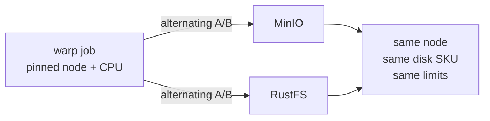

# Goal

[RustFS](https://github.com/rustfs/rustfs) is an Apache-2.0 S3-compatible object store written in
Rust, positioned as a MinIO alternative. The obvious question for this repository is whether it is
a better target for Kasten exports than MinIO — and the obvious *hypothesis* is that Rust's memory
management should beat Go's.

So we ran RustFS through the **exact four conditions** the [main tutorial](../readme.md) and the
[distributed MinIO experiment](../distributed-minio/) used for MinIO:

| # | Condition | Why it exists |
|---|---|---|
| 1 | `emptyDir` on the node's disk | the shipped, throw-away default |
| 2 | `emptyDir` with `medium: Memory` (tmpfs) | removes the disk from the path |
| 3 | one dedicated Premium SSD (P20) | a real disk, no host caching |
| 4 | distributed: 4 nodes x 4 Premium disks (P10) | the topology that actually scales |

The short answer:

| | PUT (export) | GET (restore) | Memory per pod |
|---|---|---|---|
| **MinIO**, distributed, best measured | **865 MiB/s** | **3965 MiB/s** | 3981 MiB |
| **RustFS**, distributed, best measured | 813 MiB/s | 3140 MiB/s | **920 MiB** |

**The hypothesis is right about memory and wrong about throughput.** RustFS holds about
**4.3x less resident memory** for comparable work, and it never beat MinIO on bandwidth in any
condition — it lost by 6% at best and by 13x at worst. Which of those two facts matters is a
sizing decision, and the rest of this page is the evidence for making it.

# :warning: Three of the four conditions cannot test the hypothesis

This is worth saying before any numbers, because it is the difference between a benchmark and a
number-generating exercise.

The main tutorial already established that **the single-drive conditions are pinned by the device,
not the software**. MinIO wrote at 136, 143, 147 and 155 MiB/s whether it was given 2 CPU or 12,
8 streams or 32. An Azure Premium P20 is rated ~150 MBps ≈ 143 MiB/s, and that is what you get. No
rewrite in any language moves that number, because the language is not what is slow.

So conditions 1 and 3 can only answer a narrower question — *does RustFS manage to reach the device
ceiling at all?* — and the answer turned out to be interesting on its own. The conditions where an
implementation difference can genuinely show are:

- **condition 2 (tmpfs)**, where the disk is out of the path and the server becomes CPU- and
  memory-bandwidth-bound,
- **condition 4 (distributed)**, which measures the quality of the erasure-coding and coordination
  implementation.

# How the comparison was made fair

Comparing against the numbers already written in the main tutorial would have been wrong, and we
found out why the hard way (see [the numbers that did not
reproduce](#warning-the-minio-read-numbers-in-the-main-tutorial-did-not-reproduce)). Four controls:

1. **Both servers pinned to the same node**, so they sit on the same physical disk with the same
   co-tenants:
   ```
   kubectl -n warp patch deploy minio --type merge \
     -p '{"spec":{"template":{"spec":{"nodeSelector":{"kubernetes.io/hostname":"<node>"}}}}}'
   ```
2. **Runs alternated A/B/A/B**, never all of one then all of the other, so any drift in cluster
   conditions hits both.
3. **MinIO re-measured in the same session** for every condition. Every MinIO number on this page
   was taken within an hour of the RustFS number next to it.
4. **The warp client's own CPU limit treated as a variable.** warp generates random data and
   checksums it, so it is CPU-bound before it is network-bound. If a figure does not move when you
   raise `WARP_CPU`, the endpoint is the limit; if it does, you were measuring the client. This
   control is what makes condition 2 conclusive, and it is the one most benchmarks skip.

[run-bench.sh](run-bench.sh) wraps all of this: it patches the endpoint, deletes the previous Job
(a Job's pod template is immutable), optionally pins the warp pod and raises its CPU, then greps
the report.

```
WARP_NODE=<node> WARP_CPU=6 ./run-bench.sh put http://rustfs.warp.svc.cluster.local:9000 "label"
```

# What is in this directory

| File | Contents |
|---|---|
| [01-rustfs.yaml](01-rustfs.yaml) | Conditions 1 and 2: one pod, `emptyDir` (patch it to `medium: Memory` for 2) |
| [02-rustfs-single-pod-pvc.yaml](02-rustfs-single-pod-pvc.yaml) | Condition 3: one pod, one Premium P20 |
| [03-rustfs-distributed.yaml](03-rustfs-distributed.yaml) | Condition 4: StatefulSet, 4 pods x 4 Premium P10 |
| [run-bench.sh](run-bench.sh) | Alternating A/B runner with node and CPU pinning |

Each file is a field-for-field counterpart of its MinIO equivalent — same CPU and memory limits,
same disk SKUs and sizes, same anti-affinity, same `cachingMode: None` StorageClass, and the same
throw-away credentials so that switching endpoints needs only `S3_ENDPOINT` patched.



## Deploying RustFS on OpenShift

RustFS needed no special handling beyond what MinIO already needs, but the reasons are worth
recording. The image runs as UID 10001, while OpenShift's `restricted-v2` SCC assigns a random UID
instead, so two paths must be on a writable volume or the container dies before it opens a socket:

```yaml
- name: RUSTFS_OBS_LOG_DIRECTORY
  value: /data/logs
- name: HOME
  value: /data
```

`RUSTFS_VOLUMES` is the one knob that changes shape between conditions. A single path is
single-drive mode, no erasure coding:

```yaml
- name: RUSTFS_VOLUMES
  value: /data
```

and the distributed form uses the same `{N...M}` expansion syntax MinIO does:

```yaml
- name: RUSTFS_VOLUMES
  value: "http://rustfs-dist-{0...3}.rustfs-hl.warp.svc.cluster.local:9000/data-{0...3}"
- name: RUSTFS_RPC_SECRET
  value: "warp-benchmark-rpc-secret"
```

`RUSTFS_RPC_SECRET` is not optional in a multi-node cluster: RustFS derives internode RPC auth from
the access keys and refuses to form a cluster when those are the shipped defaults. Health is on
`/health` (it also answers `/minio/health/live`, which is convenient but not something to depend
on). All four pods reached ready in about 90 seconds.

# Condition 1 — `emptyDir` on the node's disk

Both servers on the same node, same `/dev/sda4`, shipped 2 CPU limits,
`OBJ_SIZE=64MiB CONCURRENT=8 DURATION=30s`.

| Run | MinIO | RustFS |
|---|---|---|
| 1 | 124.57 MiB/s | 113.12 MiB/s |
| 2 | 128.22 MiB/s | 107.28 MiB/s |
| 3 | 124.06 MiB/s | 124.23 MiB/s |
| **mean** | **125.6 MiB/s** | **114.9 MiB/s** |

On the average, an unremarkable 9% gap — both are near the node disk's ceiling, exactly as
predicted. **The averages are the least interesting part of this table.** Look at the stability:

| | MinIO | RustFS |
|---|---|---|
| Per-second throughput spread | 104 – 133 MiB/s | **32 – 209 MiB/s** |
| Request time StdDev | 73 – 158 ms | **2115 – 2289 ms** |
| Fastest / slowest single request | 3911 / 4302 ms | **458 / 11331 ms** |

MinIO's request times are almost identical to each other — the signature of a device being
saturated cleanly. RustFS's vary by a factor of 25 within a single run, and its fastest one-second
slice (209 MiB/s) is *above* what the disk can sustain. That combination has one explanation:
**RustFS accepts writes into memory faster than the disk can drain them, then stalls when it has to
flush.** MinIO paces itself against the device; RustFS bursts and blocks.

Two earlier RustFS runs, taken before the node pinning was in place, gave 76.29 and 110.78 MiB/s.
They are not in the table because they were not controlled — but they show how wide the swing gets,
and they are why a single run of this benchmark against RustFS is worth very little.

Reads, warp pinned to a *different* node from the server:

| | MinIO | RustFS |
|---|---|---|
| GET, `CONCURRENT=8` | **2655 MiB/s** (2628, 2682) | 1190 MiB/s (1188, 1192) |
| TTFB median | 2 ms | 19–21 ms |

Both are tightly reproducible, and RustFS reads at 45% of MinIO's rate. Hold that thought — the
tmpfs run below shows this gap is not a read-path weakness in general.

# Condition 2 — tmpfs, and the CPU control that makes it conclusive

`medium: Memory`, 12 GiB tmpfs, container memory limit raised to 16 GiB, server CPU 6,
`CONCURRENT=16`, `DURATION=8s`. Verified from inside the pod rather than trusted from the manifest:

```
kubectl -n warp exec deploy/rustfs -- df -h /data
Filesystem      Size  Used Avail Use% Mounted on
tmpfs            12G   68K   12G   1% /data
```

This is the condition that can see the hypothesis, so the client had to be ruled out:

| warp CPU limit | MinIO PUT | RustFS PUT |
|---|---|---|
| 2 | 1096, 1082 → **1089 MiB/s** | 1036, 1038 → **1037 MiB/s** |
| 6 | 1303, 1305 → **1304 MiB/s** | 1062, 1064 → **1063 MiB/s** |
| **Gain from 3x the client CPU** | **+19.7%** | **+2.5%** |

At 2 CPU the two look 5% apart and you would conclude they are equivalent. **They are not — at
2 CPU you are measuring warp.** Give the client room and MinIO climbs to 1304 MiB/s while RustFS
moves 2.5% and stops. That plateau at ~1063 MiB/s is RustFS's own ceiling, and MinIO is **23%
faster** with the disk entirely out of the path.

This is the cleanest refutation of the premise on this page: on the one write condition where a
language runtime could plausibly matter, the Go implementation wins by 23%.

> **Repeat tmpfs runs need a fresh pod.** Our second pair of runs reported 615 and 29 errors and
> nonsense throughput. The tmpfs had filled: `df` showed MinIO at 75% and RustFS at 100% still
> holding the previous run's data. warp empties the bucket, but not fast enough to make the next
> run clean. Every tmpfs figure above was taken after a `kubectl rollout restart`.

And reads, same parameters:

| | MinIO | RustFS |
|---|---|---|
| GET on tmpfs | 3311 MiB/s (TTFB 3 ms) | **3369 MiB/s** (TTFB 13 ms) |

**The only condition where RustFS wins**, by 1.7%, with a *lower* request-time StdDev
(24.2 vs 39.2 ms). Which raises the obvious question about condition 1's 1190 against 2655.

## Separating the medium from the concurrency

Condition 1's GET used `CONCURRENT=8` and 2 client CPUs; the tmpfs GET used 16 and 6. Two variables
moved at once, so we re-ran the disk-backed GET at the tmpfs parameters — only the medium differing:

| GET, `CONCURRENT=16`, warp 6 CPU | MinIO | RustFS |
|---|---|---|
| `emptyDir` (node disk) | 3350 MiB/s, TTFB **3 ms** | 1722 MiB/s, TTFB **144 ms** |
| tmpfs (RAM) | 3311 MiB/s, TTFB 3 ms | 3369 MiB/s, TTFB 13 ms |
| **Effect of the medium** | **−1%** | **+96%** |

That is an architectural difference, not a tuning one:

- **MinIO's reads do not care what the medium is.** 3350 on disk against 3311 in RAM, with a 3 ms
  TTFB in both cases. It is serving from the page cache, so the device is irrelevant.
- **RustFS's reads care enormously.** Halved throughput and a **48x worse TTFB** on the same data.
  It is going to the device.

So RustFS does not get the free ride from the page cache that MinIO does. Concurrency mattered too
(1190 at 8 streams, 1722 at 16, on the same disk), because higher per-request TTFB needs more
streams to hide — but the medium is the bigger term, and it is the one you cannot tune away.

# Condition 3 — one dedicated Premium SSD

One 512 GiB P20 each on the `warp-premium-nocache` class (`cachingMode: None`, so the host cache
cannot flatter the reads), both pods pinned to the same node, 12 CPU limits, separate disks
(`/dev/sdf` and `/dev/sdg`).

> A scheduling trap worth repeating: pin the node **before** the PVC provisions. We patched the
> `nodeSelector` after applying, so the disks were already bound in `francecentral-1` and
> `francecentral-2` while the pods were pinned to a node in `francecentral-3` — `volume node
> affinity conflict`, both pods Pending forever. `WaitForFirstConsumer` binds where the *first*
> pod lands, and no amount of later patching moves an Azure disk between zones.

| | MinIO | RustFS |
|---|---|---|
| PUT, `CONCURRENT=8` | 136.77, 146.38 → **141.6 MiB/s** | 79.65, 94.57 → **87.1 MiB/s** |
| PUT, `CONCURRENT=32`, warp 6 CPU | **155.87 MiB/s** (StdDev **9.0 ms**) | **73.35 MiB/s** |
| GET, `CONCURRENT=8` | **2718 MiB/s** (TTFB 2 ms) | **209.6 MiB/s** (TTFB **567 ms**) |

Three things here, in ascending order of importance.

**MinIO reproduces the main tutorial exactly.** 2718.07 MiB/s against the 2718 recorded there, and
a PUT that pins the device at 155.87 MiB/s with a 9 ms standard deviation across 30 seconds. That
is what a saturated P20 looks like, and it is a useful confirmation that the rig is sound.

**RustFS extracts only 60% of the same disk**, and more concurrency makes it *worse* — 87.1 MiB/s
at 8 streams, 73.35 at 32. So RustFS's write shortfall is not concurrency starvation; adding
streams to a burst-and-stall writer just lengthens the stalls. Note this is the same disk class in
both columns, so the ~150 MBps device ceiling is not what is limiting RustFS at 73 MiB/s.

**The read result is the largest gap we measured anywhere: 13x.** 2718 against 209.6 MiB/s, with
TTFB going from 2 ms to 567 ms. This is condition 2's page-cache finding at full strength: MinIO
serves a 3 GiB working set out of RAM, and RustFS reads it off the platter every single time.
209.6 MiB/s (~220 MB/s) is actually *above* a P20's nominal 150 MBps, so RustFS is doing fine
against the hardware — it is simply racing a competitor that never touches the hardware at all.

# Condition 4 — distributed, 4 nodes x 4 disks

16 x 128 GiB P10 per product, one pod per node via required anti-affinity, 4 CPU limits, reached
through a ClusterIP Service. This matches step 1 of the [MinIO tuning
ladder](../distributed-minio/readme.md#the-tuning-ladder). Verified before measuring — 4 pods, 4 *different*
nodes, 4 dedicated disks each:

```
rustfs-dist-0   ocp-b28rt-worker-francecentral2-cxvlb
rustfs-dist-1   ocp-b28rt-worker-francecentral1-7r2xw
rustfs-dist-2   ocp-b28rt-worker-francecentral3-6p86q
rustfs-dist-3   ocp-b28rt-worker-francecentral1-wml26
```

| | MinIO | RustFS | Gap |
|---|---|---|---|
| PUT, `CONCURRENT=8` | 768, 756 → **762 MiB/s** | 588, 586 → **587 MiB/s** | MinIO +30% |
| PUT, `CONCURRENT=32`, warp 10 CPU | **865.5 MiB/s** | **813.4 MiB/s** | MinIO **+6%** |
| GET, `CONCURRENT=8` | **3283 MiB/s** (TTFB 8 ms) | **3110 MiB/s** (TTFB 19 ms) | MinIO +6% |
| GET, `CONCURRENT=32`, warp 10 CPU | **3965 MiB/s** | **3140 MiB/s** | MinIO **+26%** |

**This is RustFS's best condition, and concurrency is why.** Its distributed writes scale where its
single-disk writes did not: 587 → 813 MiB/s for 4x the streams (+38%, against MinIO's +14%), which
closes a 30% deficit to 6%. If you run RustFS distributed, run it with high concurrency — the
opposite of the advice for condition 3.

The GET row is the one that needed the ceiling test. At `CONCURRENT=8` both products landed at
3110–3283 MiB/s, and we had already seen ~3300–3369 in two unrelated conditions. Three numbers
clustering in the same range is exactly the trap the [distributed MinIO
page](../distributed-minio/readme.md#warning-this-experiment-corrected-the-main-tutorial) was written to
warn about, so instead of admiring the agreement we tried to break it:

| | at `CONCURRENT=8` | at `CONCURRENT=32`, warp 10 CPU |
|---|---|---|
| MinIO GET | 3283 MiB/s | **3965 MiB/s** — kept scaling |
| RustFS GET | 3110 MiB/s | **3140 MiB/s** — plateaued |

MinIO went straight through the supposed shared ceiling; RustFS moved 1%. So ~3140 MiB/s is
RustFS's own limit, the comparison is genuinely server-bound rather than client-bound, and MinIO
reads 26% faster. **Had we stopped at `CONCURRENT=8` we would have reported a 6% gap and a shared
ceiling that does not exist.**

# The hypothesis, tested directly: memory

Everything above is bandwidth. The premise was about memory, so we measured it — resident memory
per pod, sampled during a distributed PUT, both products with an identical 8 GiB limit:

| Pod | MinIO (Go) | RustFS (Rust) |
|---|---|---|
| 0 | 3806 MiB | 871 MiB |
| 1 | 4049 MiB | 939 MiB |
| 2 | 4109 MiB | 941 MiB |
| 3 | 3960 MiB | 931 MiB |
| **mean** | **3981 MiB** | **920 MiB** |
| throughput during these runs | 991 MiB/s | 837 MiB/s |

**RustFS did the same class of work in 4.3x less resident memory** (15.6 GiB against 3.6 GiB across
the four pods). That is the hypothesis, and it
holds — it is simply not a *throughput* effect, which is what the four conditions were built to
measure.

Two caveats that keep this honest. MinIO's figure is not all waste: some is deliberate caching, and
that caching is precisely what buys it the page-cache read advantage in conditions 1 and 3, so the
memory and the read performance are the same design decision seen from two sides. And a Go
process's RSS includes heap the runtime has not yet returned to the OS, so this is "memory held",
not "memory needed". Neither caveat changes the ratio by an order of magnitude.

# :warning: The MinIO read numbers in the main tutorial did not reproduce

Not a RustFS finding, but we would be burying it. Re-measuring MinIO in-session gave read figures
far above what the other two pages record, at matching topologies:

| Measurement | Recorded there | Re-measured here |
|---|---|---|
| MinIO GET, single pod, cross-node | [1359 MiB/s](../readme.md) | **2655 MiB/s** |
| MinIO GET, distributed 16 x P10 | [1986 MiB/s](../distributed-minio/readme.md) | **3283 MiB/s** |
| MinIO GET, single pod, same node | [2718 MiB/s](../readme.md) | 2718 MiB/s (exact) |
| MinIO PUT, distributed 16 x P10 | 743 MiB/s | 762 MiB/s |

The writes reproduce, and the same-node read reproduces to the digit. The two *cross-node* reads
are both roughly 1.6x higher than recorded. We did not chase the cause and will not guess at one
with this little evidence; the candidates are `minio/minio:latest` having moved in the intervening
16 days, page-cache warmth differing between sessions, or differing cluster load. Recording it
because it reinforces the discipline both other pages already argue for: **numbers age, and the
`:latest` tag guarantees it.** Re-measure your baseline in the same session as your comparison,
which is why every MinIO figure on this page was.

It also vindicates the choice not to compare RustFS against the stored numbers. Doing so would have
credited RustFS with beating MinIO's distributed GET (3110 against 1986) when a same-session
measurement shows it losing (3110 against 3283).

# So which one should hold your Kasten exports?

Sizing 1 TiB with the best measured figure for each, on the distributed topology:

| | Export (PUT) | Restore (GET) | Memory for 4 pods |
|---|---|---|---|
| MinIO | **20.2 min** | **4.4 min** | ~15.6 GiB |
| RustFS | 21.5 min | 5.6 min | **~3.6 GiB** |
| AWS S3 `eu-west-3`, for reference | 13 min | 24 min | n/a |

On a properly built 4-node topology the two are close enough that **bandwidth is not the deciding
factor**: 7% on export, 27% on restore. The deciding factors are elsewhere.

**Choose MinIO when** the endpoint is small — one pod, one or a few disks. That is where the gap is
brutal rather than marginal: 13x on reads at condition 3, because MinIO's page-cache read path
turns RAM into read bandwidth and RustFS's does not. It is also the mature choice for anything
holding real backups, and this page says nothing about durability, healing, replication or
immutability.

**Consider RustFS when** memory is the constrained resource — dense nodes, many tenants, edge
clusters — and you can give it the topology and the concurrency it needs. 3.6 GiB against 15.9 GiB
for the same job is a real saving, and on 4 nodes with 32 streams it costs only 7% of export
bandwidth to take it.

**Do not put RustFS on a single disk and expect the MinIO numbers.** Every RustFS weakness we found
is worst in exactly that configuration: 60% of the device on writes, 13x behind on reads, and a
burst-and-stall write pattern whose per-second throughput swings from 32 to 209 MiB/s.

And the conclusion the data does *not* support: "Rust is faster than Go." What was measured is one
object store against another, each a large pile of design decisions about caching, I/O paths,
erasure coding and coordination. The language is somewhere in there, and the one place it is
plainly visible is the memory table — not the bandwidth ones.

# Reproducing this

```
# conditions 1 and 2
kubectl apply -f ../00-namespace.yaml -f ../02-s3-target.yaml \
              -f ../03-warp-params.yaml -f ../04-warp-runner.yaml
kubectl apply -f ../01-minio.yaml -f 01-rustfs.yaml

# pin both to one node so they share a disk and its co-tenants
NODE=$(kubectl get nodes -l node-role.kubernetes.io/worker -o jsonpath='{.items[0].metadata.name}')
for D in minio rustfs; do
  kubectl -n warp patch deploy $D --type merge \
    -p "{\"spec\":{\"template\":{\"spec\":{\"nodeSelector\":{\"kubernetes.io/hostname\":\"$NODE\"}}}}}"
done

# alternate, never all of one then all of the other
for i in 1 2 3; do
  ./run-bench.sh put http://minio.warp.svc.cluster.local:9000  "MinIO  run$i"
  ./run-bench.sh put http://rustfs.warp.svc.cluster.local:9000 "RustFS run$i"
done
```

Condition 2 is the same patch the main tutorial documents, applied to both, plus a
`rollout restart` between every run:

```
for D in minio rustfs; do
  kubectl -n warp patch deploy $D --type=json -p='[
    {"op":"replace","path":"/spec/template/spec/volumes/0/emptyDir",
     "value":{"medium":"Memory","sizeLimit":"12Gi"}},
    {"op":"replace","path":"/spec/template/spec/containers/0/resources/limits/memory","value":"16Gi"},
    {"op":"replace","path":"/spec/template/spec/containers/0/resources/limits/cpu","value":"6"}
  ]'
done
kubectl -n warp exec deploy/rustfs -- df -h /data     # expect tmpfs, do not trust the manifest
```

Reverting to disk needs `delete`, not `apply` — `medium` was set imperatively, so it never entered
`last-applied-configuration` and `apply` will not remove it:

```
kubectl -n warp delete deploy minio rustfs
kubectl apply -f ../01-minio.yaml -f 01-rustfs.yaml
```

Conditions 3 and 4 need the Premium StorageClass, and the node pin must be injected **before** the
PVCs provision:

```
kubectl apply -f ../distributed-minio/00-storageclass.yaml
sed "s|^      containers:|      nodeSelector: { kubernetes.io/hostname: $NODE }\n      containers:|" \
  02-rustfs-single-pod-pvc.yaml | kubectl apply -f -
kubectl apply -f 03-rustfs-distributed.yaml
```

## :moneybag: Teardown — 34 disks, and they bill until you delete the PVCs

Running both products at condition 4 means **32 Premium disks plus the two condition-3 disks**,
roughly $0.90/hour, billing whether or not a benchmark is running. Deleting a StatefulSet does not
delete its PVCs:

```
kubectl -n warp delete sts minio-dist rustfs-dist
kubectl -n warp delete deploy minio-1disk rustfs-1disk
kubectl -n warp delete svc minio-dist minio-hl rustfs-dist rustfs-hl minio-1disk rustfs-1disk
kubectl -n warp delete pvc --all          # <-- the part people forget
kubectl delete sc warp-premium-nocache
```

Then **confirm the disks actually went away**, because the PVCs disappearing does not mean the
Azure disks did. Ours sat in `Released` with an `external-attacher` finalizer for about a minute
while Azure detached them from the VMs:

```
kubectl get pv -o json | python3 -c "
import json,sys
print(sum(1 for i in json.load(sys.stdin)['items']
          if i['spec'].get('storageClassName')=='warp-premium-nocache'))"
```

Do not stop until that prints `0`. A `Released` PV with `reclaim=Delete` is still a billing Azure
disk.

# Sources

- [RustFS on GitHub](https://github.com/rustfs/rustfs)
- [Installing RustFS with Docker](https://docs.rustfs.com/en/installation/container/docker) — image, ports, UID 10001, `/health`
- [RustFS Kubernetes installation (Helm)](https://docs.rustfs.com/en/installation/cloud-native) — standalone vs distributed modes, replica requirements
- [RustFS multiple-node multiple-disk installation](https://docs.rustfs.com/installation/linux/multiple-node-multiple-disk.html) — the `{N...M}` volume expansion syntax
- [RustFS CLI reference](https://docs.rustfs.com/en/reference/cli)
